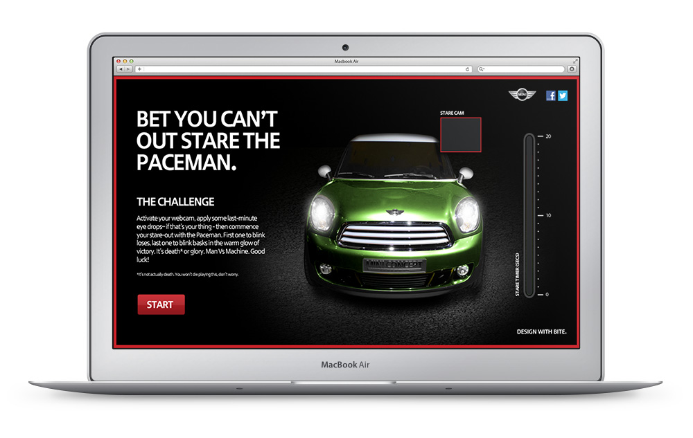
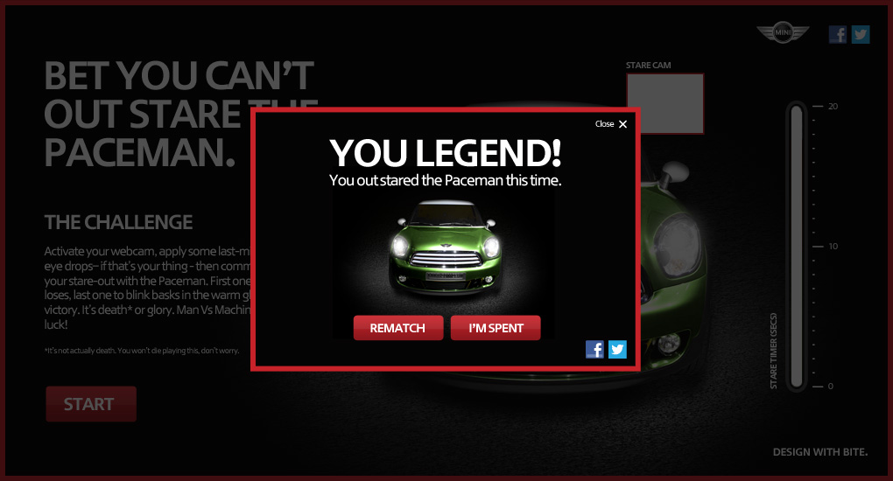
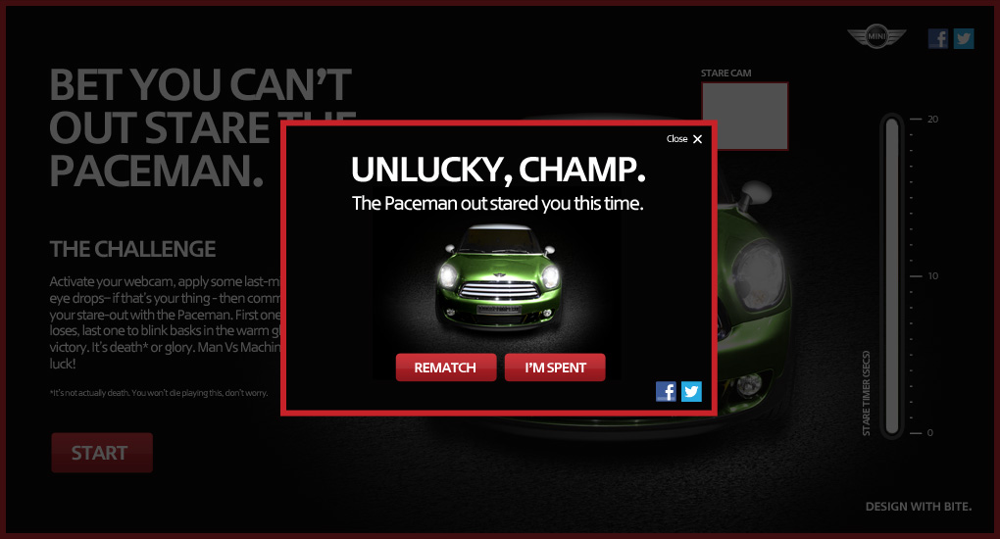

During my tenure at [WCRS](http://www.wcrs.com), I worked on an HTML5 prototype for [MINI](https://www.mini.co.uk) that uses the webcam to track the motion of the user's eyes.

In this particular application of the technology, the user had to stare for as long as posible without blinking the eyes until the meter reaches the top.

