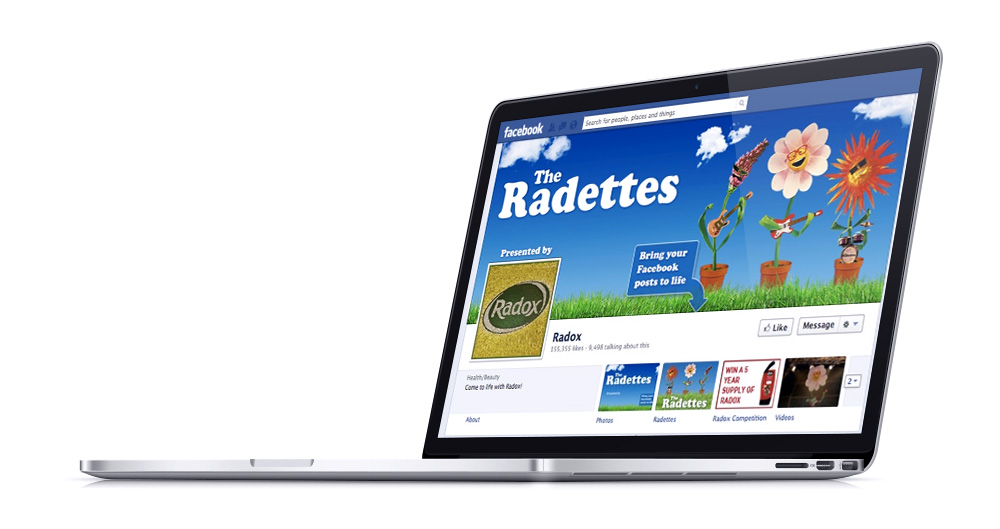

During my tenure at [WCRS](http://www.wcrs.com), I worked on the Radettes Facebook App for [Radox](http://www.radox.co.uk/).

"The Radettes" is a musical trio of puppets who sing users' status updates.

Songs they perform include a blues track for people to let friends know they have lost their phone, a new-romantic number for those who want to gloat about being on holiday and a pop track for people who want to tell friends they like their post.

<iframe width="560" height="315" src="https://www.youtube.com/embed/Z4CiuK-bbyQ?rel=0&amp;controls=0&amp;showinfo=0" frameborder="0" allowfullscreen></iframe>

Read more at: http://www.campaignlive.co.uk/article/radox-the-radettes-wcrs/1148842#dMe8gKjF6xVPh1eM.99
