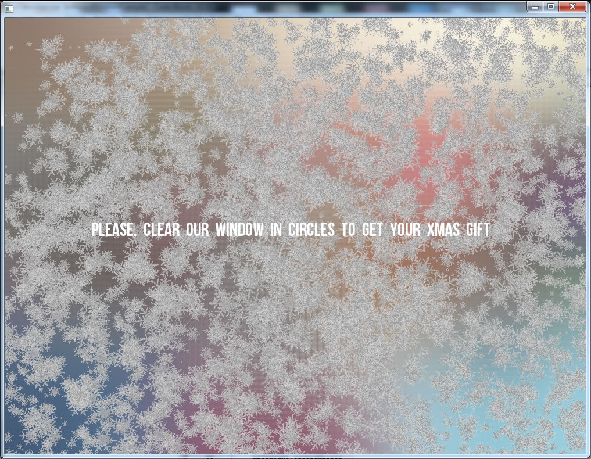
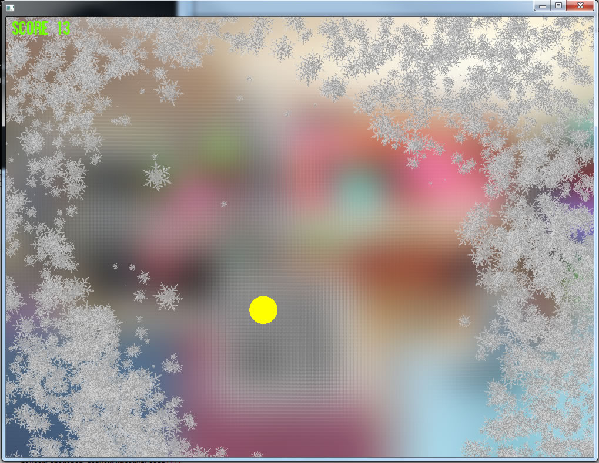
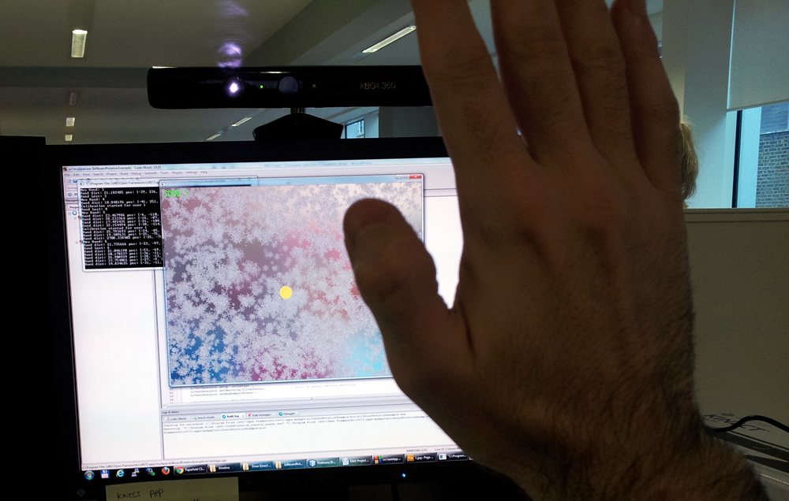
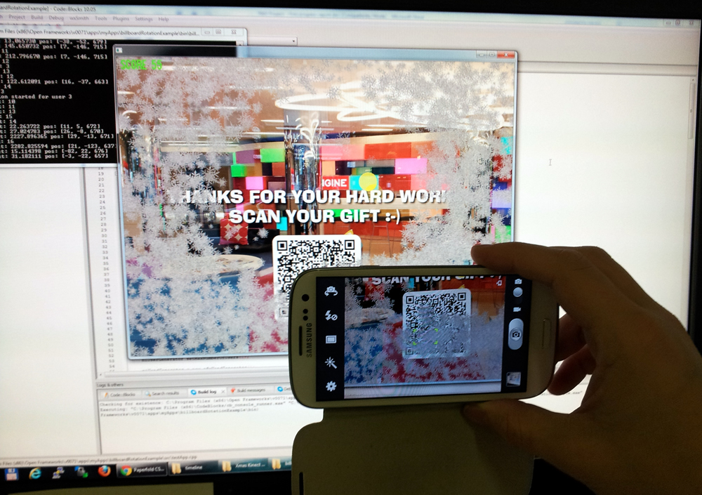

<a class="btn" href="https://github.com/gazpachu/xmas-gift" target="_blank">Source code</a>

## The idea

The aim of this project is to create a little game for Xmas 2012. The app will create the illusion of a frozen window (with the blur effect) that needs to be wiped off moving the hand in circles. To make it more fun there will be lots of snowflakes that will react to the movement of the hand.

In order to make the blur disappear, the user has to move the hands only in circles. Soon after a few seconds the blur will disappear and the background image will be revealed. The image can be easily changed and maybe we can even play a video.

To compensate the user for playing the game, several QR codes (with a link to a gift) will show up and the user will be able to scan them with their Smartphone/tablet. We can extend the game by telling the user to go to the URL to complete another task...

It was all built with OpenFrameworks, Kinect and OpenNI.

## Video

<iframe width="560" height="315" src="https://www.youtube.com/embed/4uDsONxNdDg" frameborder="0" allow="accelerometer; autoplay; encrypted-media; gyroscope; picture-in-picture" allowfullscreen></iframe>

## Requirements and improvements

- It has to be installed in the ground floor beside a window.
- It can use a powerful projector or a big flat screen. The projector can maximize the visual experience and use the glass of the window as the surface where the app will be showed.
- Further investigation needs to be done regarding the Kinect tracking threshold, Kinect calibration, and limit the maximum number of skeletons/hands to one.
- Needs to be tested in the final location in an early stage, not just a couple of days before start

## Instructions

- Press “space bar” to start again or recalibrate the hand tracking

