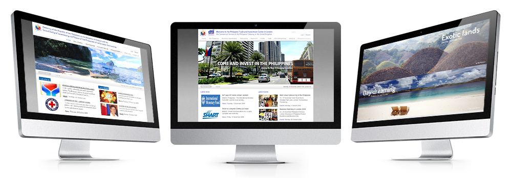

<a class="btn icon icon-external" href="http://investphilippines.org/siliconvalley/" target="_blank">Invest Philippines USA</a>
<a class="btn icon icon-external" href="http://philembassy.herokuapp.com/" target="_blank">Philippine Embassy London (archived version)</a>

While directing Webmarket.es, I partnered with the Philippines government to build a few websites for their embassies and investment centres:

* Trade and investment centre in the UK (Joomla)
* Philippine embassy in Brussels (Joomla)
* Philippine embassy in London (Wordpress)
* Trade and investment centre in the USA (Wordpress)

The oldest websites were built with Joomla (only desktop view) while the new ones were built with Wordpress and were fully responsive. In both cases, I used a custom template and graphic design.
