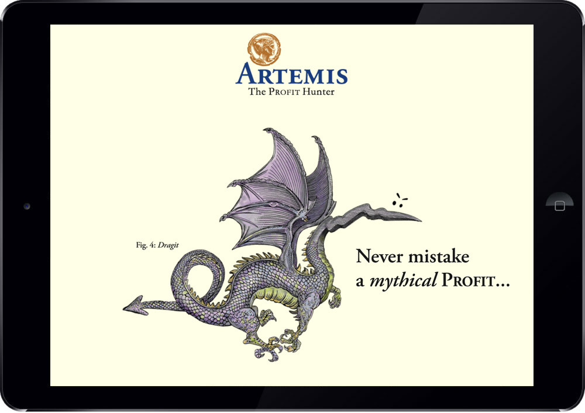
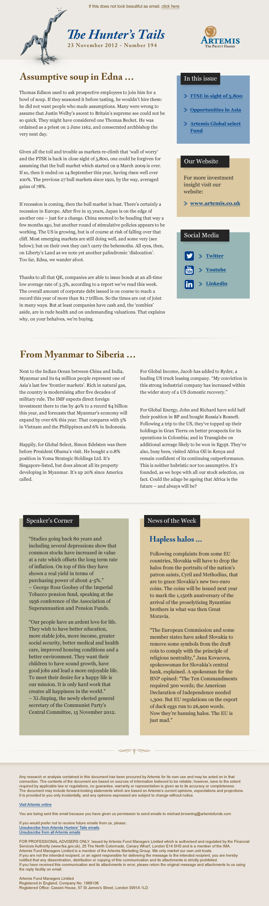

While working at WCRS, I was asked to build an animated responsive HTML Artemis ad for the iPad. This ad was displayed in the Times and Sunday websites. I used the libraries [spritely](http://spritely.net/) and [transit](http://ricostacruz.com/jquery.transit/) to create the sequence of animated sprites and the CSS3 animations.

<video class="full-img" style="border: 1px solid #CCC; border-radius: 30px;" width="100%" controls>
    <source src="./images/artemis-profit-hunter.mp4" type="video/mp4" />
</video>

I was also involved in several content updates for the Artemis website and newsletter.

