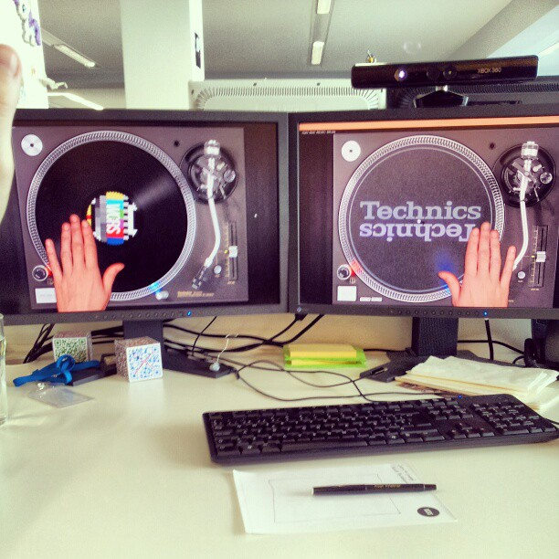
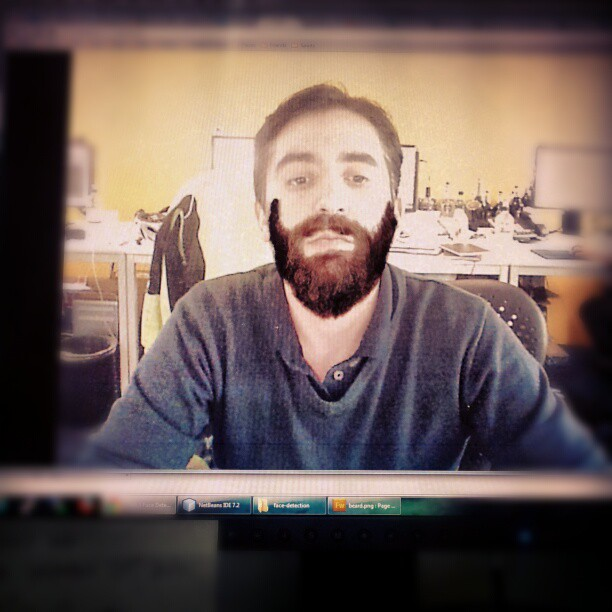
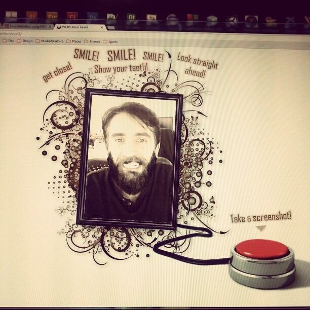
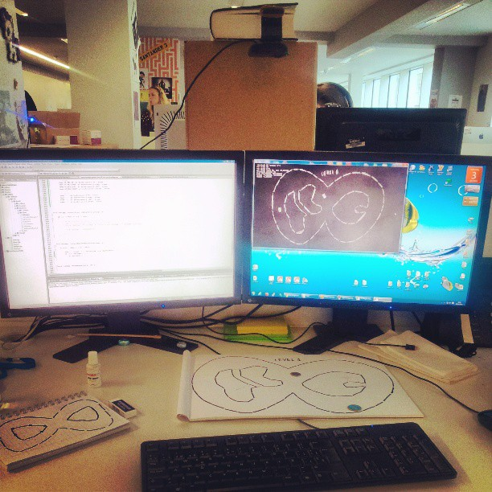
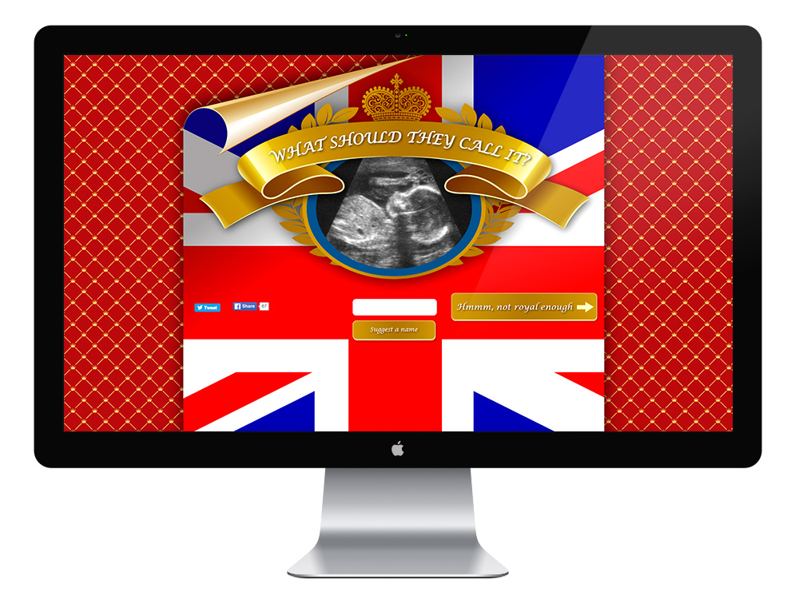

During my tenure at WCRS, I was involved in several brainstorms, promotional ideas, internal projects, hack evenings, small microsites and games. Some of them include:

* Creative work to promote on mobile phones the new electric [BMW](https://www.bmw.co.uk)'s i3
* Creative work for [Bupa](https://www.bupa.com/)'s health services
* Brainstorming and conceptualisation of ideas for a [Royal Navy](https://www.royalnavy.mod.uk/) project
* What should they call it? A small microsite to find out the best name for the new royal baby.
* A Google Maps hack to retrieve directions from point A to B
* A Wordpress plugin adaptation to capture the details of candidates for the WCRS work experience program
* WCRS 2012 xmas card with face detection
* An internal newsletter template regarding Social Media
* A Box2d and car game with track and shape detection using a webcam and OpenCV
* A Kinect and OpenFrameworks driven turntable music experiment
* A Kinect hand tracking and QRCode driven Xmas gift prototype:

<iframe width="560" height="315" src="https://www.youtube.com/embed/4uDsONxNdDg" frameborder="0" allow="accelerometer; autoplay; encrypted-media; gyroscope; picture-in-picture" allowfullscreen></iframe>

