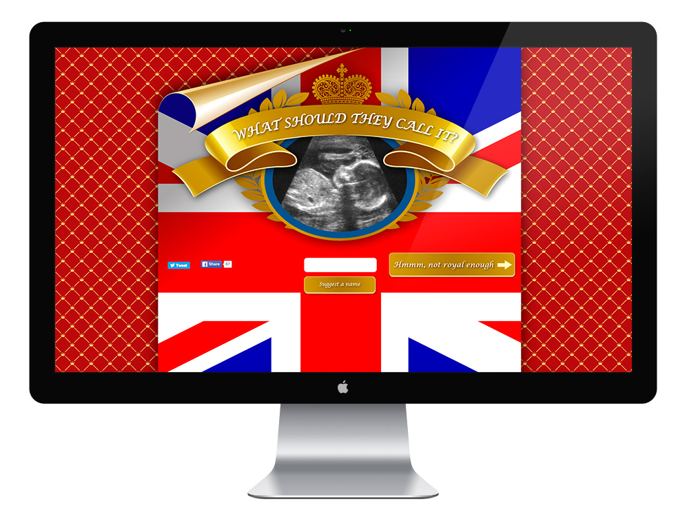

During my tenure at WCRS, I was involved in several brainstorms, promotional ideas, internal projects, hack evenings, small microsites and games. Some of them include:

* Creative work to promote on mobile phones the new electric **BMW**'s i3
* Creative work for **Bupa**'s health services
* Brainstorming and conceptualisation of ideas for a **Royal Navy** project
* What should they call it? A small microsite to find out the best name for the new royal baby.
* A Google Maps hack to retrieve directions from point A to B
* A Wordpress plugin adaptation to capture the details of candidates for the WCRS work experience program
* WCRS 2012 xmas card with face detection
* An internal newsletter template regarding Social Media

