While I was working at [WCRS](http://www.wcrs.com/) as a creative technologist, I got involved in several projects: Churchill Army Vets, Churchill Birthday Card and a landing page for the Churchill FB page. The Birthday Card became a [Guinness World Record](http://www.guinnessworldrecords.com/news/2012/10/churchill-dog-beats-spiderman-to-take-most-contributions-to-a-greeting-card-record-45716).

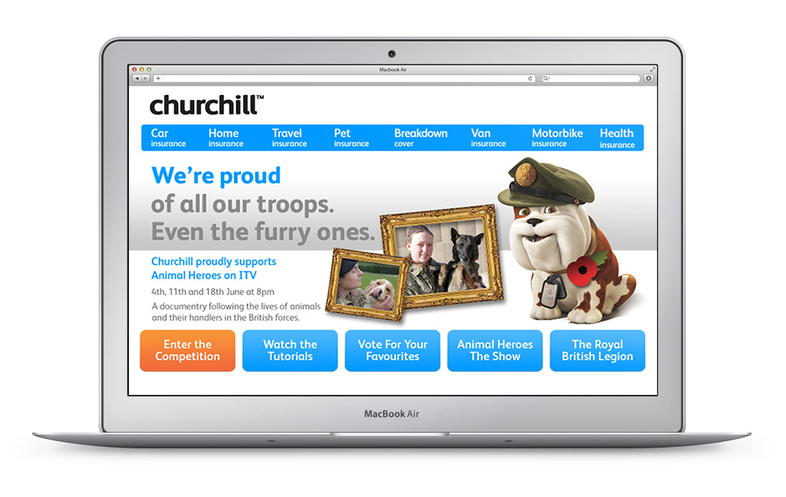

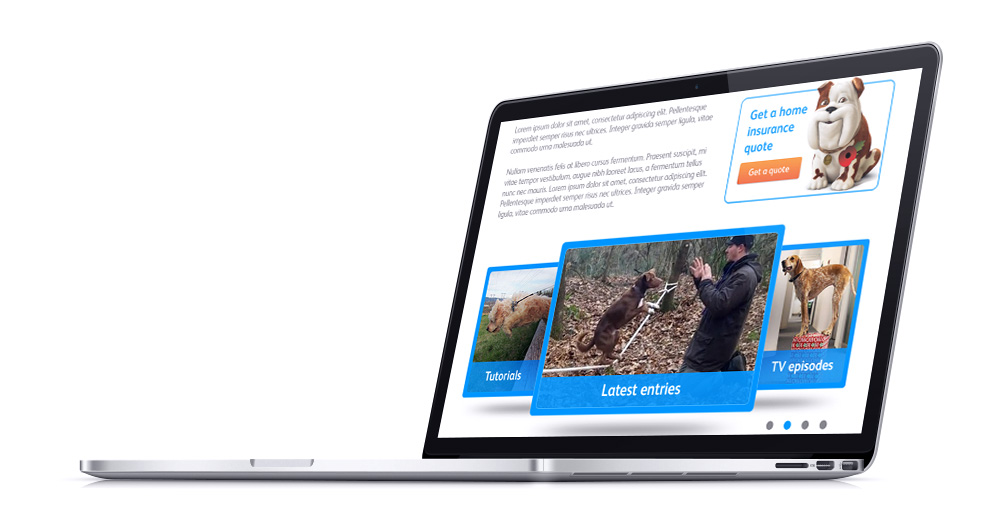

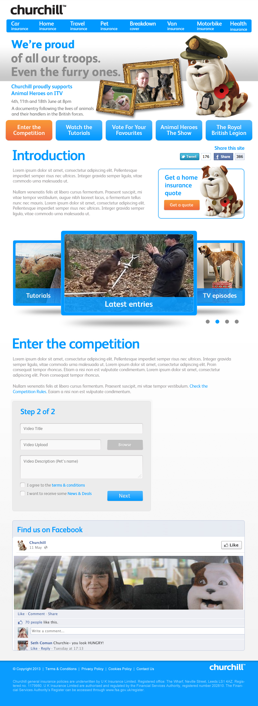

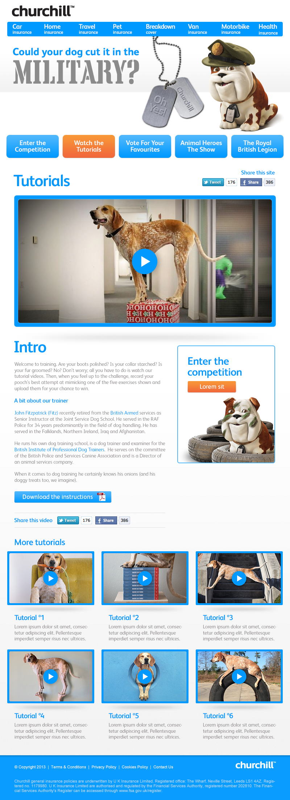

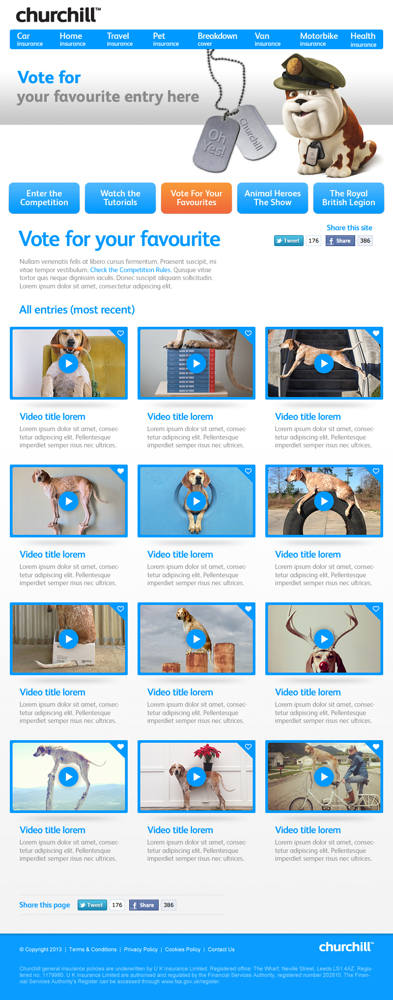

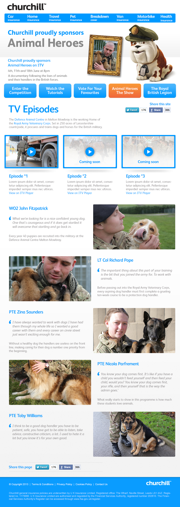

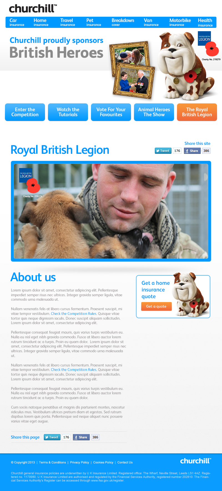

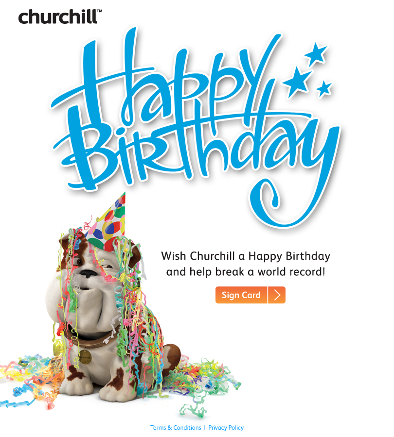

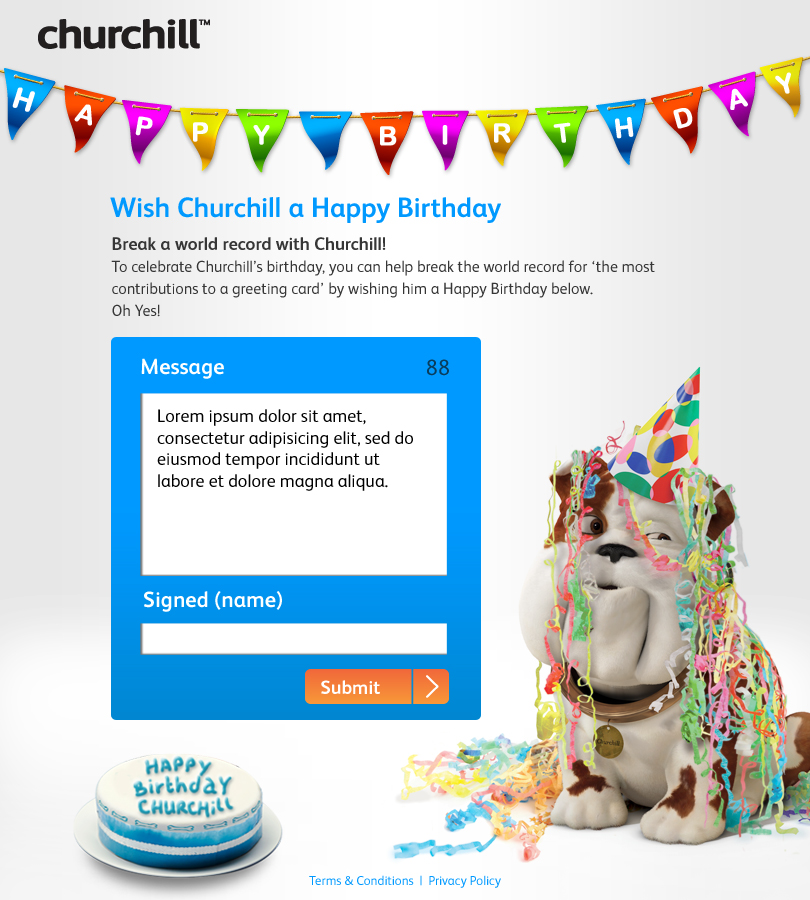

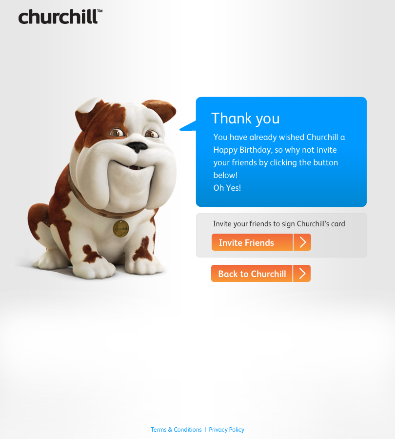

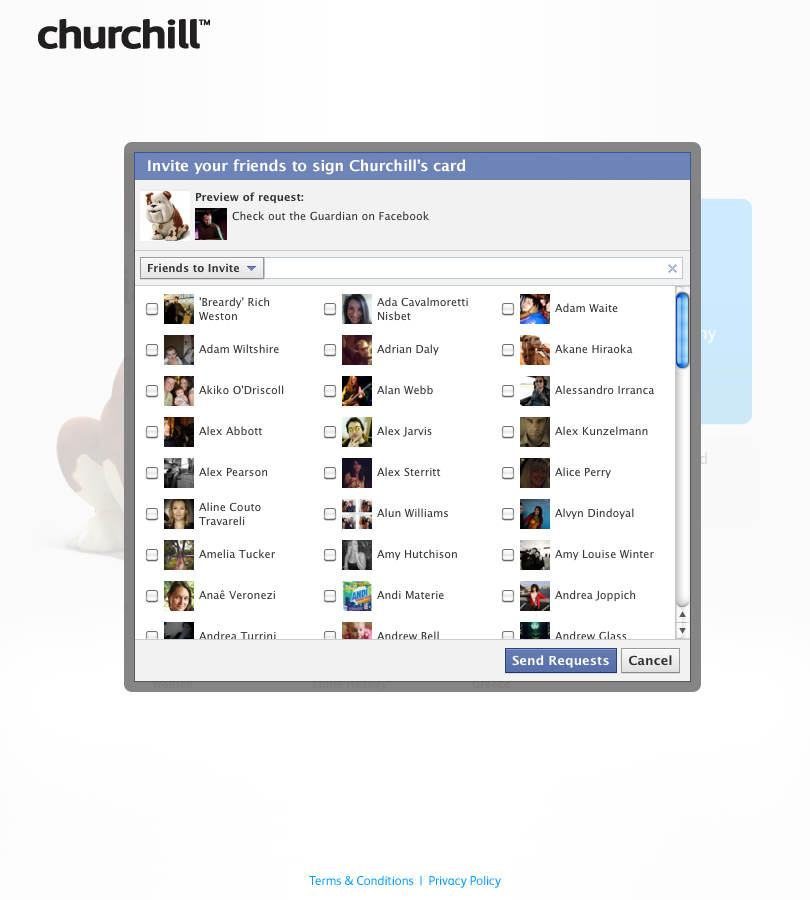
