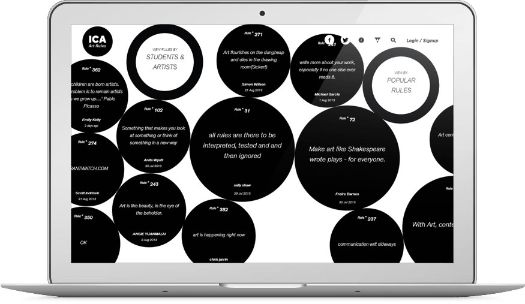
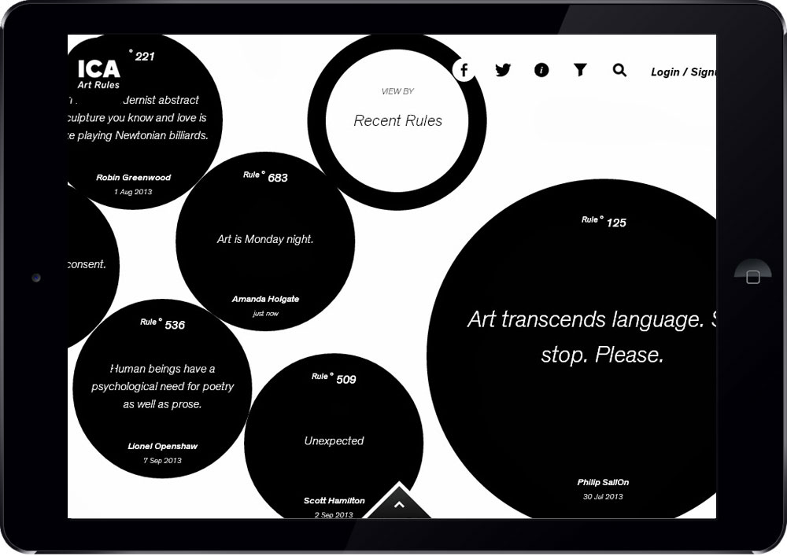
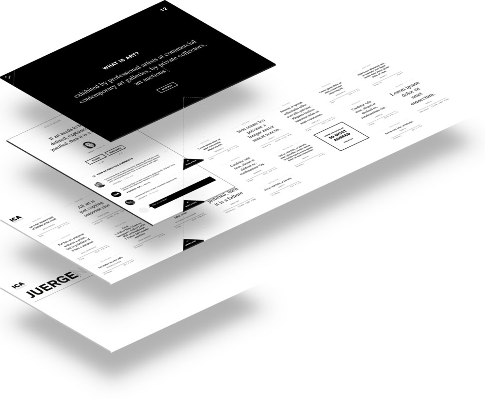
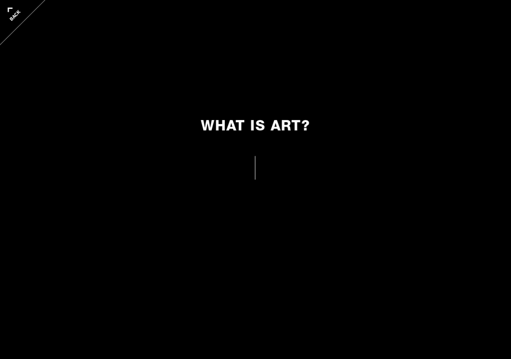
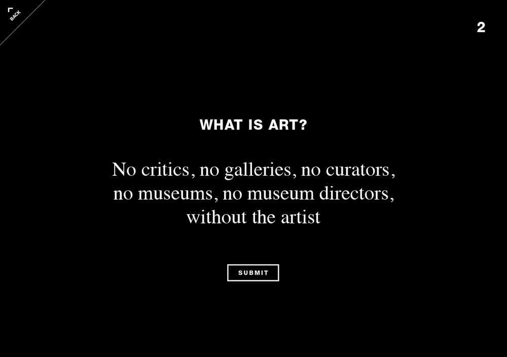
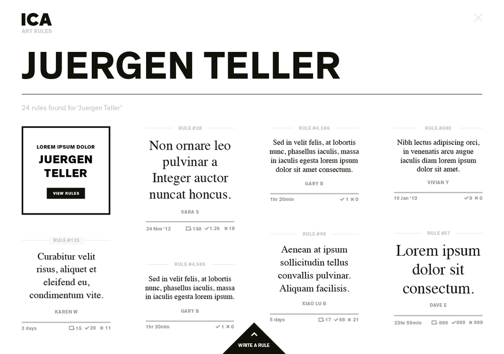
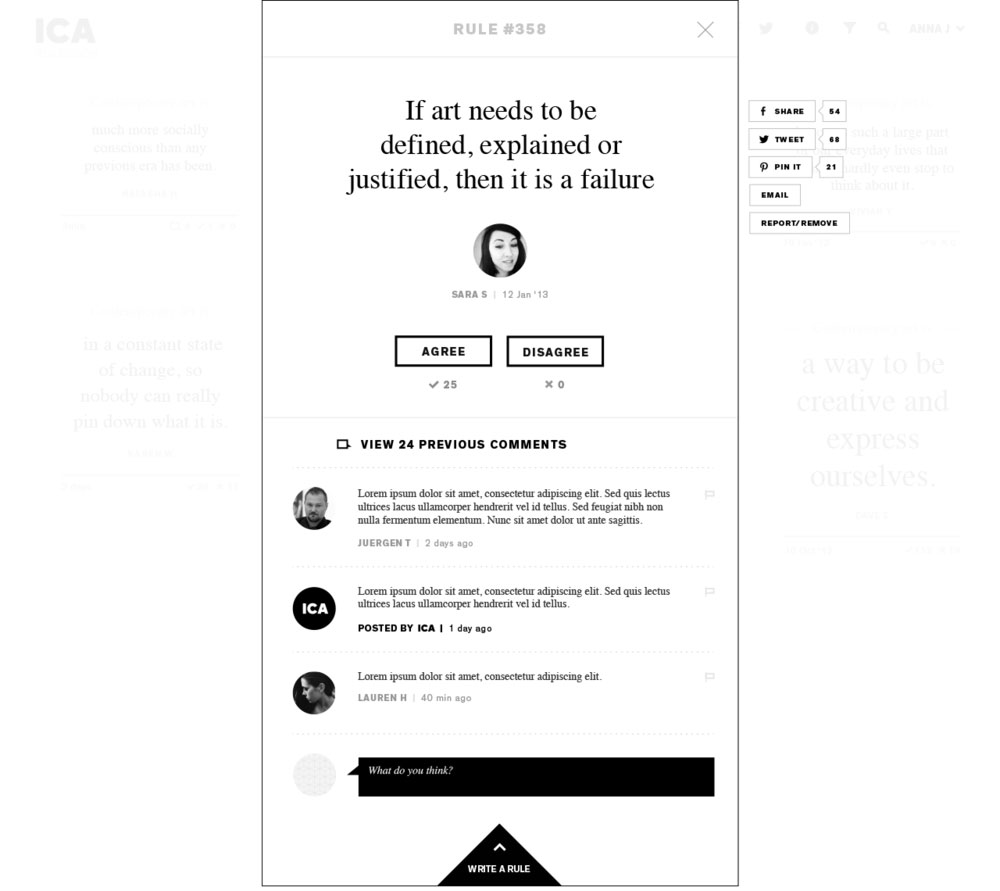
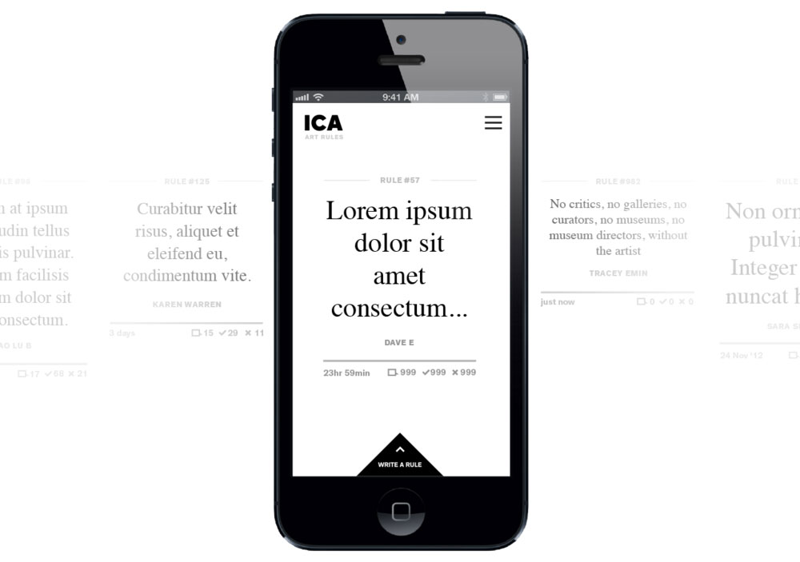
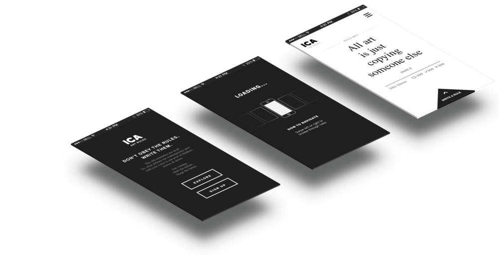
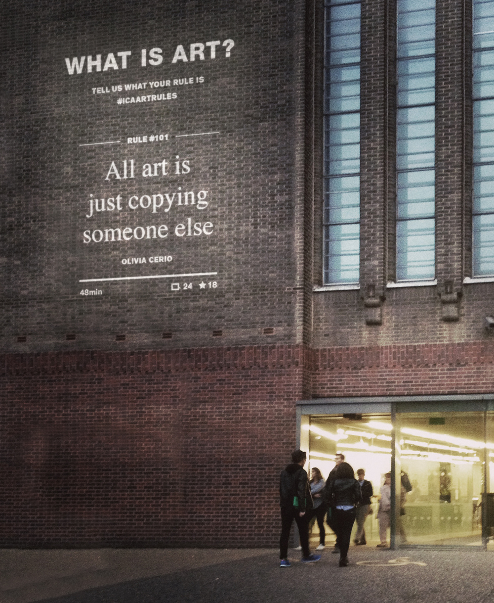

<a class="btn" href="http://artrules.ica.org.uk" target="_blank">Launch website</a>
<a class="btn icon icon-star" href="http://www.thefwa.com/shortlist/art-rules" target="_blank">FWA Shortlist</a>

The [ICA, Institute of Contemporary Art](https://www.ica.org.uk/), has been in the forefront for arts for decades. It was finding difficulties keeping up with today’s social media age and needed to be part of the online art conversation. We ([SapientNitro](http://www.sapientnitro.com/), London) built a platform to encourage people to challenge what art really means.

My role in this project was mainly focussed working on the physics and animations. Tech used includes: Ruby on Rails (RoR), HAML, Heroku, Github, SASS, CSS3 animations and Javascript Box2d 2D physics.

The major challenge in this project was to achieve fast animations on tablet devices. I had to explore different ways of rendering the circles, mostly with canvas or DOM elements and CSS3. At the end, due to the full screen nature of the animations, I decided to use DOM elements and apply realtime CSS3 transformations (hardware accelerated) to animate the circles. I used Box2d to calculate the physics for the attraction forces and pushing the circles around when resizing them. The mousewheel and the swipe events of touch devices, act as circle generators. As soon as the circle gets out of the screen dies and we create a new one on the other side of the screen.

