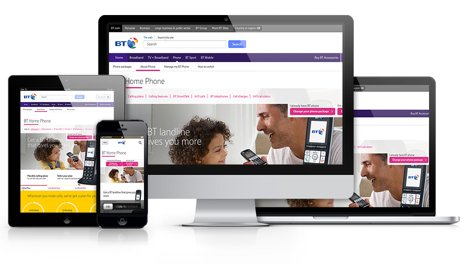
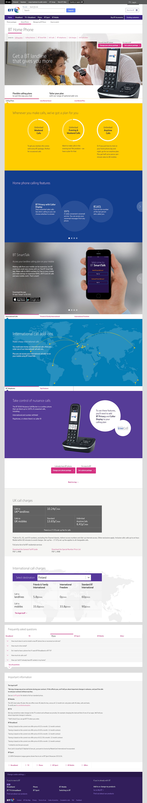
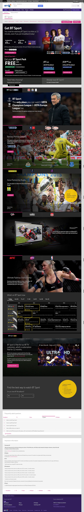
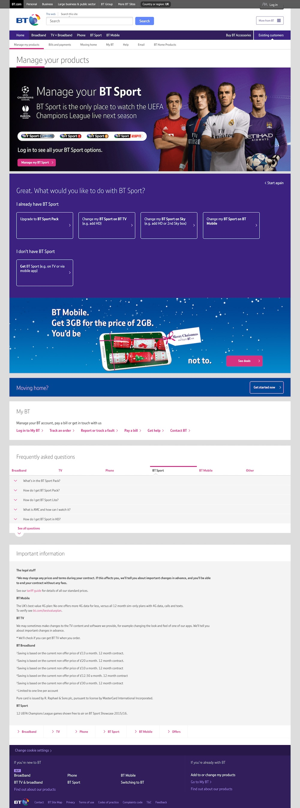
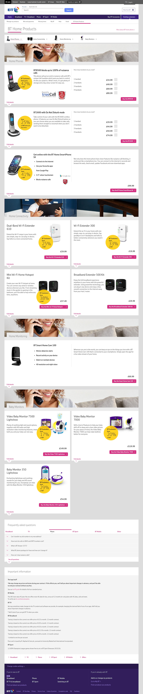
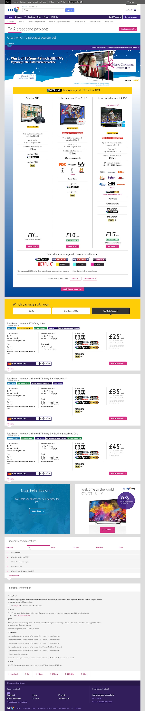
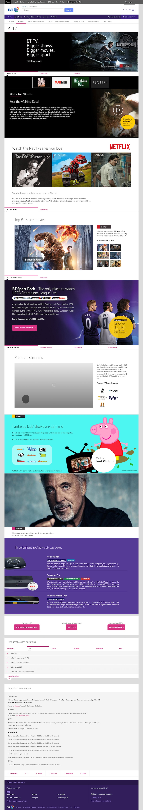

<a class="btn" href="http://productsandservices.bt.com" target="_blank">Launch website</a>

As part of SapientNitro, I co-led the development of the end to end redesign of a responsive front-end for BT, the UK's biggest telecommunications company with millions of customers. I also took full responsibility of the product overview pages (Phone, Broadband, TV and Sport), developing all their shelves responsively.

The site uses the latest front-end technologies, including the [Grunt](https://gruntjs.com/) task runner and a static site generator called [Assemble](http://assemble.io/). I also designed and coded several iOS compatible HTML5 canvas animations made with Adobe Flash CC.

The development phase had a very tight deadline and we had to push our limits to build a fully responsive robust architecture with an innovative design and real time data for Sport and TV shows events.

Once we went live with the site, I continued involved in the project for a few weeks to hand over the platform to BT. Since then, the site has continued evolving.

