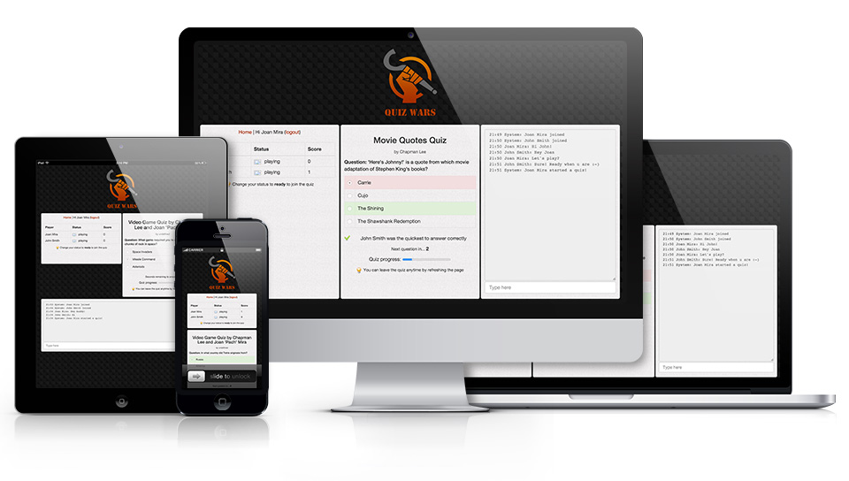

<a class="btn" href="http://quizwars.herokuapp.com" target="_blank">Launch demo app</a>

QuizWars is an R&D experiment that I did while working at SapientNitro. My aim was to learn about realtime bidirectional communication between the server and the clients.

I also wanted to learn more about Node.js and sockets. I decided to use the Sails.js framework and build a quiz app. You can learn more about the project in the [tutorial article](/tutorial-how-to-build-a-multi-player-quiz-app-with-sails-js/) I wrote about it.
