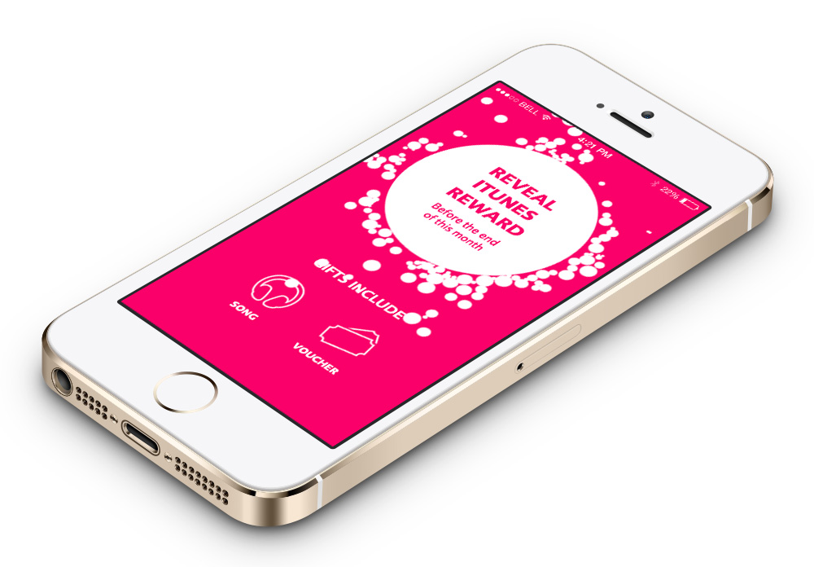
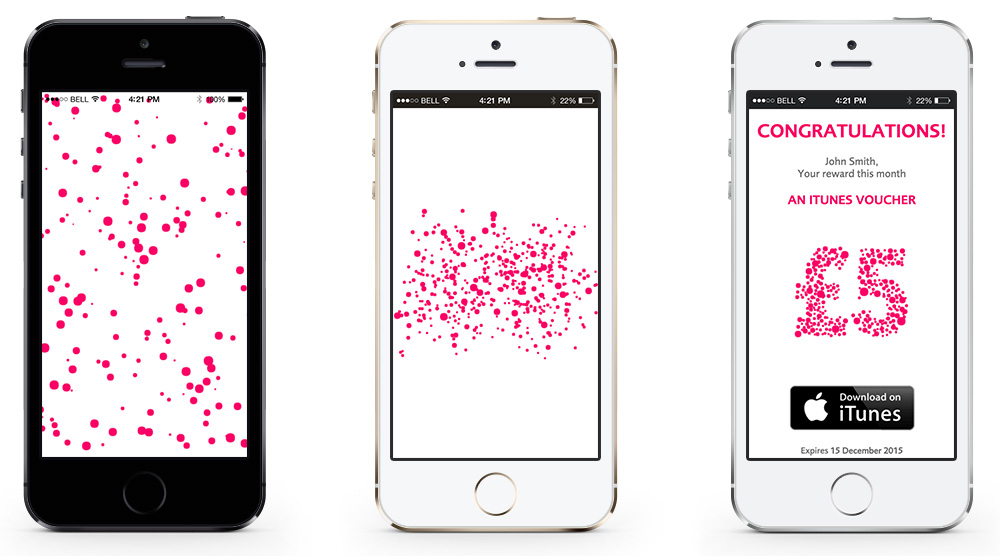

The project brief consisted of creating an animated journey for an iTunes contest in the Vitality's mobile app. The idea was to reveal slowly the price won by the user and the design involved the use of particles and dynamic random prize withdrawal.

After exploring different options with Box2d physics and CSS3 animated DOM elements, I decided to use a mix of Box2d and SVGs illustrations made out of small dots (particles). These particles are loaded into a javascript array using an SVG Ajax loader and then rendered and animated in an HTML5 canvas.

The whole animation journey has two different stages. In the first one, I use Box2d to create the attraction forces that pull and push the particles to the big white circle. When the user taps on it, we load the second stage, seen in the following image.

Once the user has tapped into the white circle, this resizes to fill the whole screen and then thousands of particles explode from the center of the screen and start moving around randomly.

The particles then start to slow down and at some point they get together to start forming the shape of the prize won. The final illustration can be anything, from a voucher in pounds to a headphone or whatever the designer created with Illustrator.

Once the illustration is formed by the particles, these keep moving slowly without losing the shape of the illustration.
