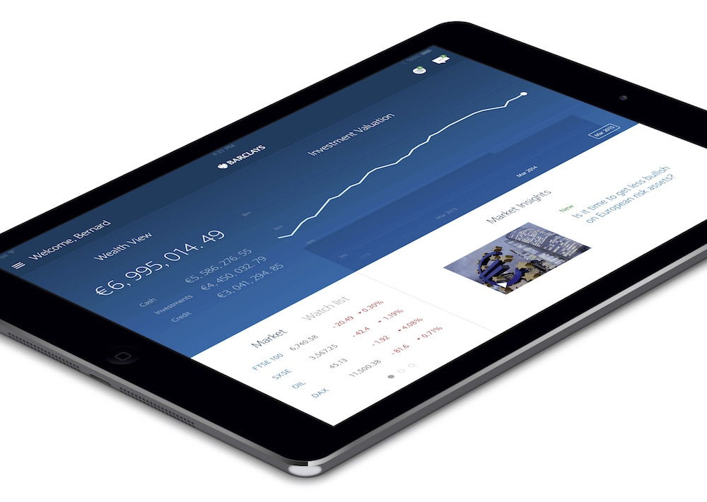
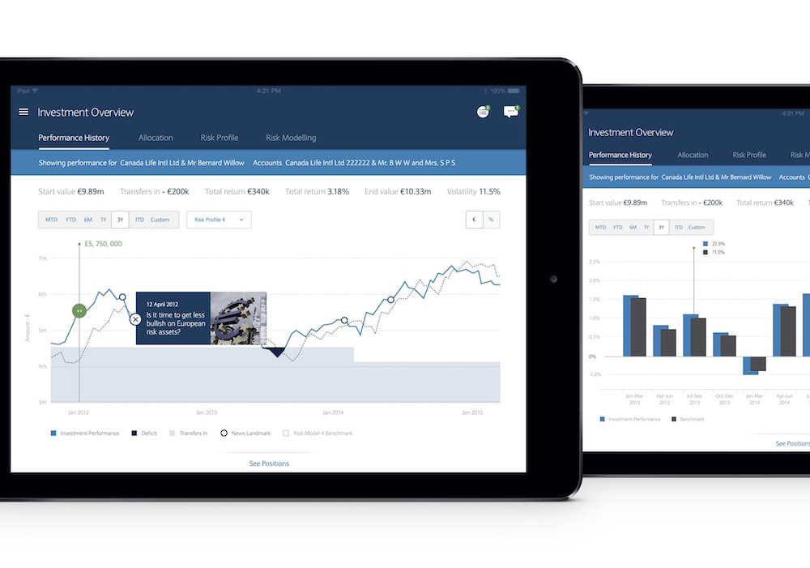
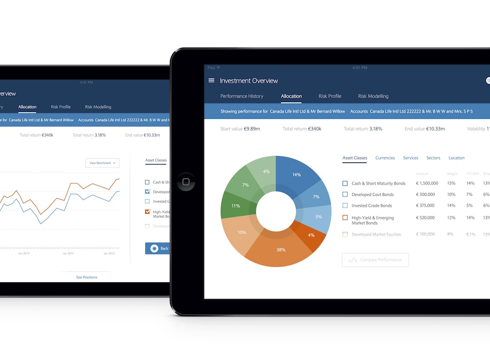
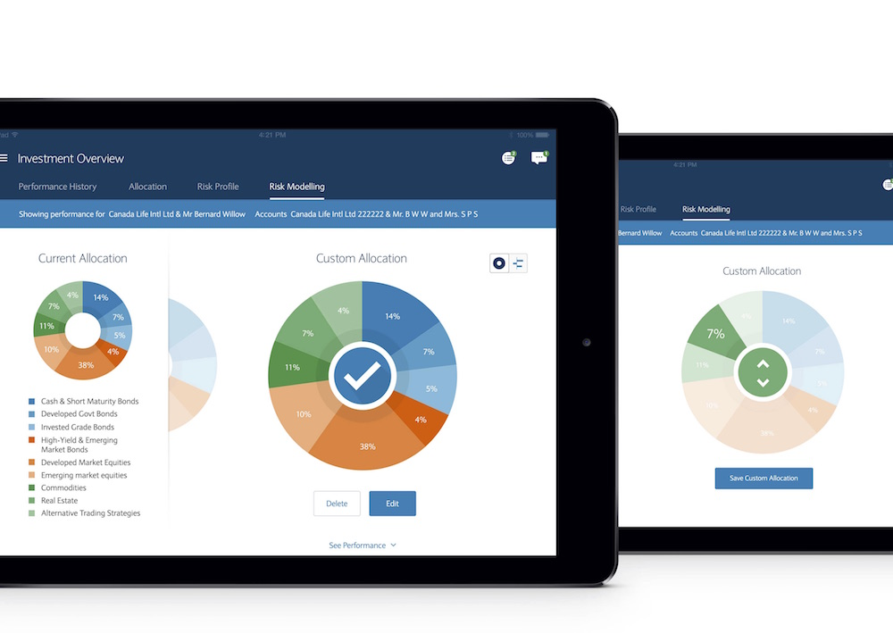
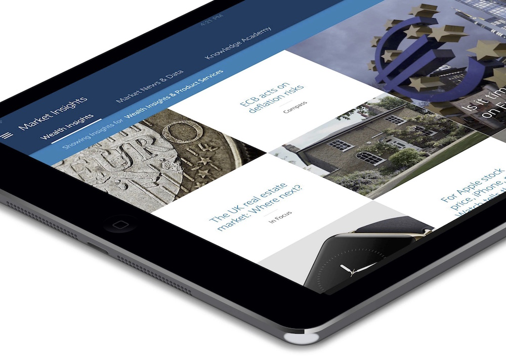
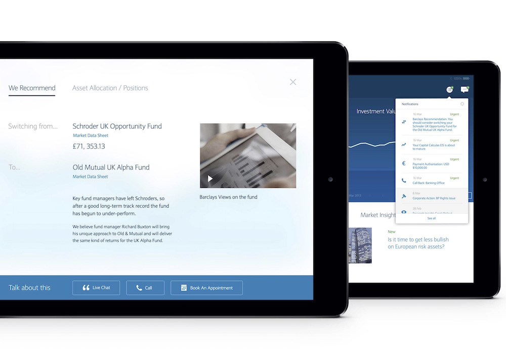
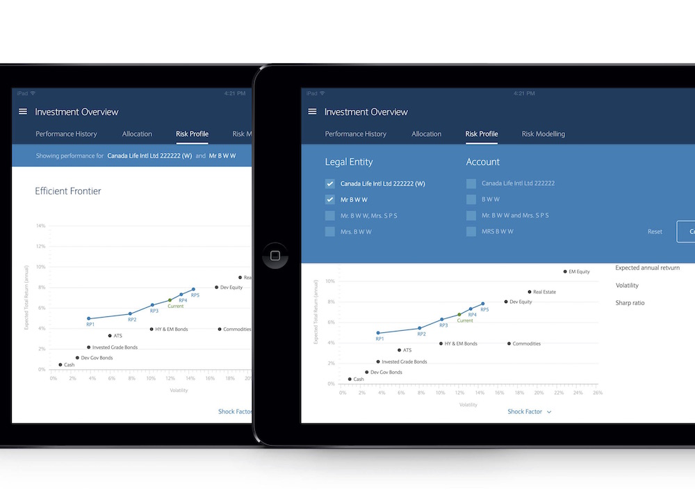

While working at SapientNitro, I built an iPad prototype for Barclays based on Adobe AIR and compiled as a native iOS app.

This quick project included draggable controllers with dynamic data, animated charts and transitions, swipeable pages and panels and video playback.

