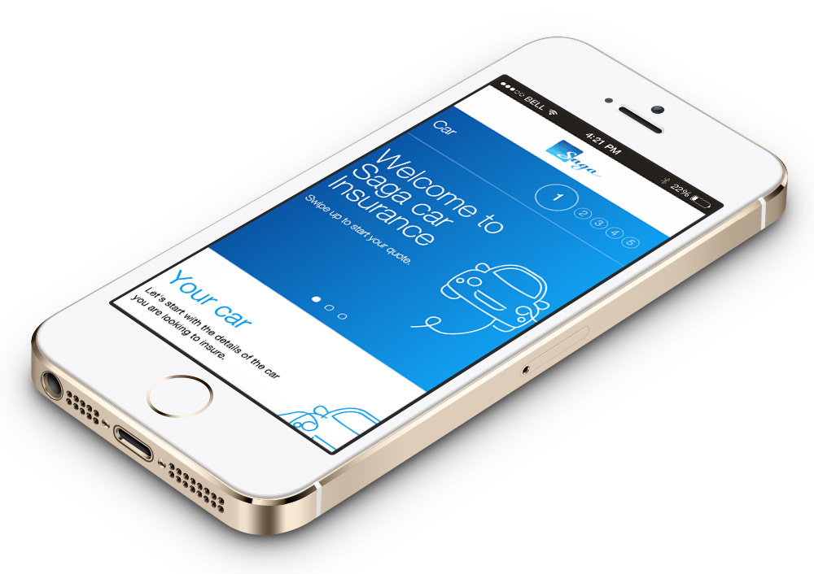
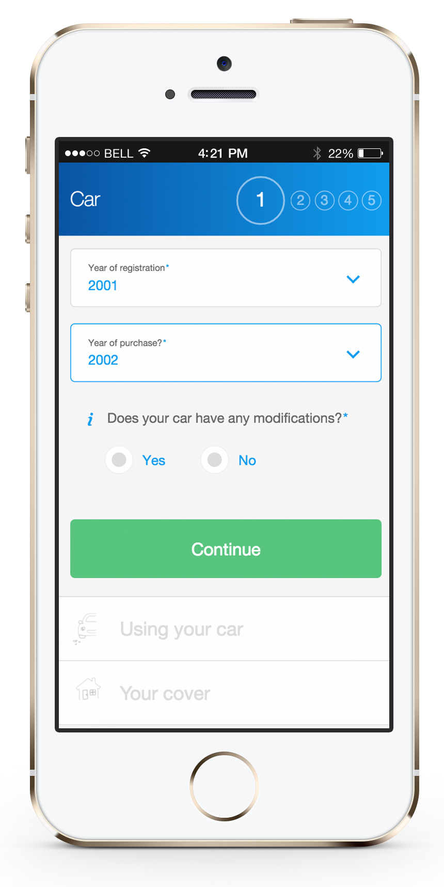
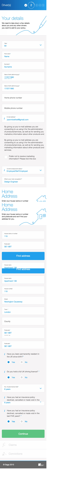

<a class="btn icon icon-external" href="https://m.saga.co.uk/insurance/car-insurance/get-quote/Vehicle" target="_blank">Launch website (check on mobile)</a>

SAGA and SapientNitro worked together in a new mobile journey for SAGA's car insurance service. As part of the development team, I took responsibility of the front-end, working together with a junior developer and a senior manager to implement the new designs.

One of the constraints that we had to face, was the Microsoft .Net tech stack. We were not experienced with .Net, but quickly learned the basics around Microsoft Visual Studio and the development environment to start adapting the mobile views from their MVC application.

At some points, when we were working in the address lookup or the addons, we also had to tweak the controllers to make them more flexible and allow us to implement the new designs.

The date picker component was also an interesting challenge, mostly due to the fact that we couldn't use the native HTML date pickers for Android and iOS. The W3C set a very strict date format, which if you wanted to use, it would have meant we had to rewrite a big portion of the application. Therefore, we decided to use [pickadate.js](http://amsul.ca/pickadate.js/), which turned out to be very nice and fun to work with.

The input fields are also quite innovative in the way their labels resize within the inputs and dropdowns. This gives the customer a better UX, allowing them to know at all times the name of the fields whilst optimising the space.

The journey was divided also in collapsable sections, which helps the user to focus their attention in a step-by-step fashion. This makes the process easier to diggest.

From a front-end perspective, we also implemented form validation, responsive sliders, scrollable overlays, navigation animations and other custom form elements.

