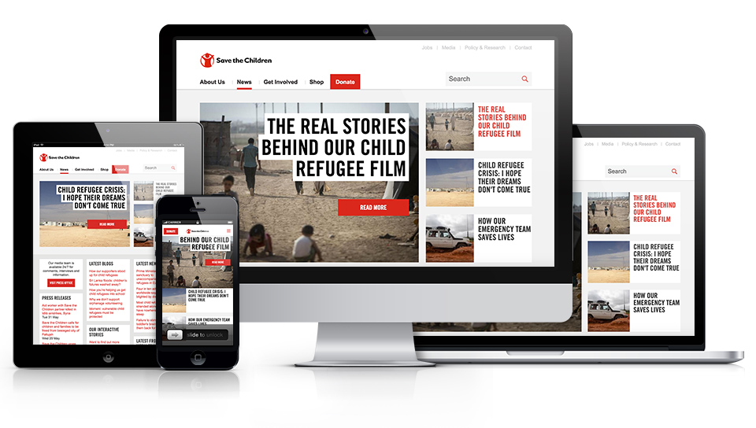

During my assignment to Save the children's project, I helped the organisation by doing a tech audit of the new website they were building.

I covered the following areas:

* Content optimisation and basic SEO
* Semantic markup
* Accessibility
* Site architecture and internal linking
* Technical issues
* Site speed
* Mobile
* Search indexation

At the same time, I also built a mega-menu for their new Drupal website and researched about how to implement a responsive asset management system with Amazon AWS.
