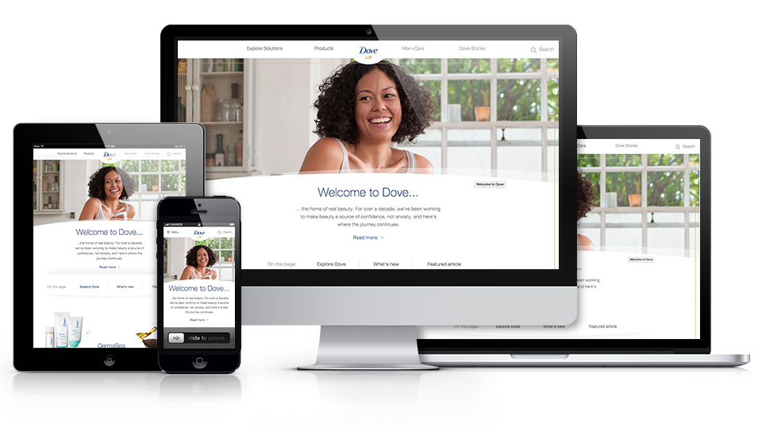
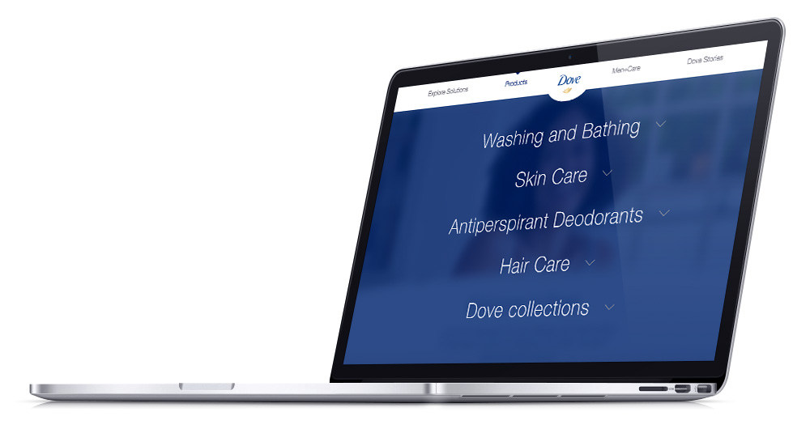
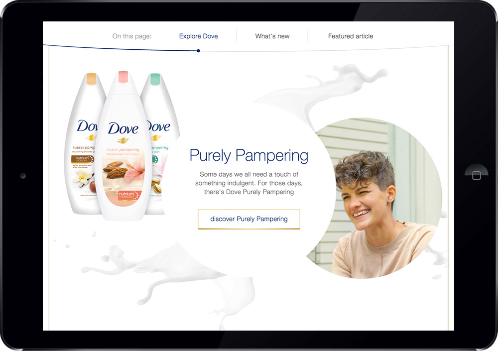
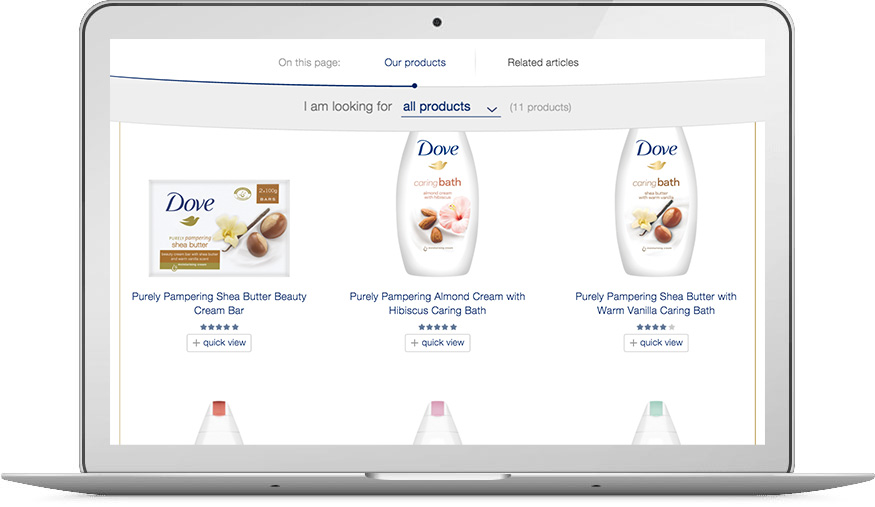
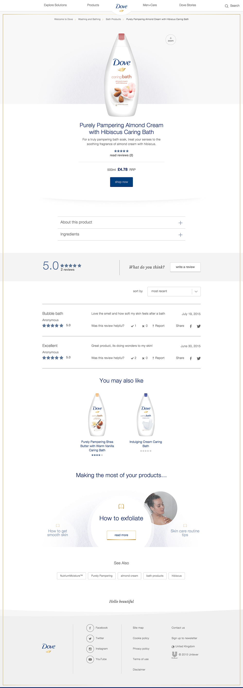

<a class="btn" href="http://www.dove.com/uk" target="_blank">Launch website</a>

The new Dove website is part of an ambitious Unilever project led by SapientNitro to change the platform used by many of its brands.

This new platform uses a modern tech stack (based on Backbone.js) and CMS solution like Adobe Experience Manager, allowing Unilever brands to reuse components and themes to design their websites.

My involvement in the project was in the front-end area, where I co-led a group of eight developers. We built white-label components and dove-specific components like the main navigation, carousels, lightbox, anchor link navigation, zoom, PDP, PLPs, quick view, search, footer, etc.

The platform allowed us to build the components with a clear separation between data and functionality, which gives them a lot of flexibility to be reused and customised in other websites.

One of the areas I clearly took responsibility of was the animations and the navigation components. We experimented with many different animation techniques (specially with parallax) and devices to maximise and guarantee a smooth interaction and pleasant user experience across all browser breakpoints and a wide range of devices. Old iOS devices still have issues running native browser scrolling events and javascript logic at the same time, which complicated things, but after many tests, we came out with a subtle parallax animation (which can be seen in the homepage).

Another interesting part of my work in this project is related with the navigation. I built both, the main navigation and the anchor link navigation. The first one features an innovative single column scrollable menu in the desktop view and a multi-column scrollable menu in the mobile view. Both approaches use the same markup, which was quite an achievement due to the complexity and differences between both modes.

Aside from the development tasks, I also was involved in many of the interactions with the design, UX, content, platform and QA teams. We followed a an Agile methodology, which means morning stand-ups, continuous refactoring, Jira issue tracking, back-end and front-end integration stage, etc. We also started to use Sketch and Zeplin rather than the classing Photoshop PSDs.

All an all, it was project with a very tight timeframe and ambitious requirements but with a setup which allowed me to have a more managerial perspective than previous projects. The target is always to learn new things and continue to improve my skills in web development, so I'm glad we could deliver it on time and with the right quality.

