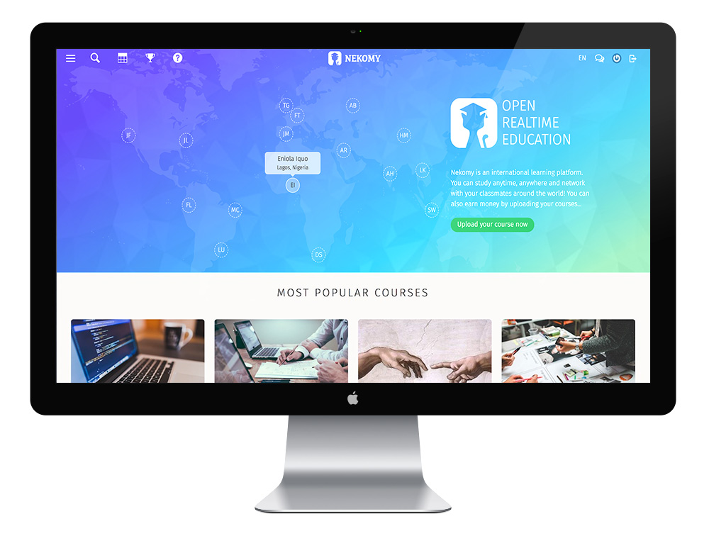
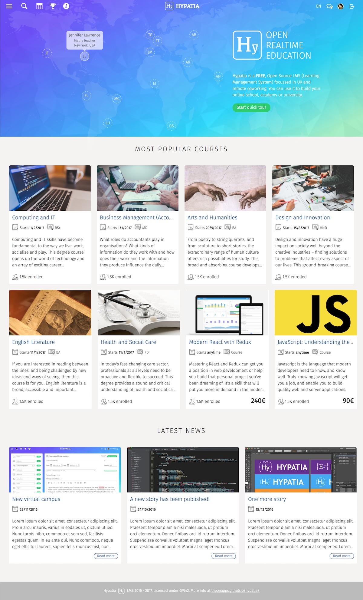
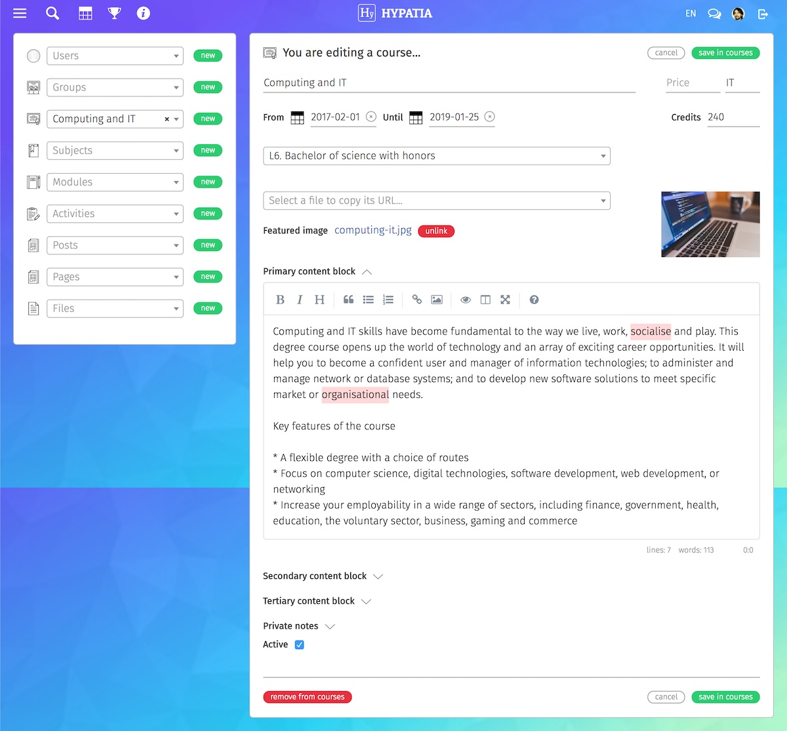

<a class="btn" href="https://github.com/nekomy/nekomy-platform" target="_blank">Source code</a>
<a class="btn" href="https://nekomy.com" target="_blank">Demo</a>
<a class="btn" href="https://nekomy.github.io/nekomy-platform/" target="_blank">Project website</a>

Nekomy, previously known as Hypatia, was my University final project. It is an open source LMS (Learning Management System) focussed on MOOCs.

<iframe width="560" height="315" src="https://www.youtube.com/embed/YlZpcrvJcbs" frameborder="0" allow="accelerometer; autoplay; encrypted-media; gyroscope; picture-in-picture" allowfullscreen></iframe>

