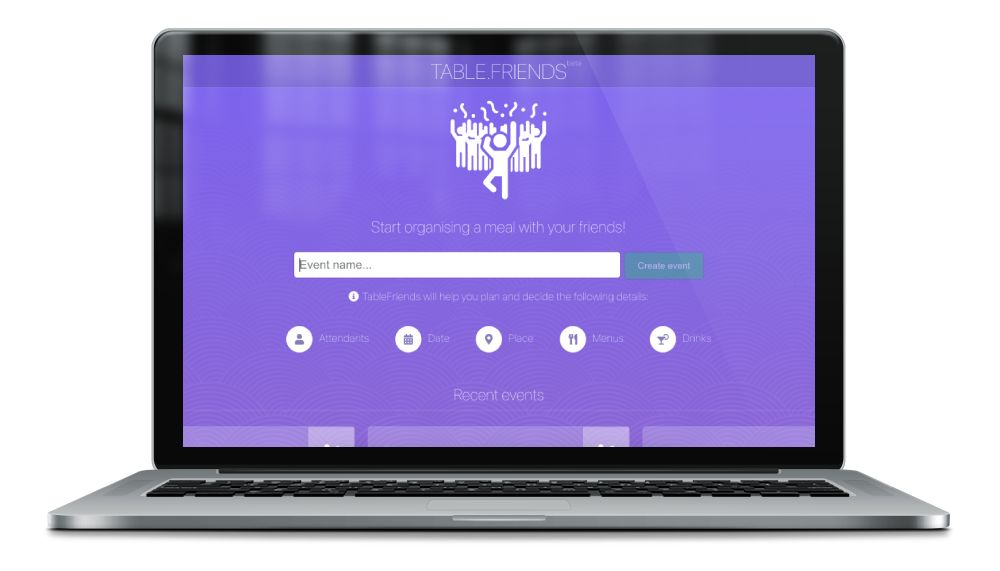

<a class="btn" href="https://tablefriends.netlify.app/" target="_blank">Live App</a>
<a class="btn" href="https://github.com/gazpachu/tablefriends" target="_blank">Github repository</a>

TableFriends is an open-source web app prototype (not ready for production) to organise restaurant events for big groups of people. It helps them to find the right date, time, course and drinks. The admin user can select all the different options and the guests can choose what are the preferences. Once the deadline is reached, the options with more votes get selected and the admin can proceed to make the restaurant reservation.

I built this app to practice a few technologies that TableCheck was using before my first day of work at the company. My colleagues were very pleased with the idea and eventually we wanted to finish it and launch it as a company service but we never found the time to do it. Hopefully in the future.

The app is based on React, Emotion, GraphQL, Prisma, Lambda and Netlify.
