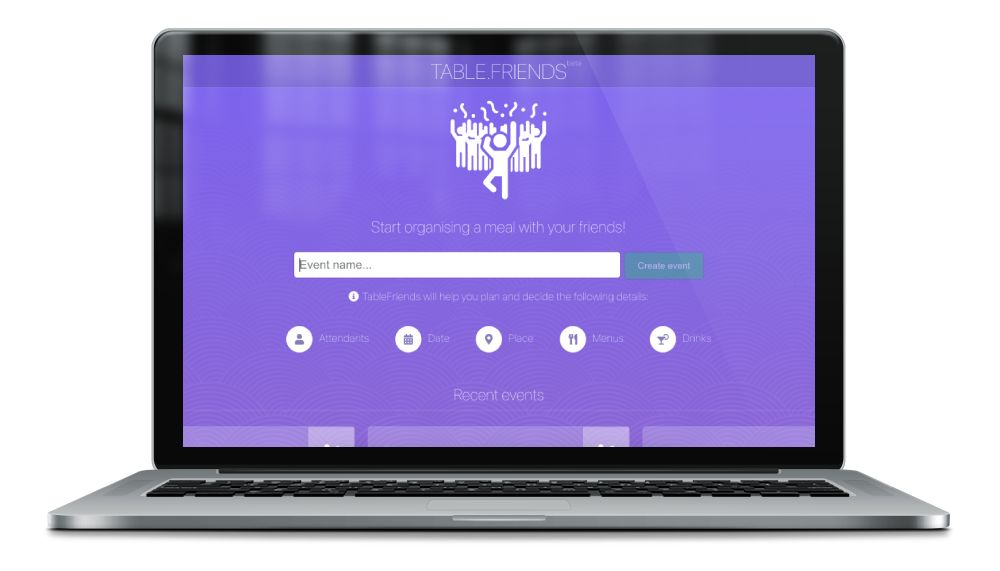

<a class="btn" href="https://tablefriends.netlify.app/" target="_blank">Live App</a>
<a class="btn" href="https://github.com/gazpachu/tablefriends" target="_blank">Github repository</a>

When I joined TableCheck, I started to work on their Data Science team as the front-end lead. During one year, I managed to bring the product from its initial prototyping stages until its release in August 2019 in 3 languages. Together with the Head of Data Science and a team of 3 front-end engineers and 3 back-end engineers, we built one of the most advanced analytics suite in the industry for TableCheck’s customers like Hilton, IHG Intercontinental, Hyatt, Westin or Okura hotels among others.

After the release, I was promoted to Engineering Manager and moved to other projects within TableCheck.

##What is exactly Insight?

Insight is a restaurant data analytics tool for management-level reporting, data visualization, forecasting, and AI decision-making. Whereas TableCheck automates restaurant operations, Insight complements the core product suite by automating business decisions for restaurant managers, marketing directors, and revenue managers. The primary goal with Insight is to help restaurants improve their own efficiency by identifying and monetizing patterns in reservation and diner experience. Insight's success comes from simplifying the organization and display of complex information without sacrificing the power and flexibility to answer any question.

The front-end tech stack involved React 16, GraphQL, Apollo, MobX, Flow, Emotion, ReactVis, i18Next, Lokalise, ReactPDF, Lodash, MomentJS, TableCheck’s own design system and UI component library and other NPM modules.

###Preset Dashboards

Insight includes preset dashboards that contain curated charts to answer specific questions.

There are a number of standard dashboard templates available that can be used readily. Insight includes the following preset dashboards:

- **Revenue**: how much revenue was received and what is its breakdown
- **Reservations**: why, when, and how did diners make reservations
- **Cancellations**: why, when, and who cancelled reservations
- **Occupancy**: diner occupancy characteristics by day of week, time of day, etc.
- **Online** Providers: the characteristics of reservations booked via an online source such as TableCheck or an OTA like OpenTable, Tabelog, etc.
- **Channels**: the characteristics of reservations booked via preset or custom marketing channels.
- **Forecasts**: an overview of expected revenue, total diners, cancellations, walk-ins, and no-shows.
- **Upcoming**: reservation counts and total number of people for the week to come (including today)
- **Surveys**: how did diners rate the food, service, atmosphere, and value and how was the survey response rate (data are only visible for venues subscribed to Survey)
- **Text Messages**: where, when, and why were text messages sent to diners
- **Waitlist**: how long did diners have to wait before being seated

###Custom Dashboards

In addition to the preset dashboards, you can create an unlimited number of custom dashboards by organizing charts and tables of your choice. Any chart from the preset dashboards can be added to the Custom dashboard.
