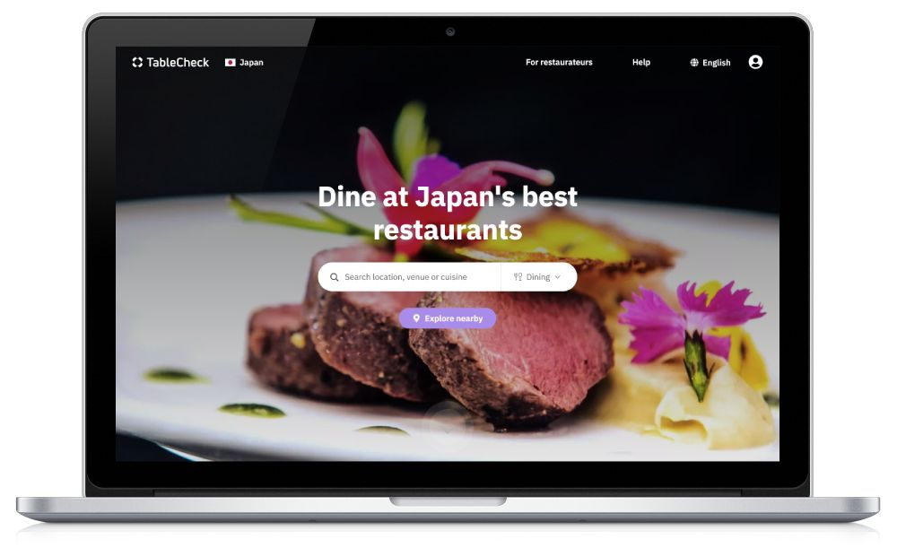
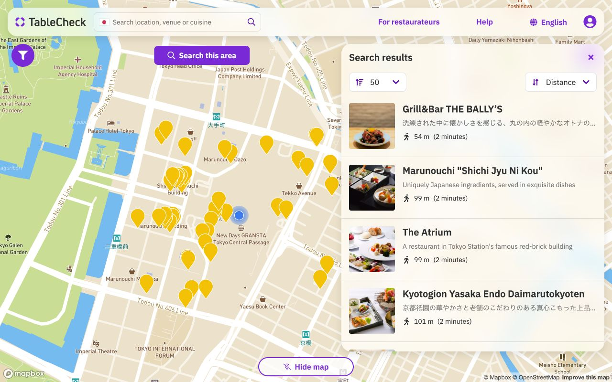
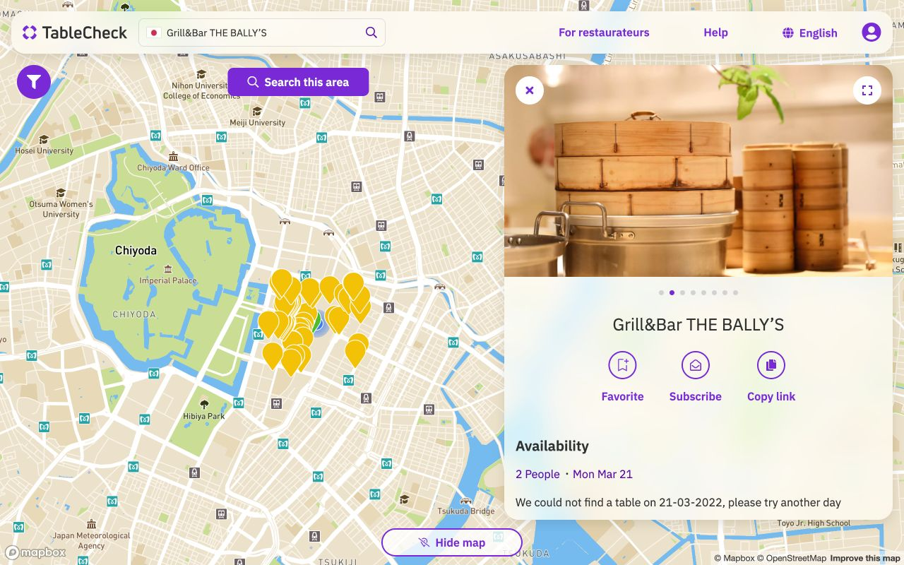
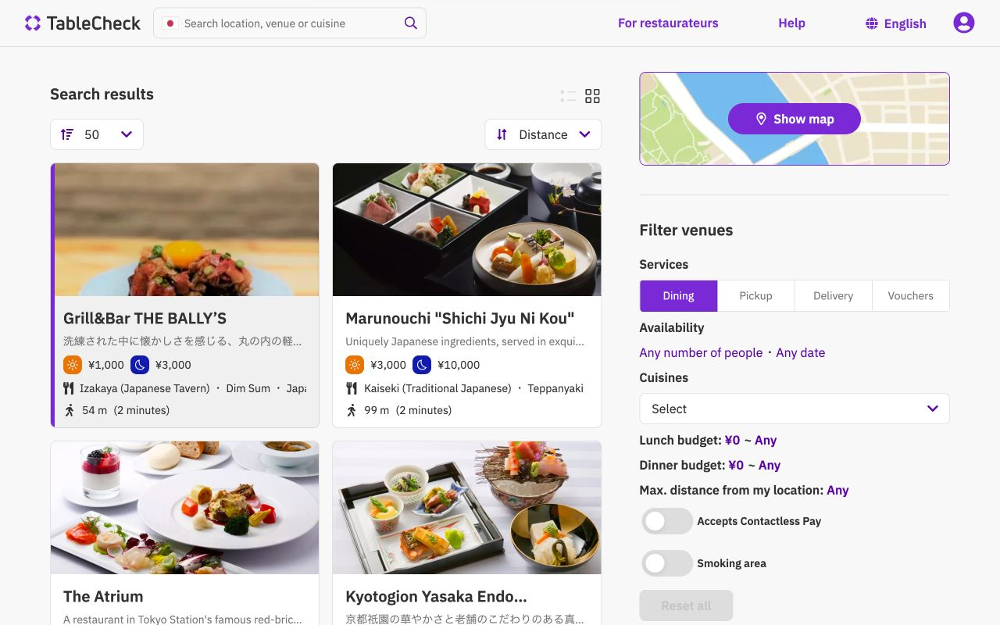
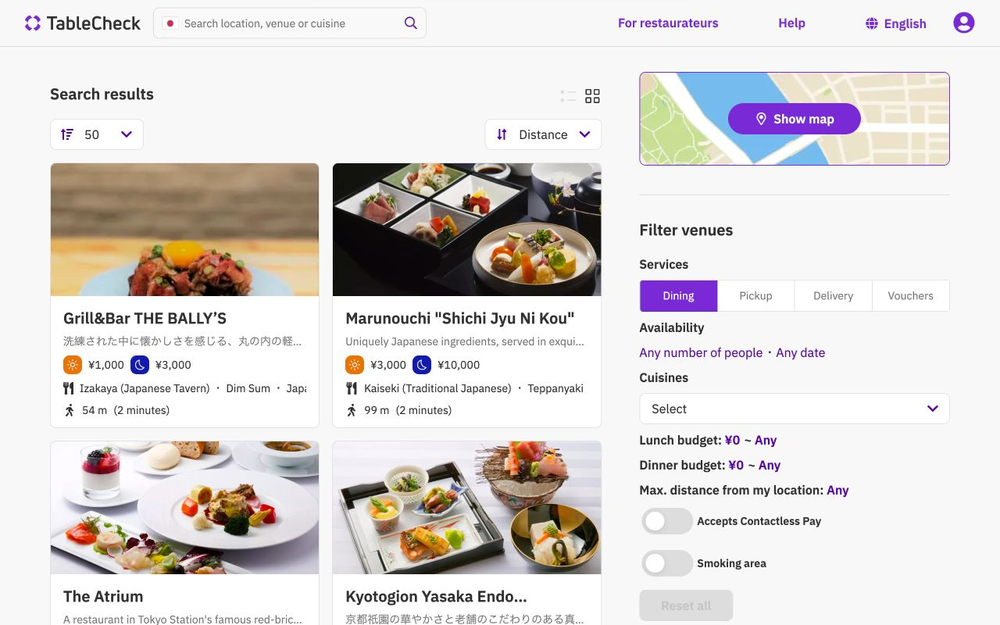
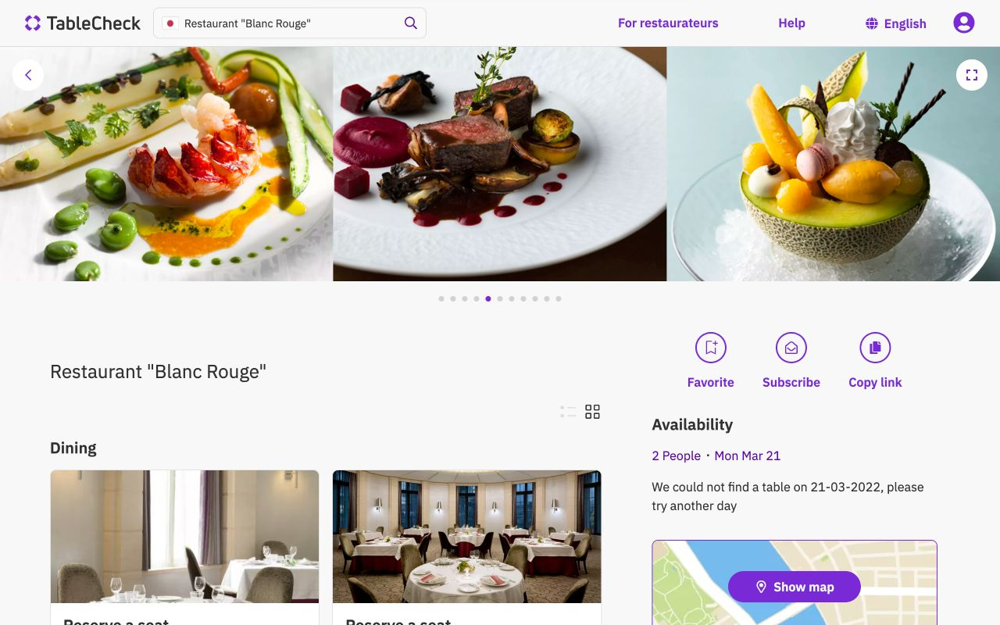
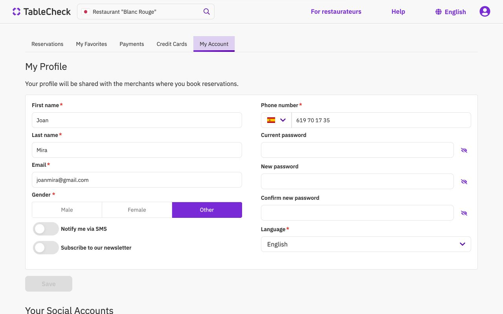
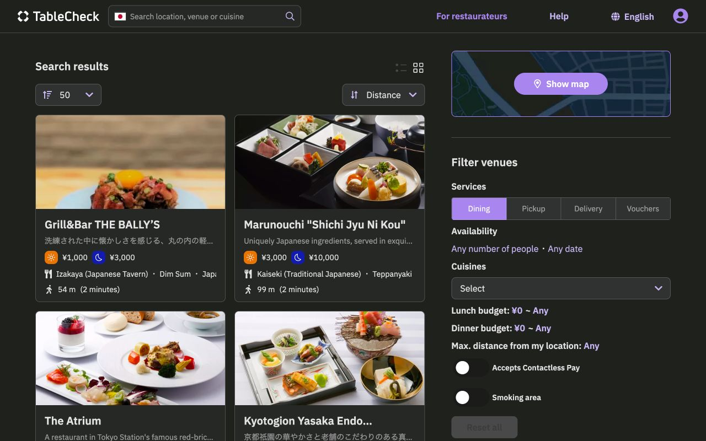
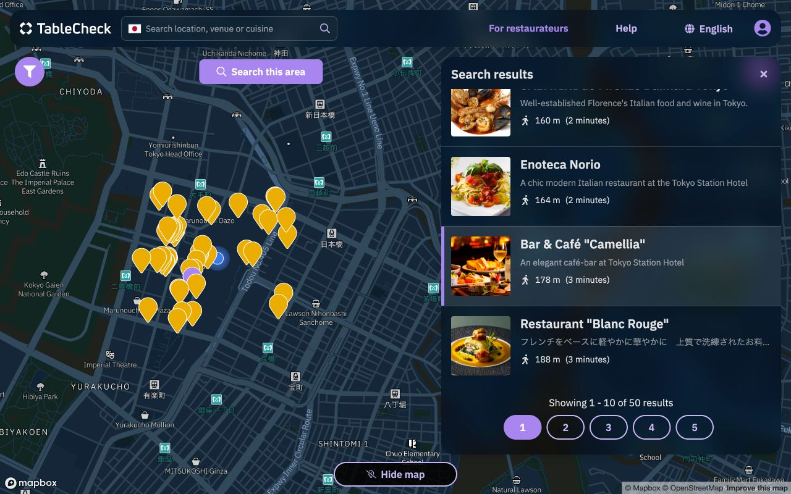

<a class="btn" href="https://diner-app-spa-staging.tablecheck.com/" target="_blank">Demo App</a>

The new Diner App is a renovated version of the app currently published at tablecheck.com. It's a restaurant search engine with multiple filtering and display options. It also includes a user account section where diners can manage their TableCheck reservations. It is based on <a href="/wekohi">Wekohi</a> but with many new upgrades, some of them include:

- A new homepage design with easier to update banners
- Venue search available from any page with command palette
- Map view (using MapBox) with real-time user GPS tracking
- New search filtering UI with room to scale
- Updated tech stack to latest React, Typescript, and TableKit
- Reduced codebase and JS bundle size
- Simplified CI & Infrastructure. Moved from SSR to SPA + prerender.io (for SEO)
- Full support for light and dark mode

Some other planned features include:

- Ability to create and share custom lists, rankings, and selections of venues
- CMS Integration for the homepage
- Implement a venue review system based on aggregated reviews, or use something like Kuchikomi.com or partoo.com 
- Add more specific filters, like remote work / pet / child friendly

###Screenshots

