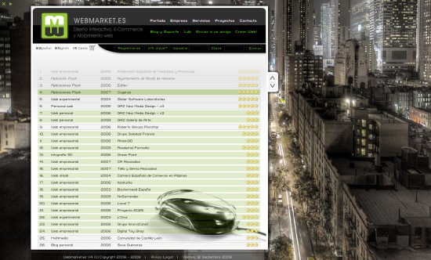

Llevamos ya varias semanas con cambios en los servidores de Webmarket, algo muy entretenido… pasando las noches junto a entrañables protocolos achetetepe y efetepés, hablando sobre la política de deeneeses, probandonos los nuevos parches de moda, … en fin, todo un festival de tecnologismos (atención, no se sí existe la palabra) y demás “amenities” para geeks y profesionales de internet.

Aprovechando este estado de reorganización, también nos hemos lanzado a arreglar el muestrario de trabajos de webmarket (por fin!) y ahora sí… podemos espetar al mundo… ya funcionan todos los links! y ya podeis criticar con fundamento nuestras humildes creaciones. La [foto de fondo](http://upload.wikimedia.org/wikipedia/commons/2/22/New_York_City_at_night_HDR.jpg) no es nuestra.

Como **objetivo para este año 2008/2009** estaría bien crear un proyecto original digno de un mismísimo **premio [FWA](http://www.thefwa.com)**. Ya tengo una idea que me gusta mucho y que por ahora no la he visto en ningún medio de carácter interactivo. Si alguien se anima a participar en este proyecto, podéis escribirme a joan (at) webmarket.es . Cualquier ayuda será bienvenida y espero que la recompensa sea de tamaño MAYÚSCULO! :)

