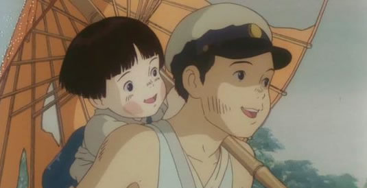

<iframe allowfullscreen="" frameborder="0" height="340" src="http://www.youtube.com/embed/XMY2Op1jYdw?feature=oembed" width="604"></iframe>

*Resumen de la película [Tema musical del final “hotaru”]*

Acabo de terminar de ver “[Hotaru no naka](http://www.imdb.com/title/tt0095327/)” [Japón, 1988] y me ha dejando en tal estado de preocupación e intranquilidad, que me veo obligado a retrasar la hora de ir a la cama para poder escribir unas palabras aquí sobre esta historia tan triste…

Lo primero de lo que quiero hablar es de lo asombrado que estoy (ya que es la primera vez que me pasa) de que una película de dibujos animados como esta, pueda llegar a “tocarme” tan profundamente. Normalmente, aunque sea de forma inconsciente, solemos asociar rápidamente los dibujos animados con historias que están muy lejos de la realidad y por tanto, es dificil que éstas lleguen a ser algo más que simples entretenimientos. Sin embargo, en algunas peliculas de anime, las historias están tan bien escritas y hechas que puede que nos pille con la “guardia baja” y acabemos lloriqueando o con un *traumatismo intelectual*™ severo sin darnos cuenta.

No voy a contar nada del argumento de la película, pero sí que voy a hablar del autor, [Akiyuki Nosaka](http://es.wikipedia.org/wiki/Akiyuki_Nosaka "Akiyuki Nosaka"), nació en 1930 en la ciudad de Nakamura, situada en la prefectura de Kanagawa; su nacimiento provocó una grave enfermedad a su madre, que, por ello, no podía hacerse cargo de los pequeños y la familia se trasladó a vivir con su tía; no obstante, su madre se recuperó y la familia tuvo otra niña, Keiko. En 1945, durante los intensos bombardeos estadounidenses, su padre murió y su madre enfermó gravemente. Poco tiempo después, su hermana también murió debido a la malnutrición… Los que sepáis de qué va la historia podréis apreciar en la historia que Hotaru no Haka (La tumba de las luciérnagas) nos narra clarísimas similitudes con respecto a su vida real. Nosaka es principalmente un escritor de la posguerra, que narra las contradicciones de la sociedad japonesa de ese periodo, pero a la vez hace hincapié en las causas que provocaron la participación de Japón en dicho acontecimiento histórico. En Hotaru no Haka podemos apreciar una crítica a la sociedad tradicional japonesa, en el sentido de la forma en que se involucró en la guerra, y también en la forma tradicional de ver la vida típica de ese país encarnada en su tía, que no entiende las motivaciones de Seita, el protagonista, y los deja marchar a sabiendas de que eso a la larga conllevará su muerte por inanición.

Hotaru no Haka es sobre todo un alegato pacifista, pero a la vez pesimista… el autor no escatima los detalles a la hora de describir la penosa situación de Seita y su hermana Setsuko, la miseria en que están obligados a vivir, la despreocupación del resto de la sociedad ante sus problemas. En definitiva, una serie de acontecimientos y actitudes que desembocan inevitablemente en un desenlace trágico…

Nos hallamos ante un retrato de la sociedad japonesa de la posguerra, narrado con un estilo agridulce, triste, muy acorde con la historia que nos está contando, tristemente real y, sobre todo, muy creíble. En este sentido, los que habéis visto la película, si leéis el libro, apreciaréis que ésta sigue fielmente la historia de Nosaka punto por punto, pero hemos de decir que Nosaka es un autor, como casi todos los de su generación, extremadamente realista, así que no encontraremos en este libro las dosis de lirismo que se pueden apreciar en la película homónima, sino áridas descripciones de la realidad, aunque siempre vistas desde el punto de vista del protagonista, Seita -alter ego del escritor, sin duda-.

En definitiva, una historia triste, pero a la vez totalmente recomendable. El mayor pecado de la humanidad es olvidar la historia, y esta triste historia nos otorga la oportunidad de **no olvidarnos de lo triste que puede ser la guerra**, y de las funestas consecuencias que todo acontecimiento de este tipo lleva consigo.
