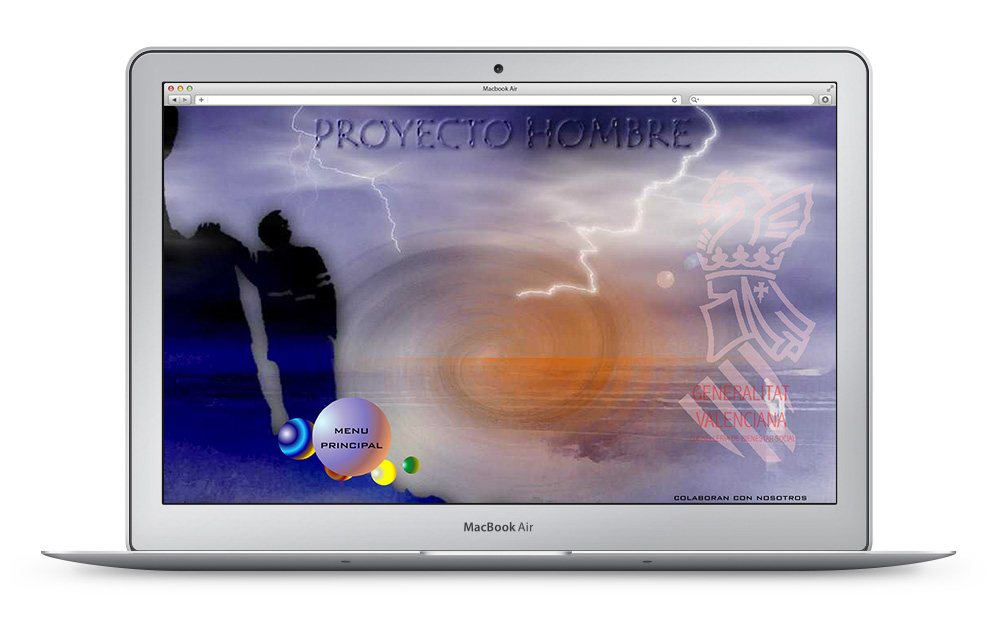
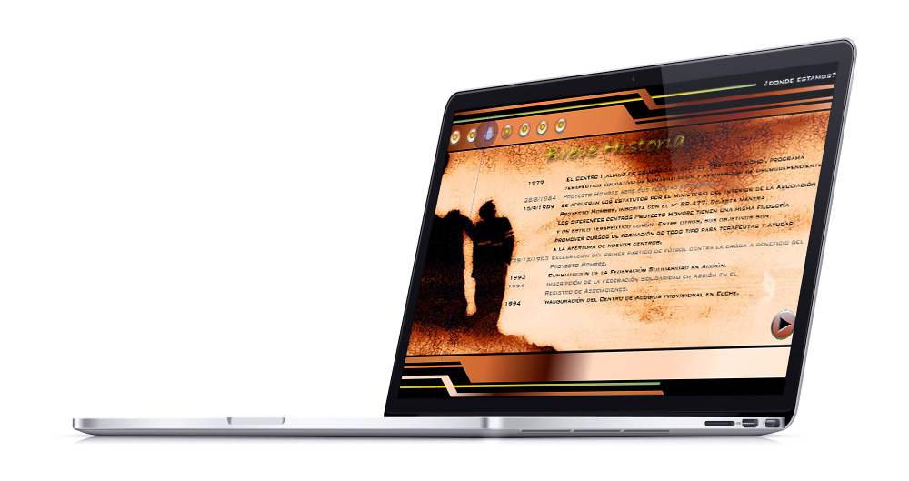
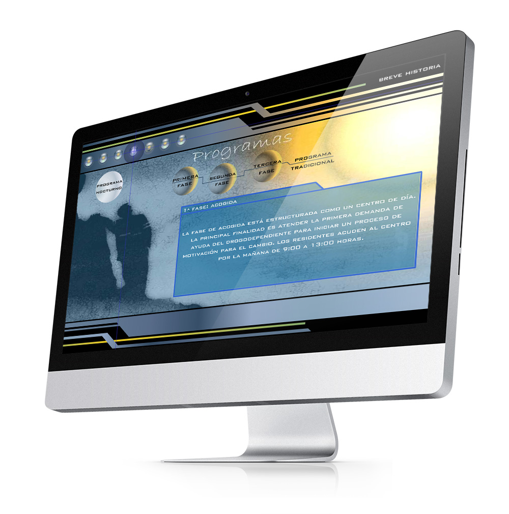

<a class="btn" href="http://work.joanmira.com/webs/phombre/" target="_blank">Launch archived template</a>

While working at Grupo Odesa, I was asked to build a website for Proyecto Hombre. An organisation supported by the Valencian government to help drug addicts. The whole website was built in Flash, using many animations and vivid colours.

