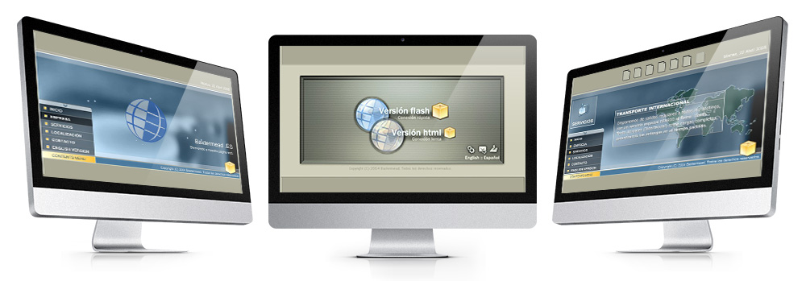
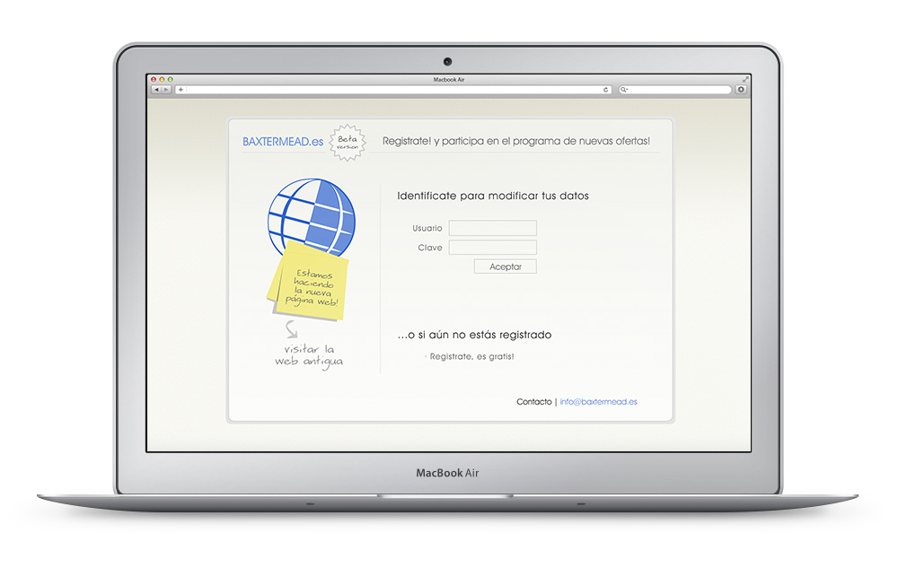

<a class="btn" href="http://work.joanmira.com/webs/baxtermead/" target="_blank">Launch v1 website</a>
<a class="btn" href="http://work.joanmira.com/webs/baxtermead/v2" target="_blank">Launch v2 prototype</a>

Baxtermead was a special project. Mainly due to my friendship with its general manager, but also because it was one of my first clients. The first version was built in Flash and HTML. For the Flash version, I put special care into the animations. It was a very custom website with many details.

At some point, we started to work on a new version, but the company had financial issues and it closed without having enough time to finish the new website.

