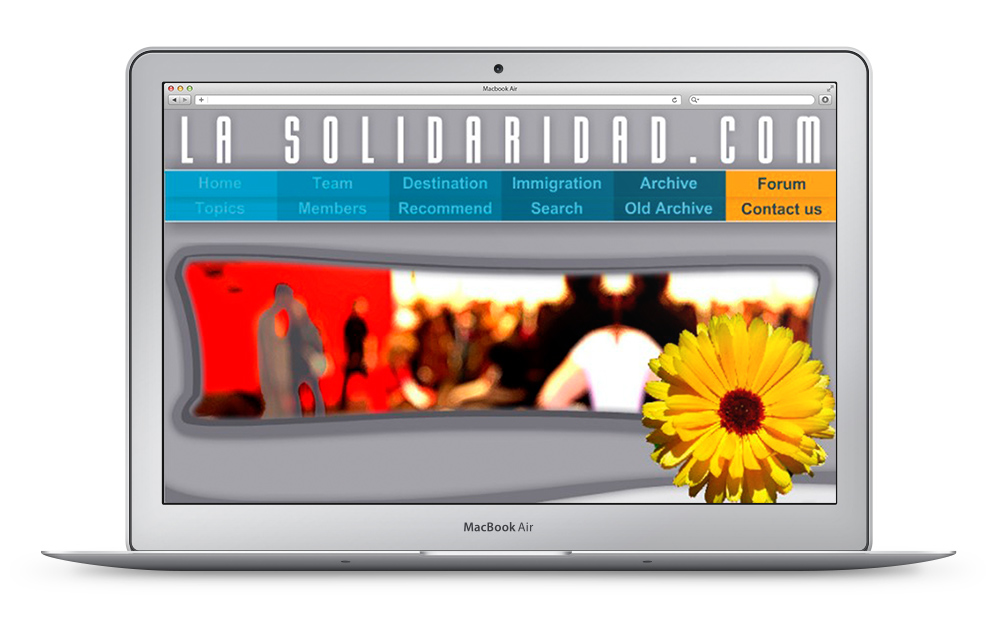

<a class="btn" href="http://lasolidaridad.herokuapp.com" target="_blank">Launch archived website</a>

La Solidaridad was a personal project (together with my wife). It's purpose was to be an online newspaper to talk about ecology, immigration, politics, economy, etc.

It was also like an online playground where I could explore and practice with graphic elements, animations within a CMS like PHP-Nuke.

After some time, the website was migrated to Joomla and the theme became more impersonal, which eventually ended up killing the project.
