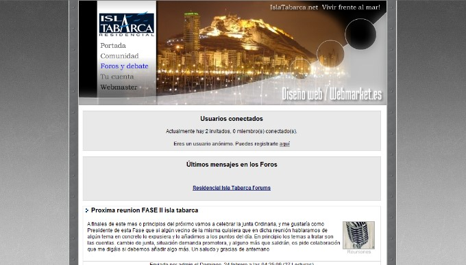
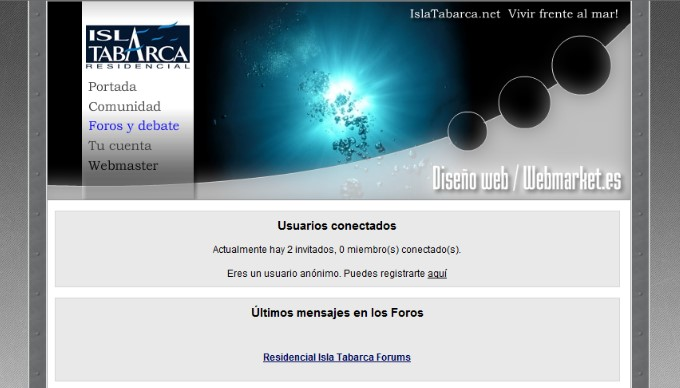

<a class="btn" href="http://islatabarca.herokuapp.com" target="_blank">Launch archived website</a>

I built a couple of websites for Residencial Isla Tabarca in Alicante. The first one was built using PHP-Nuke and the second one using a custom Wordpress theme. It features a forum for the residents, a blog, photo gallery and other widgets and modules.

