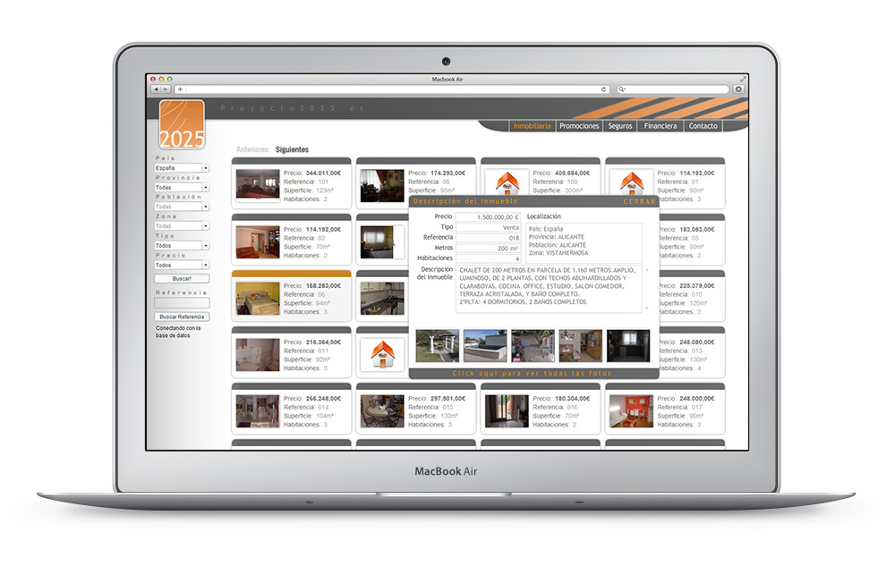
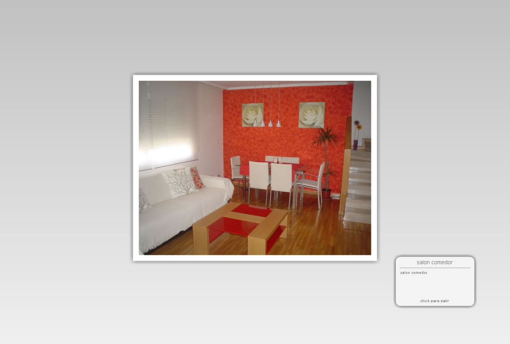
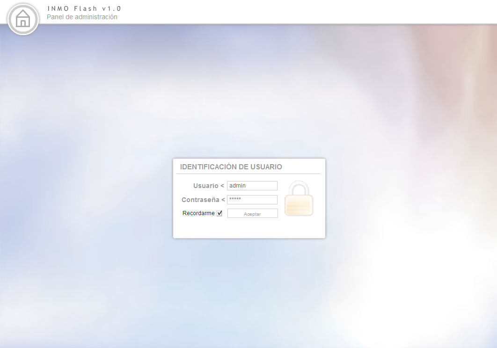
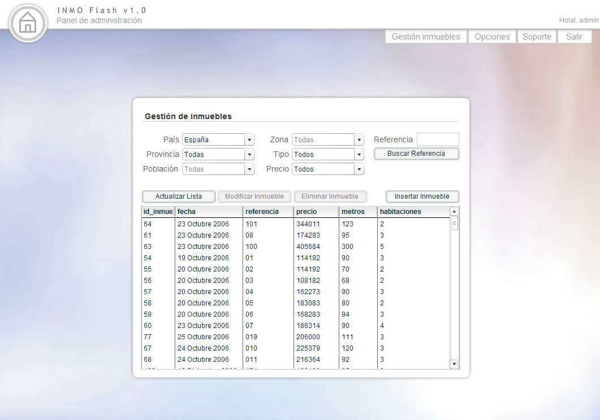
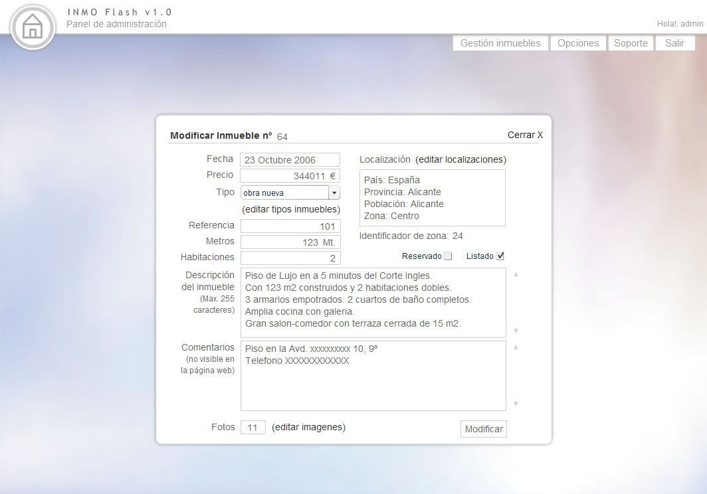
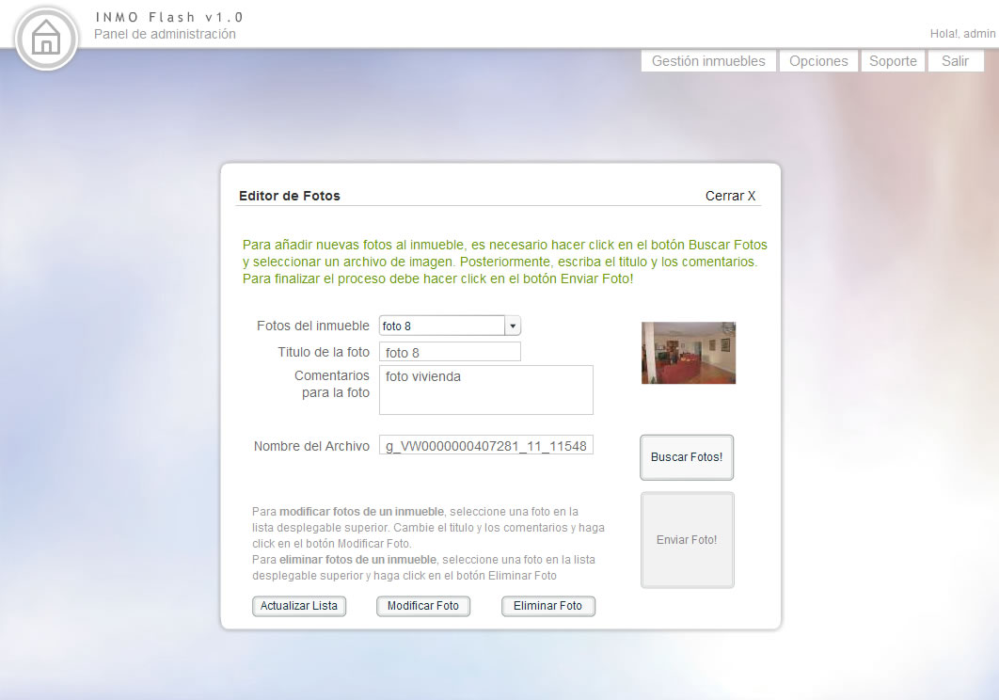
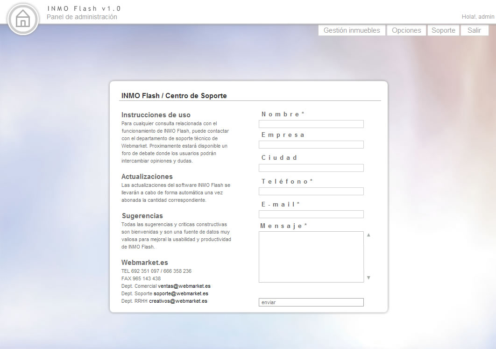

<a class="btn" href="http://work.joanmira.com/webs/proyecto2025/" target="_blank">Launch archived template without DB</a>

Proyecto2025 contacted us (Webmarket) to build a website to feature their real state properties and allow customers to search them. They also wanted a flexible system to edit, add or remove properties easily.

At this point, I didn't have a system or CMS with this sort of functionality. The open source options available at that time were also very insufficient for the requirements, so I decided to build my own bespoke solution. I called it INMOFlash, because it was based in Flash, PHP and MySQL.

The combination of using Flash for the UI and MySQL and PHP for the backend was a winning solution in terms of creativity and UX. Years after, I realised that Flash was not the best option for SEO, therefore this solution didn't have a very long future, but at the time, it was quite impressive and flexible.

