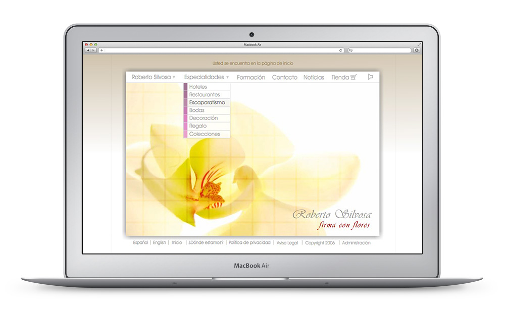
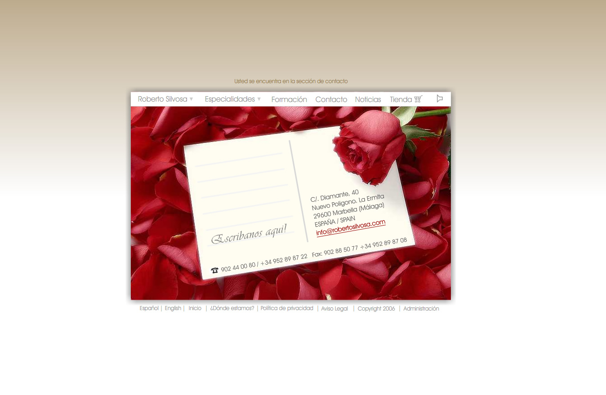
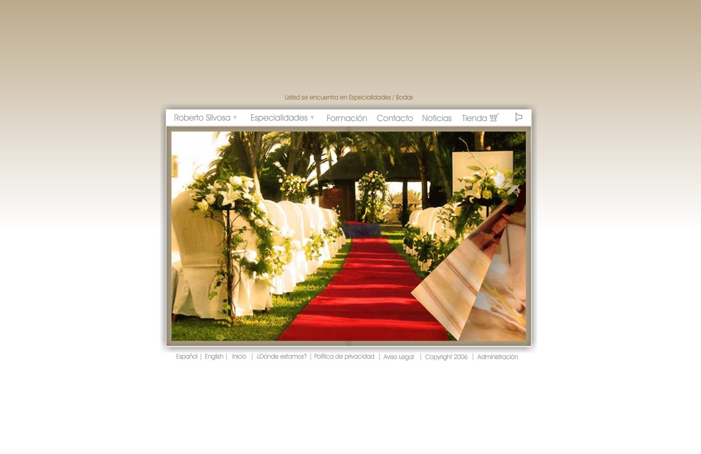

<a class="btn" href="http://work.joanmira.com/webs/robertosilvosa/" target="_blank">Launch archived template</a>

Roberto Silvosa contacted me to design and build a custom website for his business with an special emphasis on the aesthetics. He also needed to be able to upload new photos of his floral projects.

The portfolio of works uses a book metaphor to swipe the photos, which are loaded from the custom CMS built for the Flash website. It also has a small product catalog and checkout system to allow customers to order products via email. The products in the catalog and the news are also controlled via CMS.

