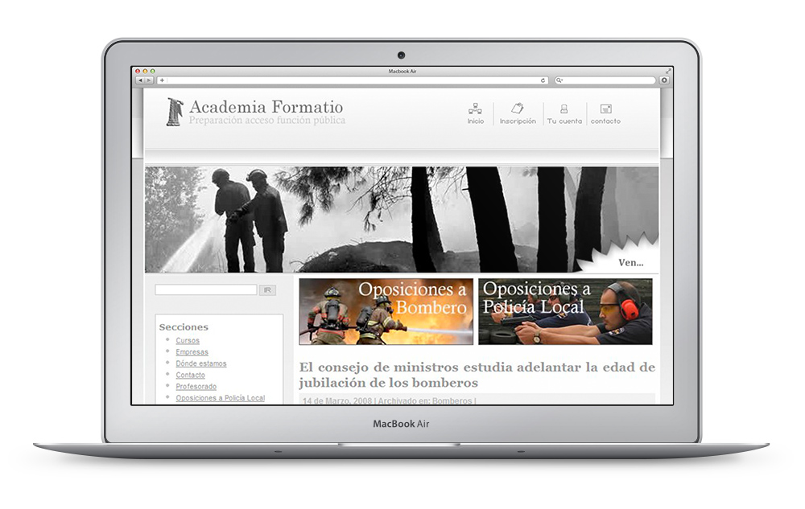
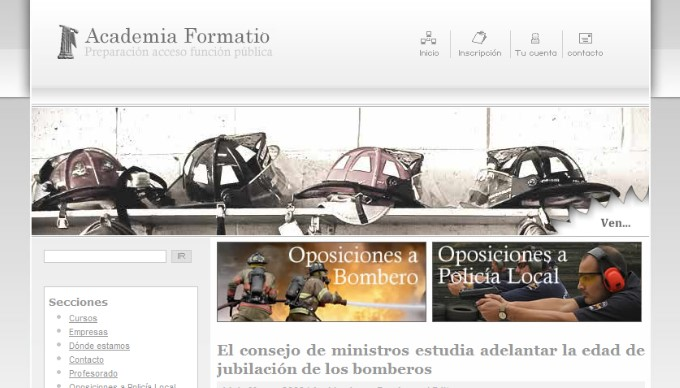
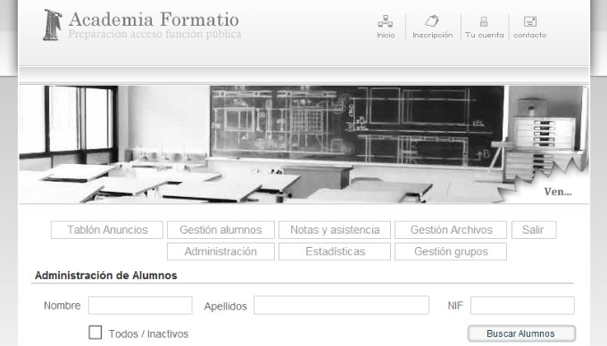
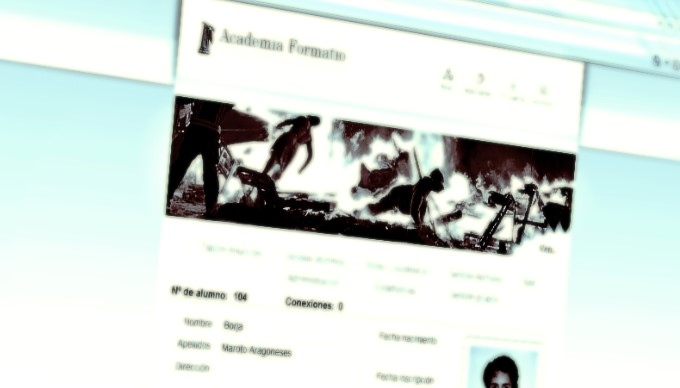
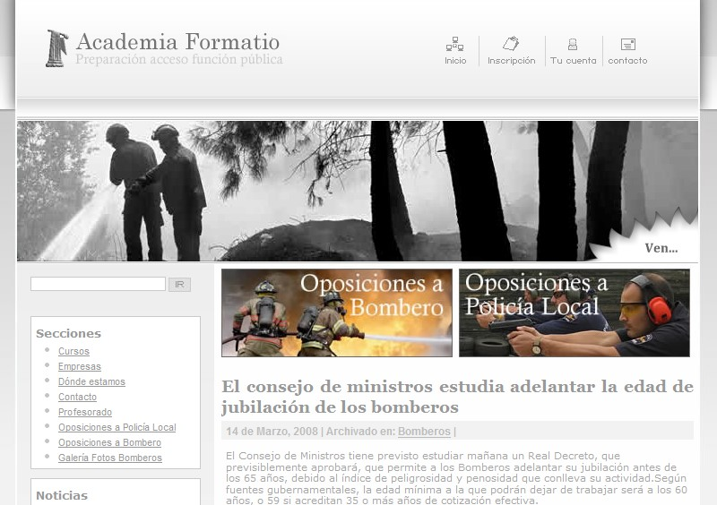
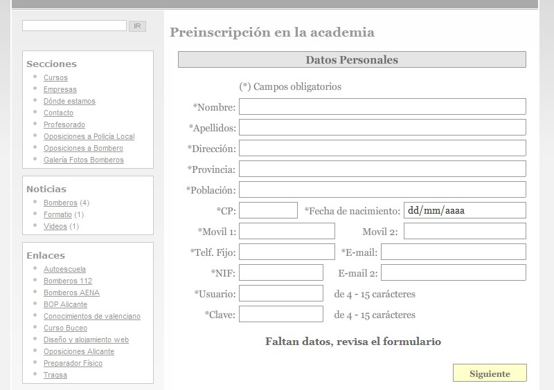
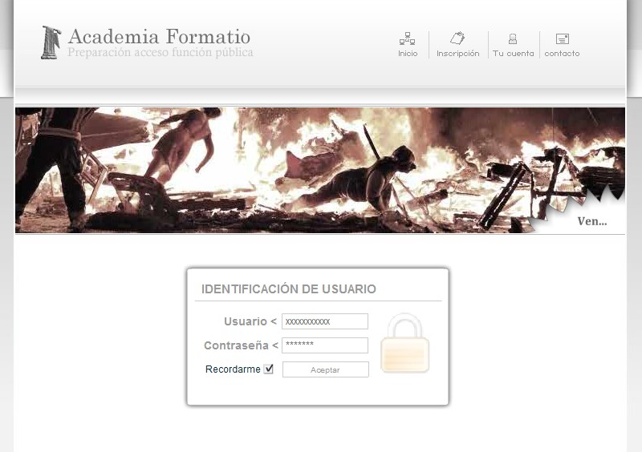
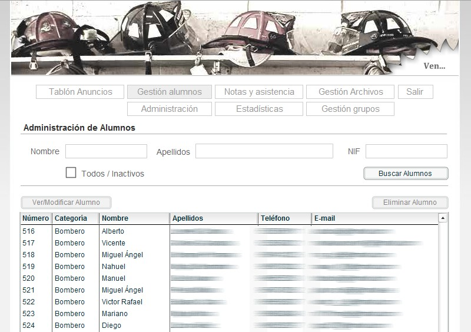
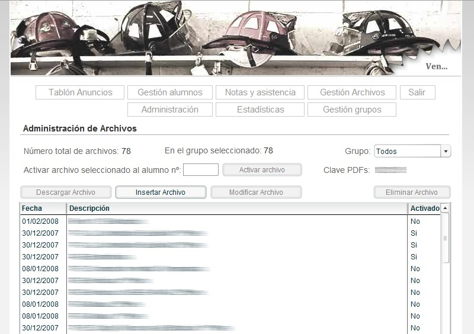
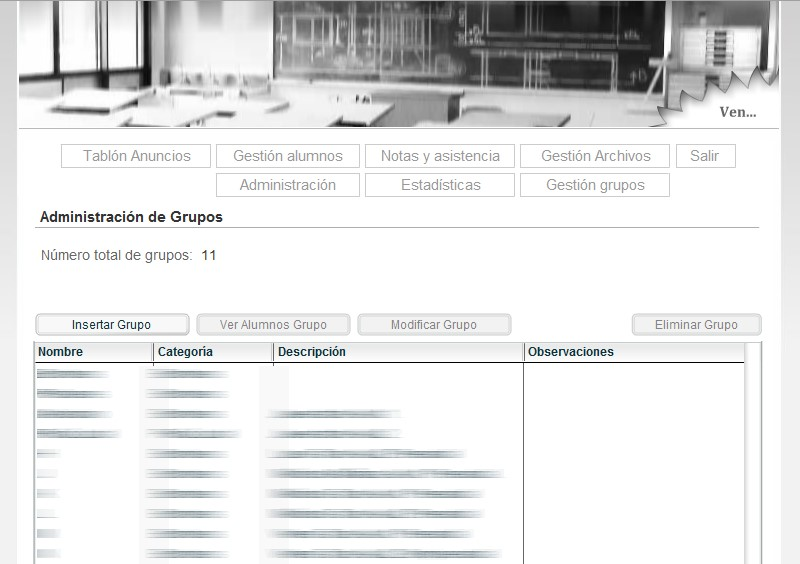

Formatio required an online platform for their academy, something like a custom [LMS](https://en.wikipedia.org/wiki/Learning_management_system). I built their website using Wordpress and the CMS was built from scratch using Flash, MySQL and PHP.

It features an advanced content management system that handles the students profiles, their exams results, the groups, files, statistics, etc.

