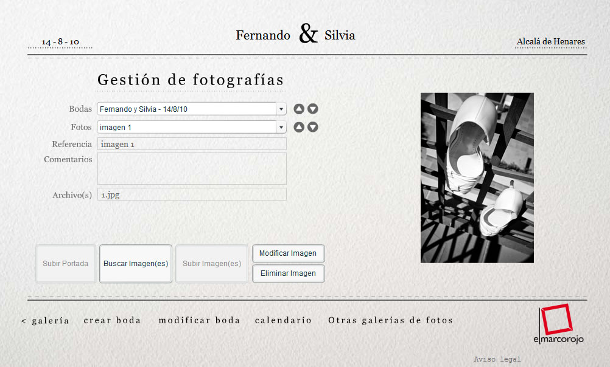
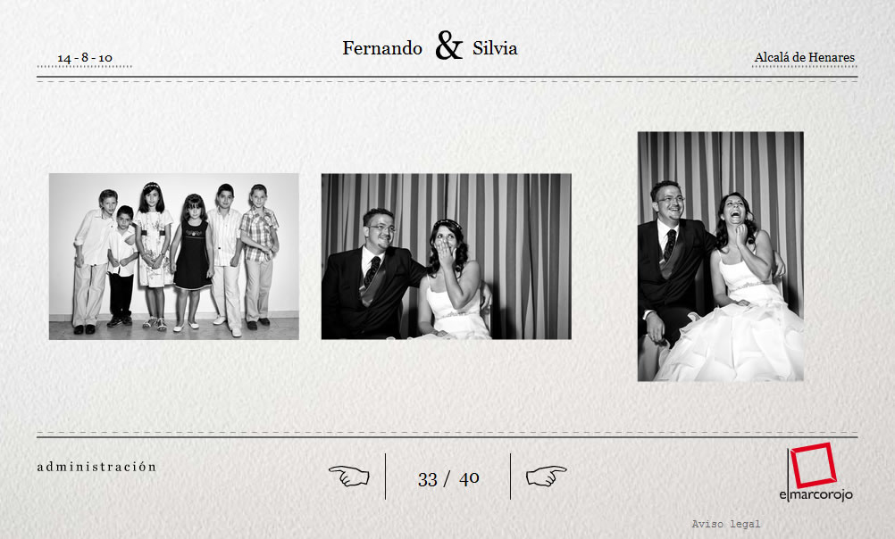

<a class="btn" href="http://work.joanmira.com/webs/marcorojo/" target="_blank">Launch archived template</a>

This project is a collaboration with the agency Narcea Multimedia. El Marco Rojo (a photography studio specialised in weddings) was their client. I joined the team and took fully responsibility of the development and creation of the sites. They required a Flash site to showcase their photo galleries, a custom Flash CMS to upload new content and a Wordpress powered blog.

