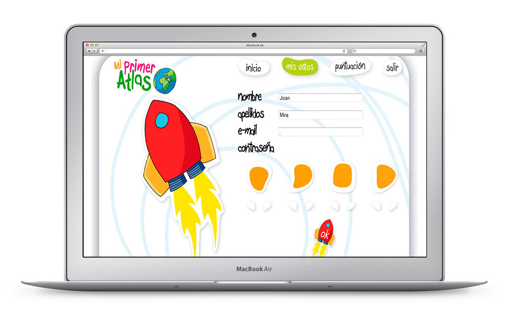

As part of my partnership with [IBCMass](http://www.ibcmass.com/), I built an interactive Flash educational app for kids. All the user interface is custom made, with many interactive elements, puzzles and games, most of them using the drag&drop metaphor.

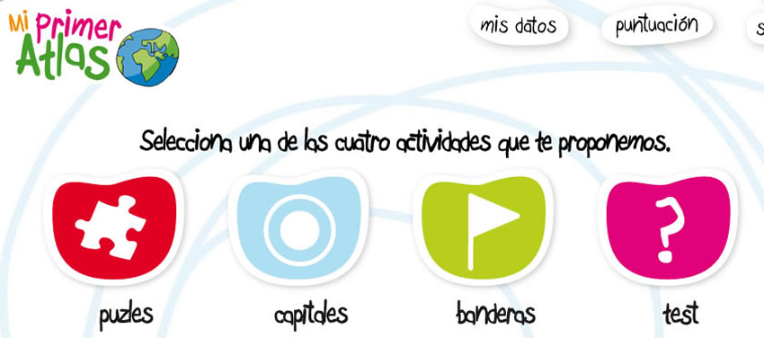

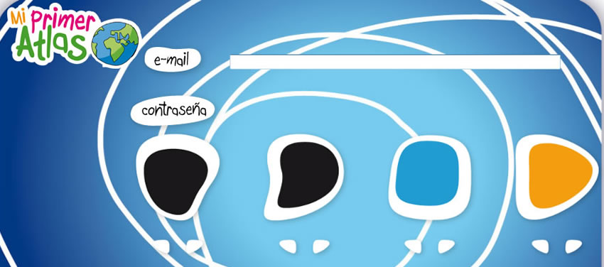

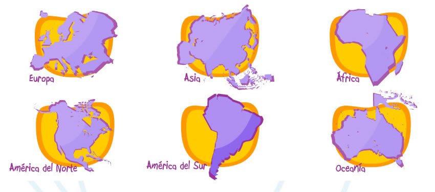

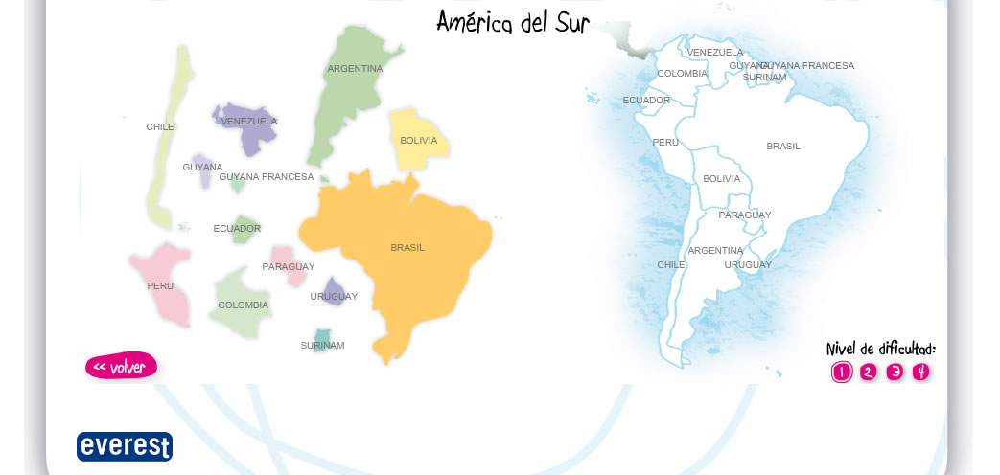

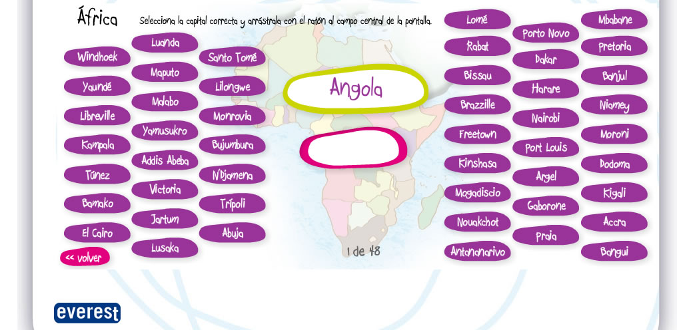

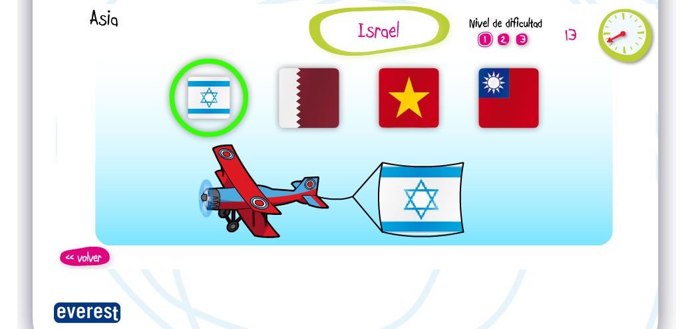

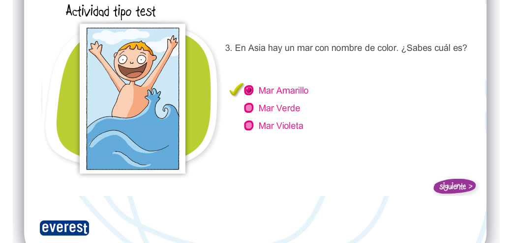

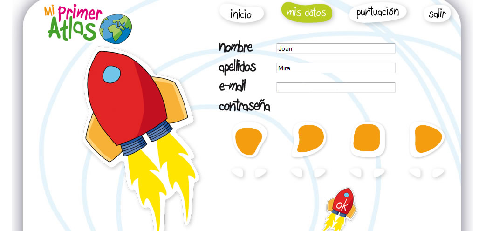

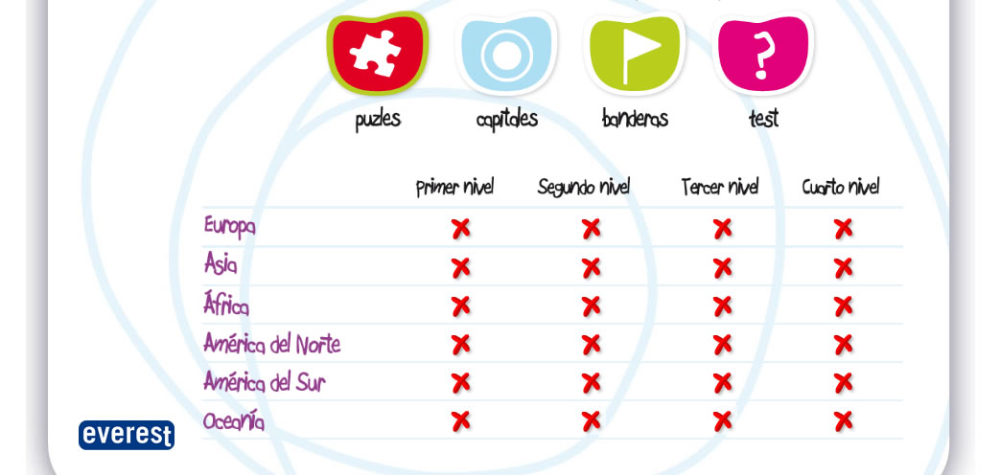

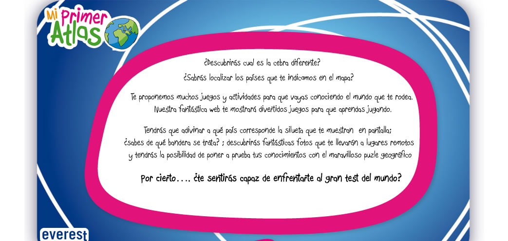
