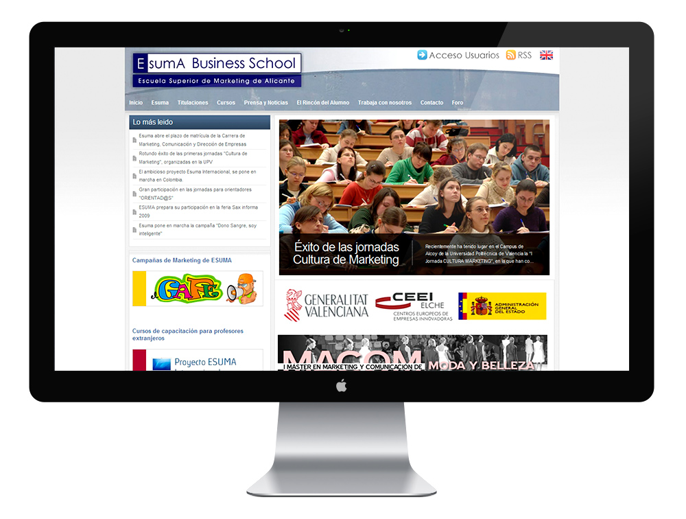

As part of my partnership with Esuma, where I also was a teacher in one of their master programs, I built a Joomla website for the institution. It features a login area with private pages for the students and teachers and other static pages with content related with the educational offer and latest news.
