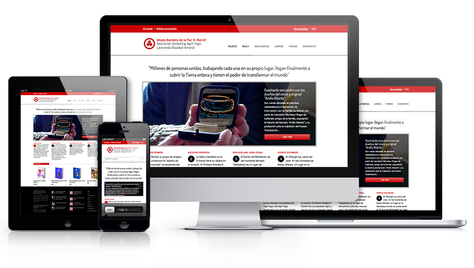
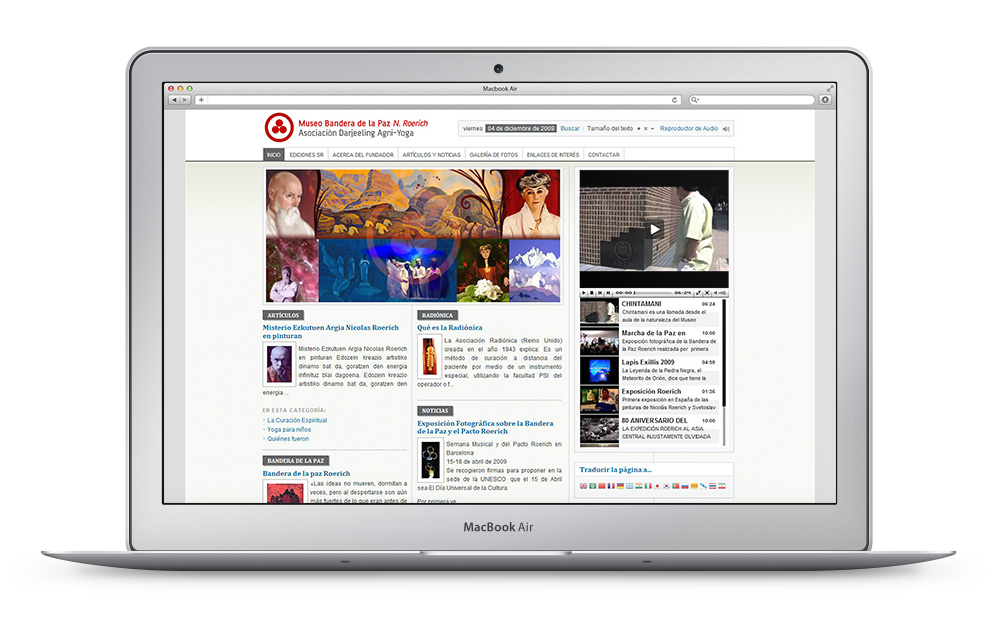

At some point, while working in Webmarket, I was contacted by Leonardo Olazabal, the founder of the Shambala Roerich museum in Bedia, Bizkaia.

He needed help with the maintenance of the museum's website, which at that point, was using Joomla. I helped him with a few changes and we decided to build a new template with more features, like video player, better blogs taxonomy, etc:

A year later, we decided to build a responsive website using Wordpress and implement an e-commerce module to sell his books.

I am also very grateful to Leonardo and his wife Petri for having supported my [Samurai Route](/samurai-route) trip with their sponsorship.
