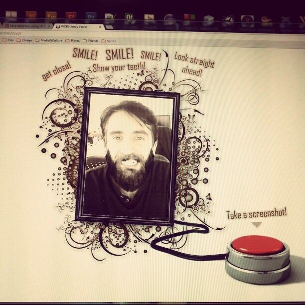

<a class="btn" href="https://github.com/gazpachu/face-detection" target="_blank">Source code</a>

This project was about detecting the face and the smile of a user using the webcam and then making a screenshot. It was coded all in Javascript and I mainly used the [HAAR.js](https://github.com/foo123/HAAR.js) library and HTML5 features like canvas and getUserMedia.

