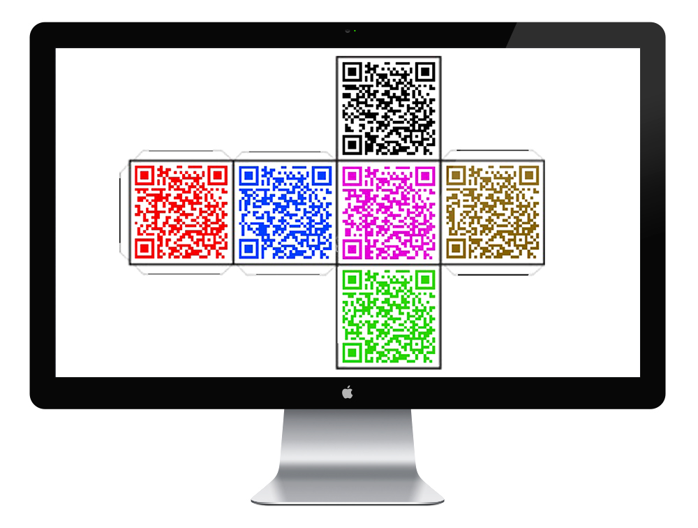

QRCube is a trivial game that uses QR Codes to trigger the questions. It's built using a custom template (50x50x50 mm) that you need to print and glue to form a cube.

Each side has a QR Code with a different color and represents a team or a player. Each team has to throw the cube by turns and scan the code on top. After scanning, you get redirected to a URL with a random question for the team whose color corresponds to the code scanned.

The app allows the players and teams to signup (to create their own QR code) and join the game and also keeps track of the correct/failed answers.
