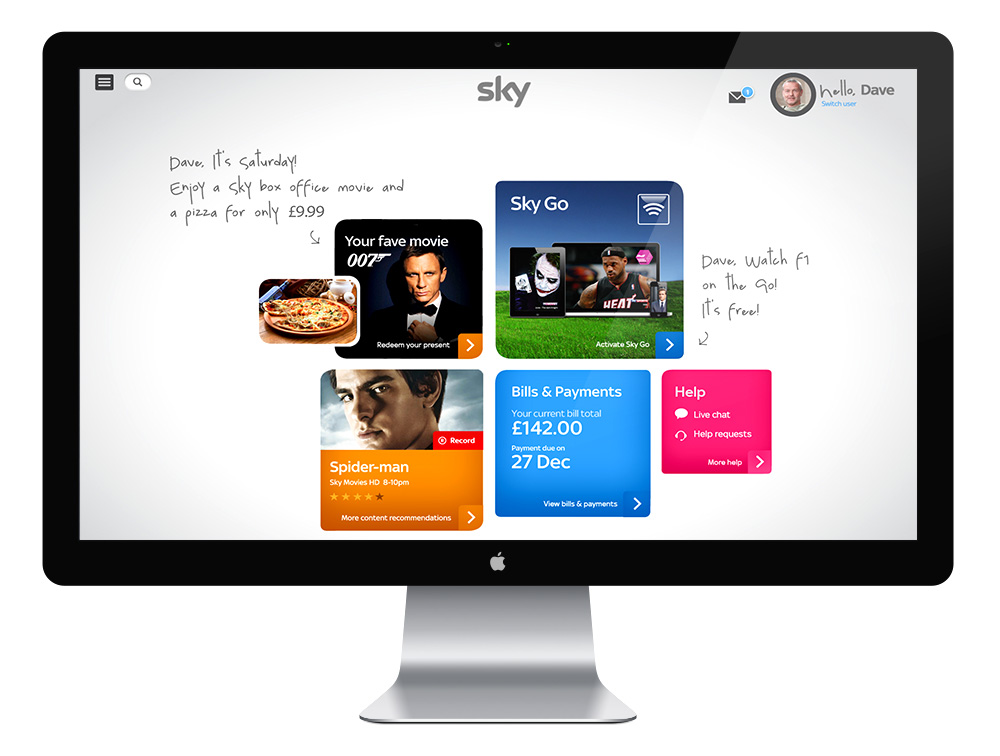
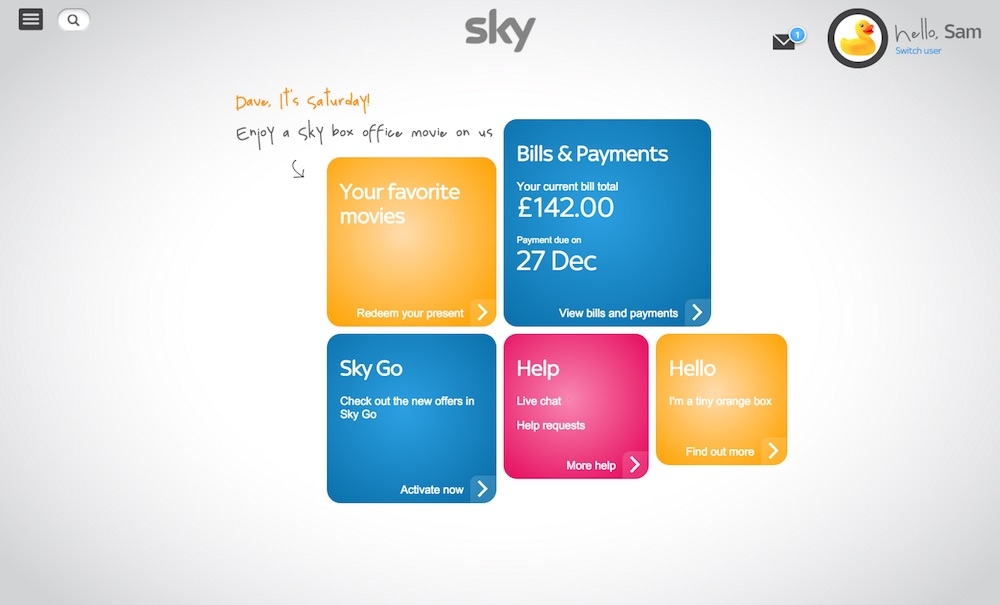
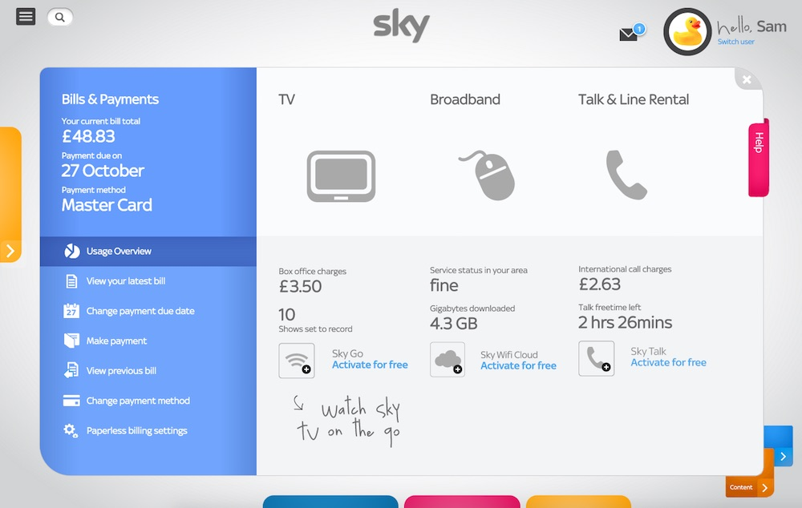
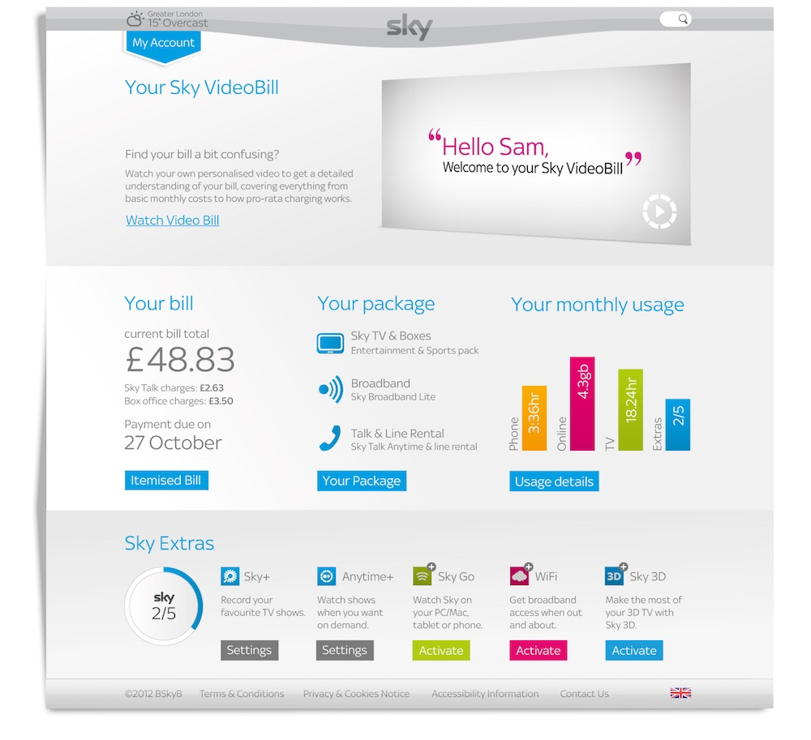
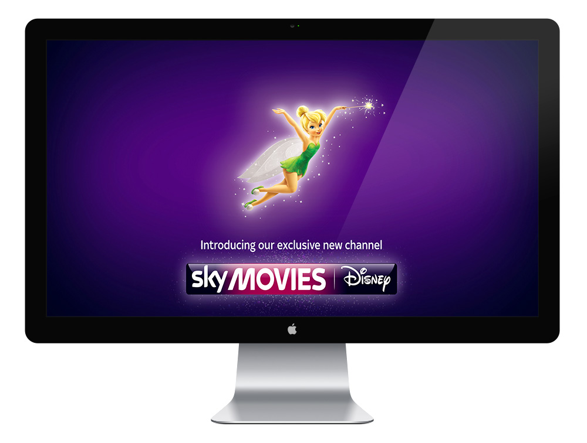

While I was working at WCRS, I got involved in several prototypes and promotional ideas for SKY. One of the prototypes involved R&D with Javascript and CSS to animate the panels of the following design. I built a few responsive demos with reactive and unfolding animations. When the panels were clicked, the new sections would reveal themselves and push the other panels to the border of the screen.

I also built a prototype with folding panels, which uses CSS3 to create the panel shadows dynamically.

The highlight of these prototyping works was a installation demo I built using OpenFrameworks and Microsoft Kinect to promote the new Disney Channel in Sky. The demo app tracks the hand of the user and translate the movements into Tinkerbell's magic dust, therefore the user can move Tinkerbell with his hands. It uses a particle system, shaders, blur and other graphic techniques to increase the visual appeal.

