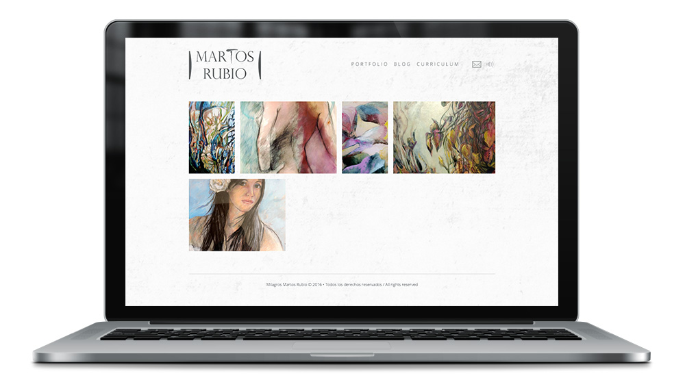
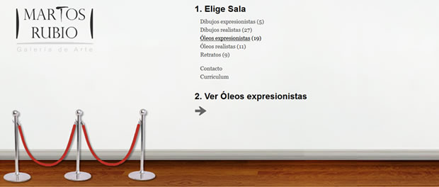
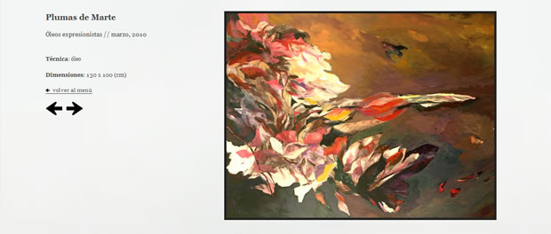
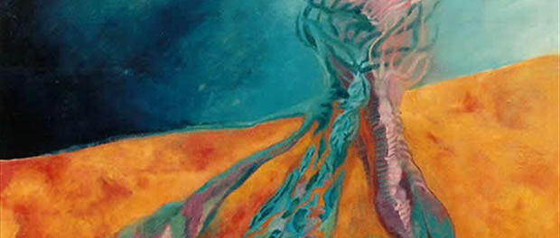
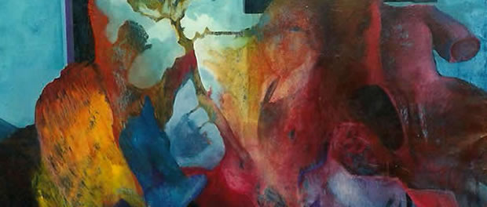
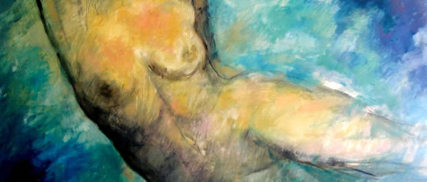

<a class="btn" href="http://martosrubio.com" target="_blank">Launch website</a>

The spanish artist, Milagros Martos Rubio, asked me to build a website to showcase her work. I decided to use Ghost and build a custom responsive theme. I also created the previous version of the website, which was based on Wordpress and also had a custom theme with horizontal scrolling (mocking the wall of an art gallery).

