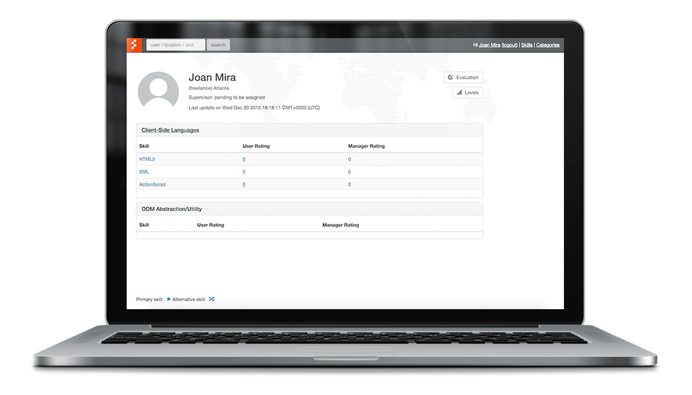
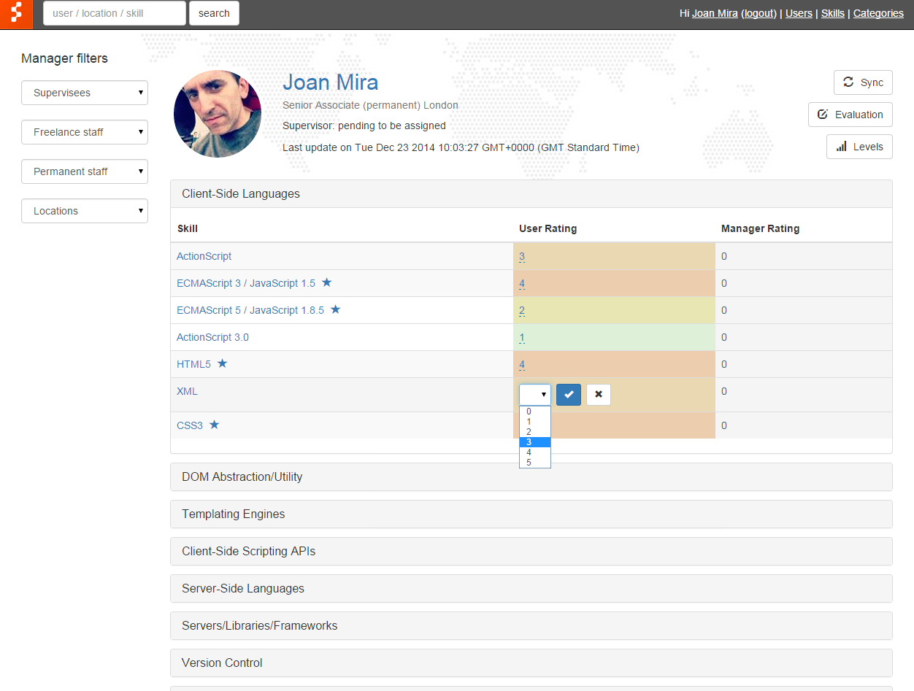
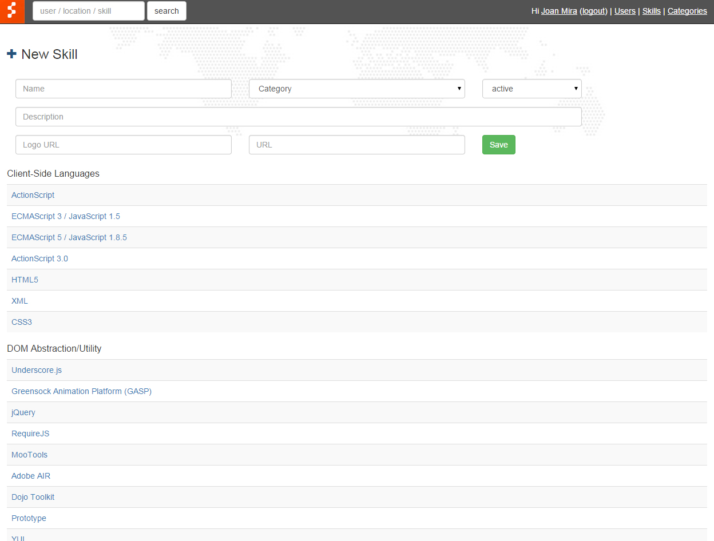
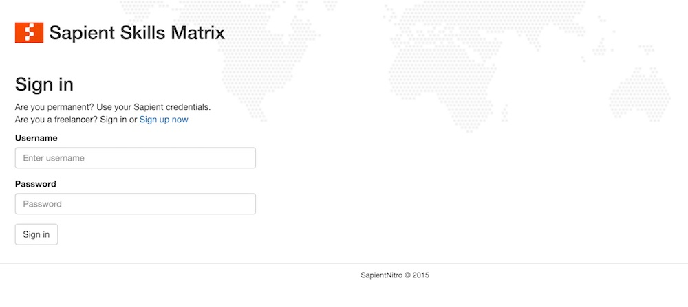
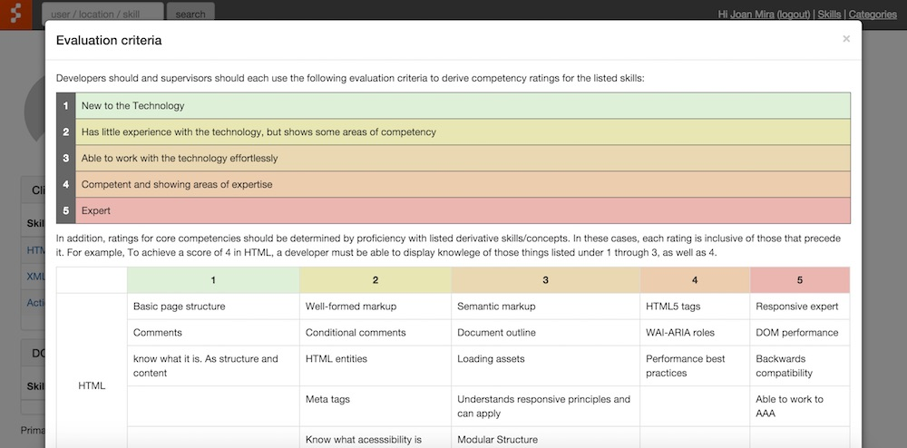
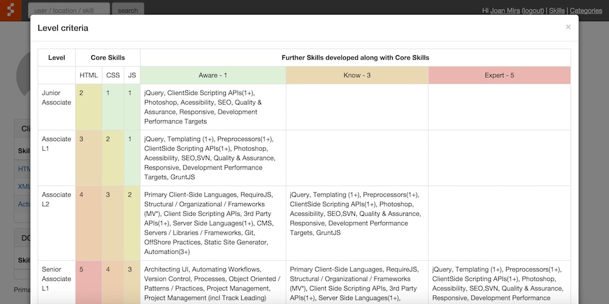
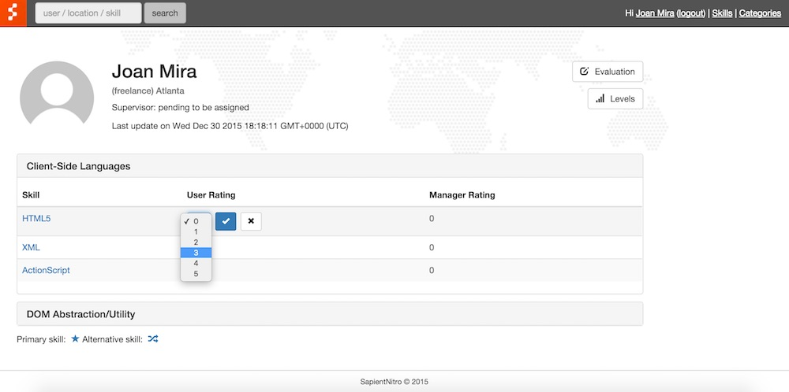
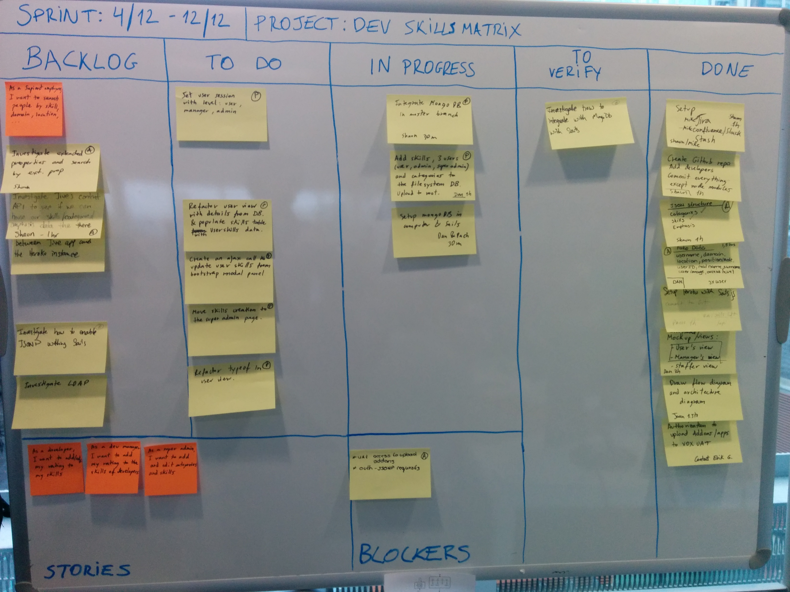

As part of my work as a senior interactive developer at SapientNitro, I started to architect and build an internal application to manage the technical skills of Sapient developers across the world.

I got two other developers on board (for a couple of weeks) and we started to work on it. The app was built using Sails.js, an MVC framework based on Express/Node.js that creates a REST API with the endpoints defined by the models. We also connected to the Active Directory to fetch employee data and used Sapient's user credentials to sign-up and sign-in users.

The DB was driven by Mongo (we used Mongolabs for testing) and for the UI we used Bootstrap. The app allows admins to create/edit/delete new skils and categories.

Developers can update their skills (using a level criteria) and managers can review them and also assign a value to them.

