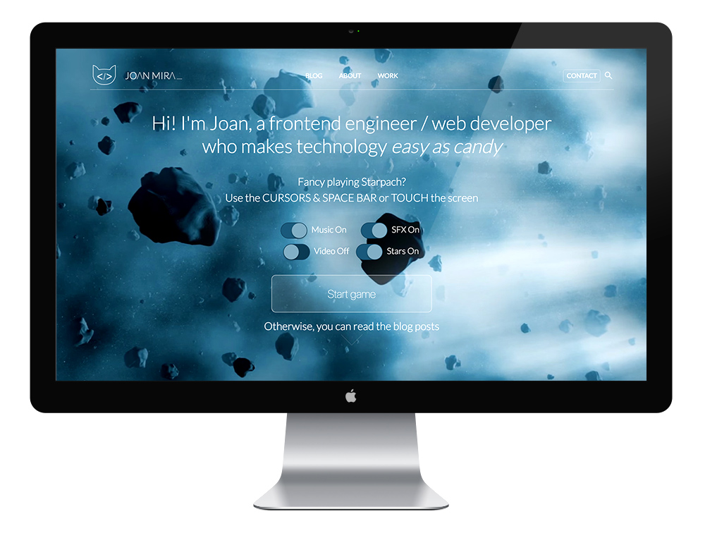

<a class="btn" href="http://joanmira-ghost.herokuapp.com" target="_blank">Archived website</a>

This project was the first version of my new personal website. Before it was called [gazpachu.com](/gazpachu).

It was built using GhostJS, a beautiful Node.js and Ember powered blogging platform. I decided to try Ghost because I was tired of Wordpress always being targeted by hackers and the constant security issues. I also wanted to stop using PHP and MySQL and try a newer tech stack.

The experience with Ghost was quite good. It gave me a lot of freedom to build a custom them and even include cool stuff like easter-eggs and my own interpretation of the asteroids game, which I called `starpach`.

After 3 years using Ghost, I've realised that I also wanted to stop using my VPS in OVH and move to an easier to maintain approach. That's how I ended up migrating to GatsbyJS and Github pages. I was still quite happy with the design of the website, so I only changed a few bits during the transition.

Unfortunately, I had to leave Starpach in the previous version, but I will do something cool for the new website...
