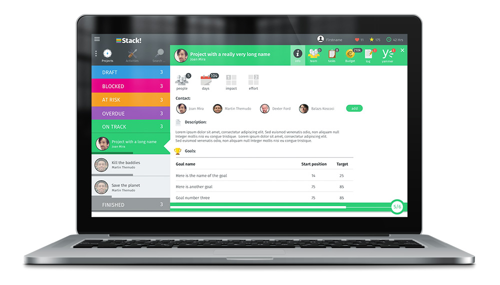
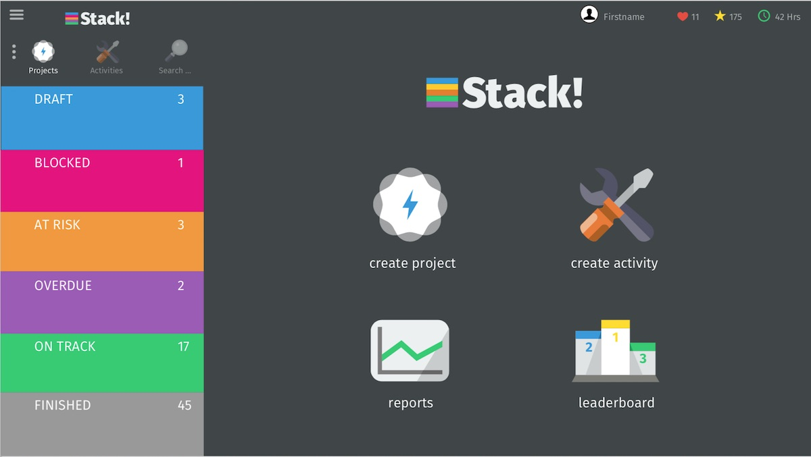
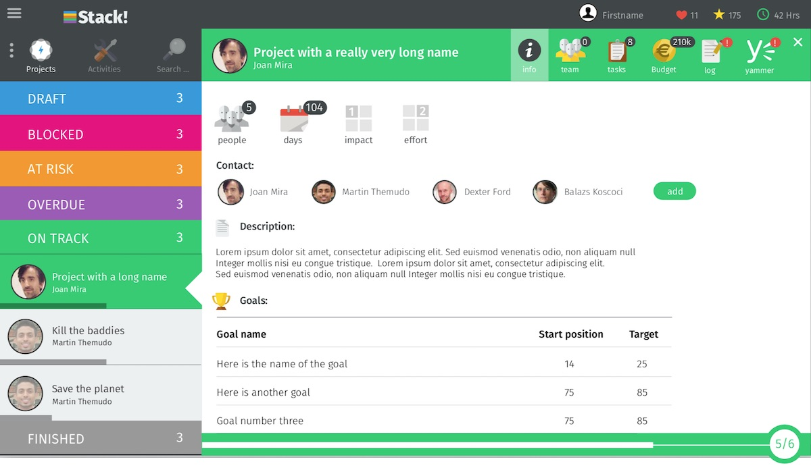
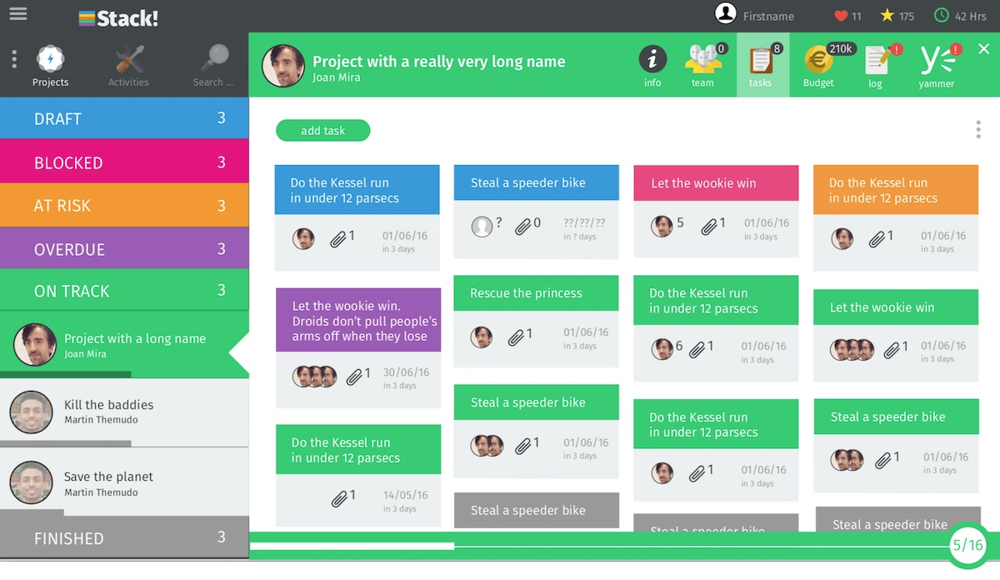
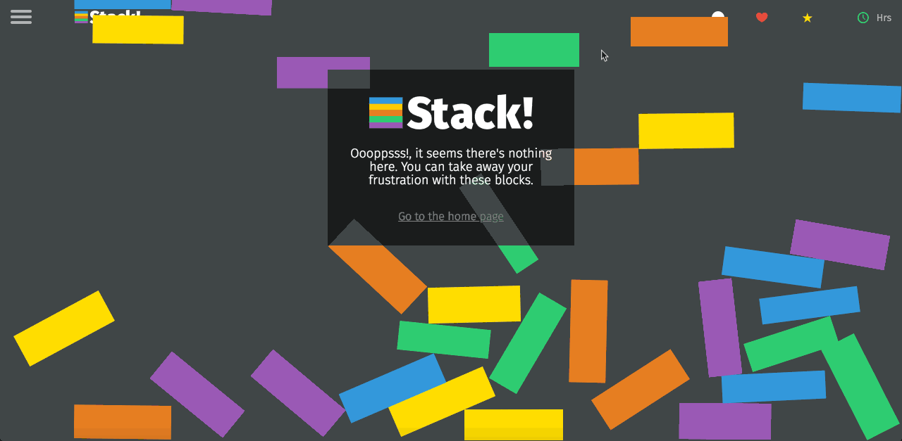

Stack was my first project when I started to work at Vodafone. Stack's purpose was to track the projects and activities of teams and organisations within Vodafone in a fun and light-hearted way. Users would define tasks for each project that then could be moved along the 'stack' towards completion. They could also be assigned to other team members and link them with budget items.

The project was built using the AngularJS framework (v1.6.4) in the frontend and all the data was fetched from an external API. We also used Grunt, SASS, SVG sprites, ShuffleJS and HightCharts.

I built the front-end together with two other co-workers.

<video class="full-img" width="100%" controls>
  <source src="./images/stack_v1.4.mp4" type="video/mp4" />
</video>

The project took around 3 to 5 months and during the development, I had some time to build a very cool 404 page and easter egg game that was hidden :-). To load the game, the user had to type the [Konami code](https://en.wikipedia.org/wiki/Konami_Code) sequence. The objective of the game was to build the stack logo by dragging and dropping, in the correct order and color, the bars that formed the logo.

<video class="full-img" width="100%" controls>
  <source src="./images/stack-easter-egg.mp4" type="video/mp4" />
</video>
