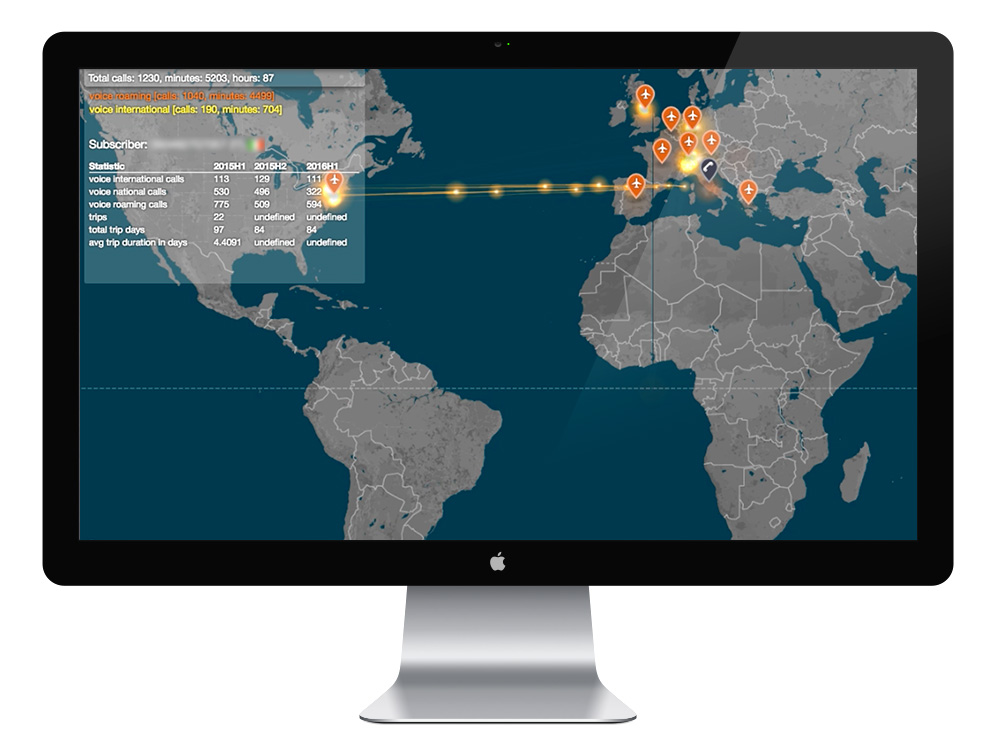

While working at Vodafone, I was tasked to do an interactive data visualisation piece for one of its clients.

The idea was to show a world map with a timeline to represent the mobile calls of a particular subscriber of the client. The calls were represented with particles jumping from the origin of the call to the destination.

To amplify the visual appeal of the animation, I used a few Javascript libraries and APIs to represent the particles and their trails in the map:

- [leaflet full-screen](https://github.com/Leaflet/Leaflet.fullscreen)
- [leaflet markercluster](https://github.com/Leaflet/Leaflet.markercluster)
- [leaflet locatecontrol](https://github.com/domoritz/leaflet-locatecontrol)
- [mapbox](https://docs.mapbox.com/mapbox.js/api/v3.1.1/)
- [blackhole.js](https://github.com/artzub/blackhole.js)
- [d3.js](https://d3js.org/)
