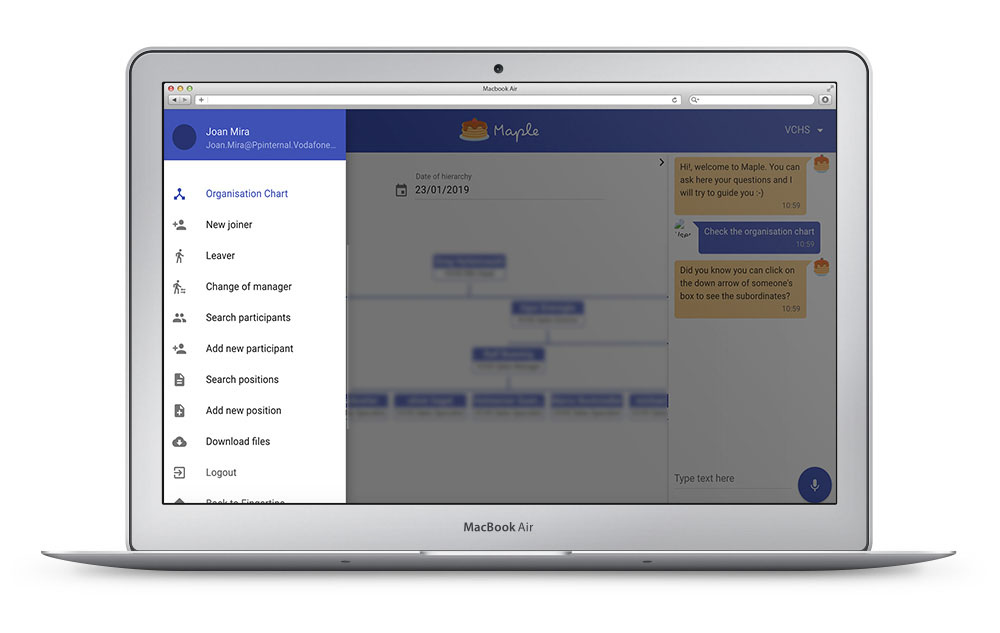
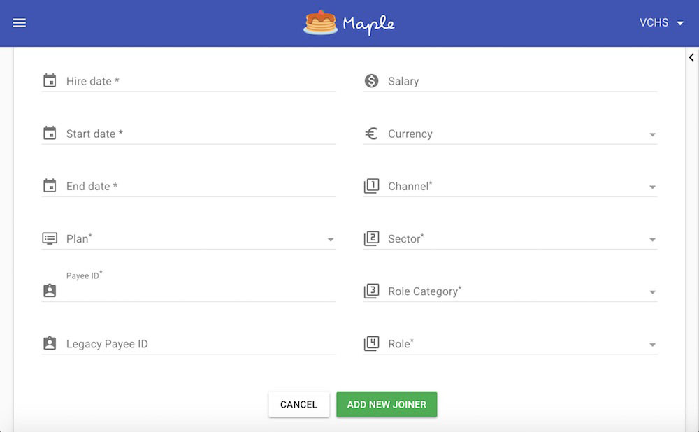
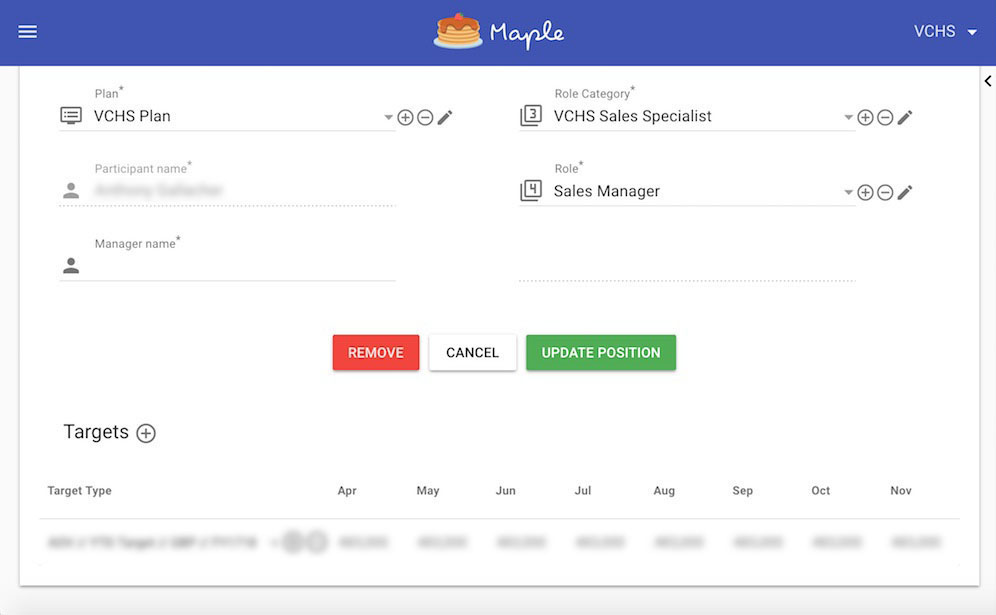

Maple is an app to manage the sales hierarchy in Vodafone. It allows to add new employees, assign them roles and targets and move them under new teams.

In this project, I owned the 100% of the front-end build until it was published. Later on, I worked in a couple of more journeys (joiners/leavers, change teams) and features with another co-worker.

Maple was built using VueJS, Vuex (to manage the global state) and the Material-UI library for Vue. It also uses a library called [OrgChart](https://github.com/dabeng/OrgChart) to build the organigram in the homepage. I also added a chatbot with speech recognition powered by [Dialogflow](https://dialogflow.com/) (formerly known as Api.ai).

