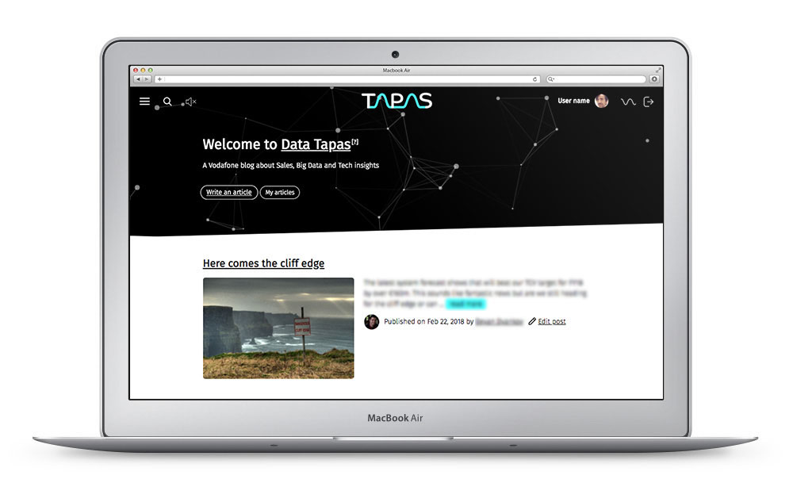
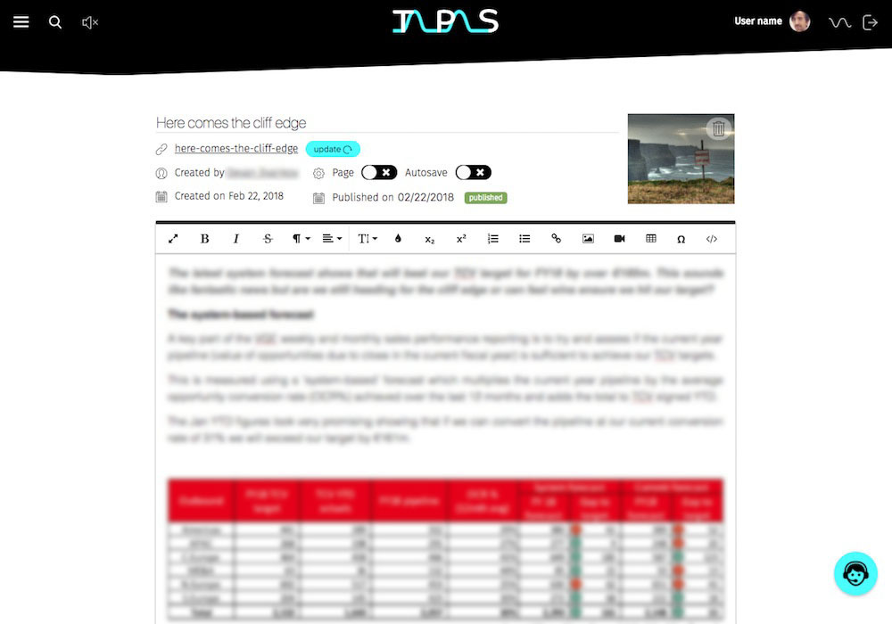
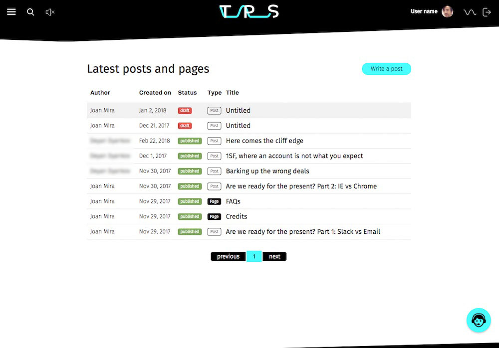

<a class="btn" href="https://github.com/gazpachu/react-ghost-tapas" target="_blank">Source code</a>

Tapas is a Vodafone web blog about Sales, Big Data and Tech insights. It is based on the [Ghost](http://ghost.org/) platform.

In this project, I was in charge of building the front-end, design (except for the logo) and UX. I built a custom React based theme and admin panel using the Ghost API. The header also has an animated particle system based on [Particles.js](https://vincentgarreau.com/particles.js/). There was also as small easter-egg in the footer of every page, which was a rocket that when clicked, would take-off and scroll the page to the top.

