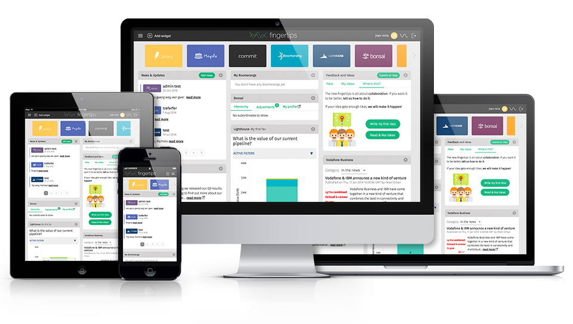
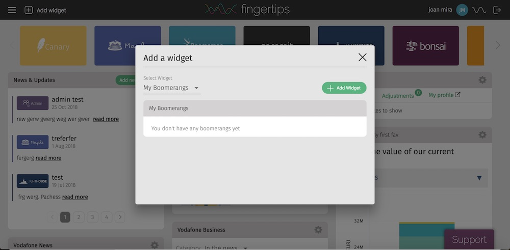
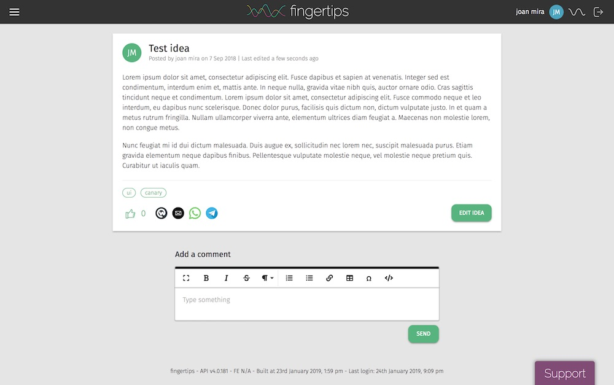
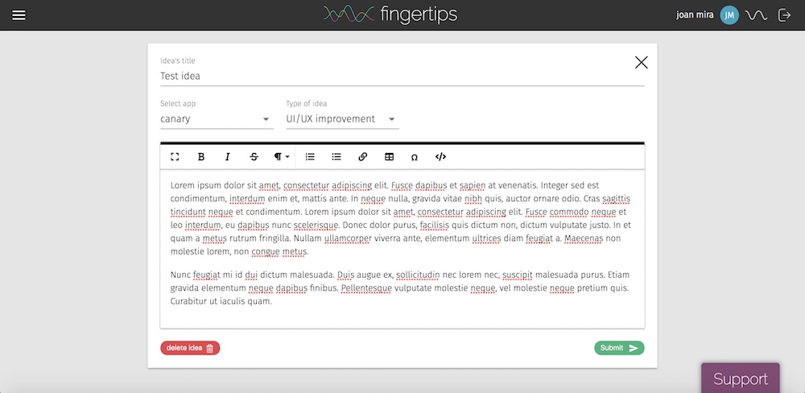
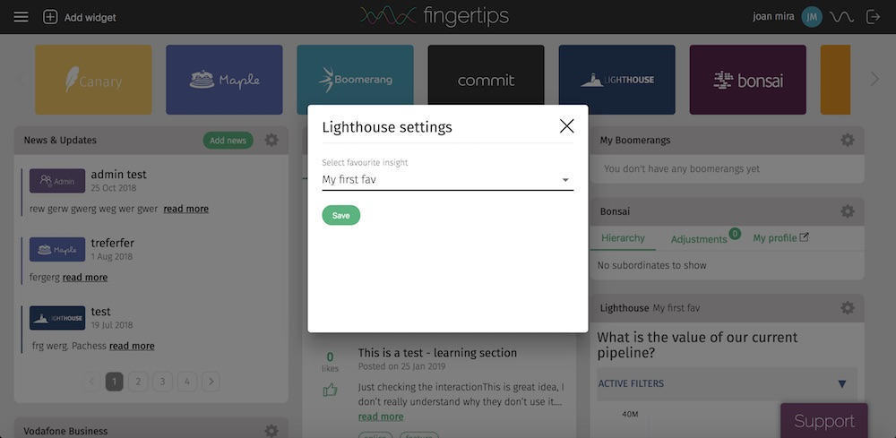
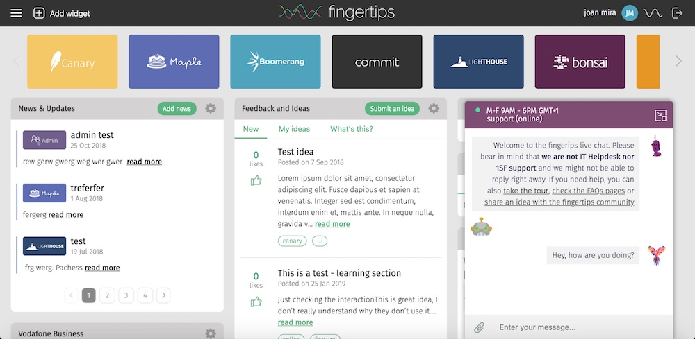
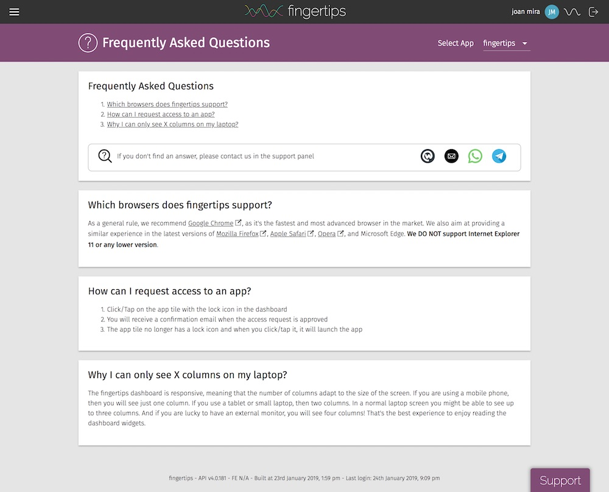
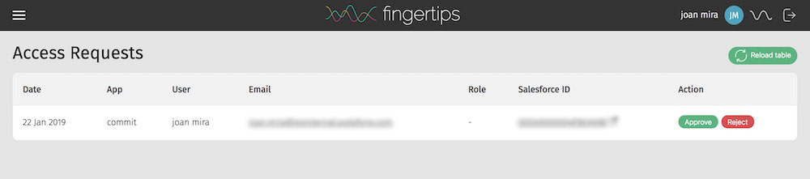
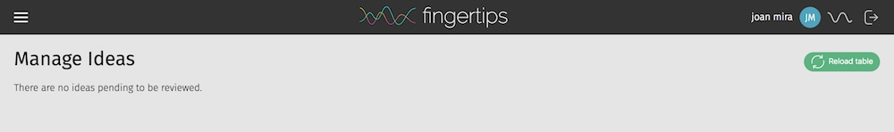
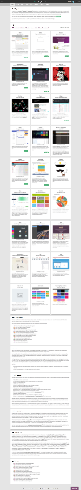

Fingertips (aka Dashboard) is the main app that hosts all the other apps I built while working at Vodafone. Its purpose is to serve as:

- the platform to access all the other available apps
- inform the users about news and updates
- have quick summaries about the apps using Widgets
- give feedback and have real-time support

Initially, there was just a page with boxes for the apps, but I thought we could rebuild it into something that has more information and would allow us to connect with our users. That's how I came out with the dashboard and widgets design.

After making a few mockups and sharing my ideas with the rest of the team, the project was approved and I started building it. I owned 100% of the front-end work, including the UX user testing sessions with Vodafone employees and some parts of the final design.

**All the widgets and app tiles are draggable**, so each user could organise the dashboard in whichever way they prefer. Widgets can also be added or removed, although there are some that are mandatory, like `news` or `feedback`.

At the top of the app there is an horizontal scrolling slider that contains all the available apps. Some of them might be `locked`, so the user needs to access request by clicking on them. These requests are then managed from another section of the app.

I also built widgets for various Vodafone RSS news feeds and for specific apps like Lighthouse, Bonsai or Boomerang. These app widgets show favourite items or a summary of the latest changes in those apps.

Some of the widgets include pagination and others include settings.

News stories and ideas have their own canonical URL and page. Ideas include comments from users as well.

<video class="full-img" width="100%" controls>
  <source src="./images/tour.mp4" type="video/mp4" />
</video>
