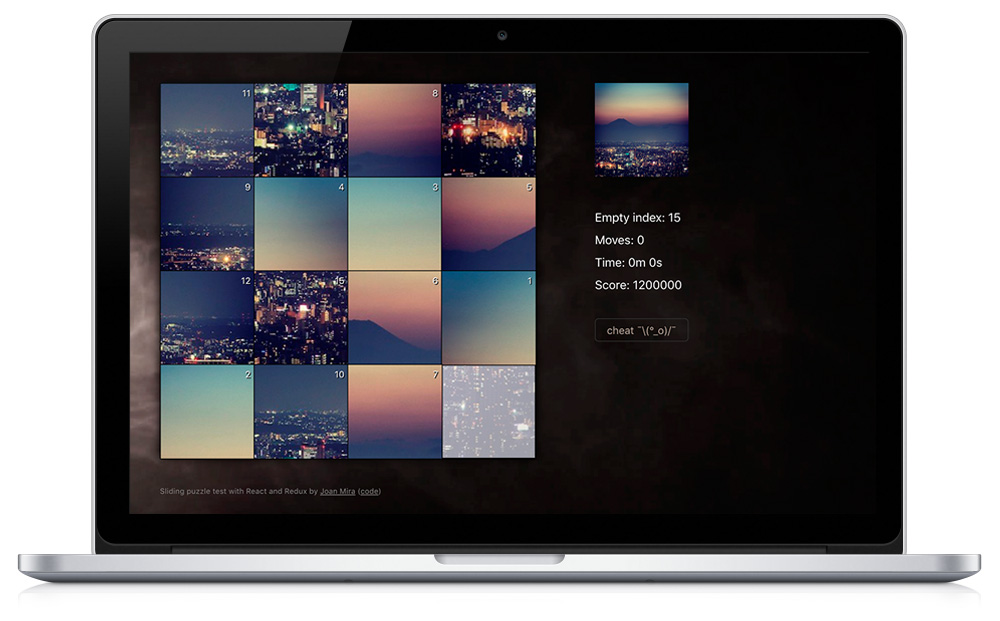

<a class="btn" href="https://gazpachu.github.io/sliding-puzzle/" target="_blank">Launch app</a>
<a class="btn" href="https://github.com/gazpachu/sliding-puzzle" target="_blank">Source code</a>

Sliding puzzle is a small experiment with React and Redux to create a puzzle game. It was built using the [create react app](https://github.com/facebook/create-react-app) in just a couple of days.

