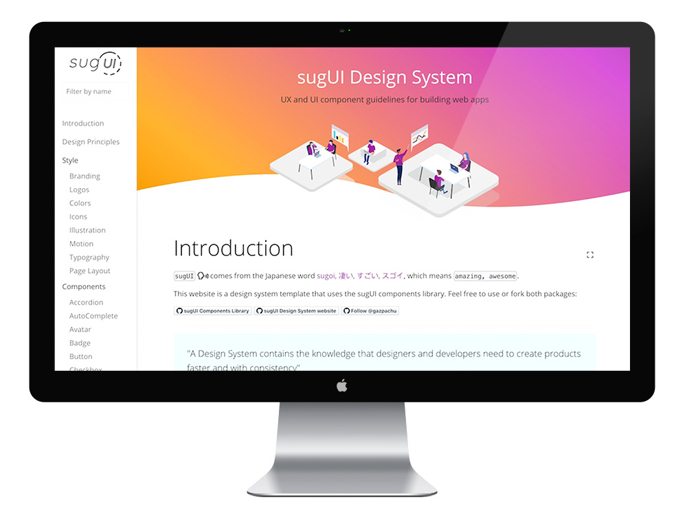

<a class="btn" href="https://gazpachu.github.io/sugui-design-system/" target="_blank">Project website</a>
<a class="btn" href="https://github.com/gazpachu/sugui" target="_blank">UI Library Github repo</a>
<a class="btn" href="https://github.com/gazpachu/sugui-design-system" target="_blank">Design System Github repo</a>

sugUI is an open source UI components library and design system template based on React, Styled Components, Styleguidist and React Testing Library.

For users who are only interested in the components, they can clone/download/fork the UI library alone and use them in their projects. Other users who are also interested in creating a design system for their product/company/organisation, they can fork the sugUI design system template and customise it with their needs.
