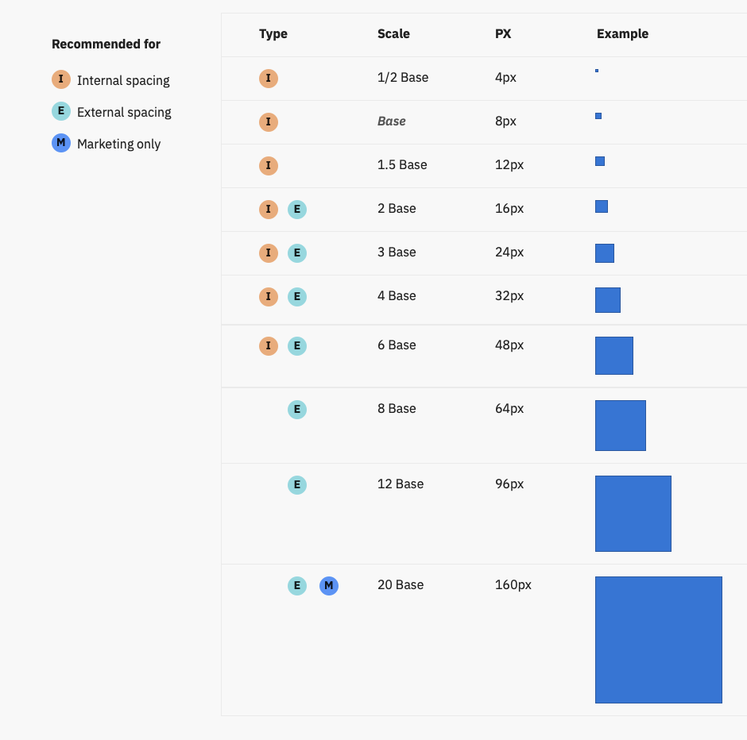

<a class="btn" href="https://tablekit.tablecheck.com" target="_blank">TableKit Live Version</a>

Before joining TableCheck, I was already a big fan of design systems. In fact, I built [SugUI](/sugui) together with a work colleague (UI/UX designer) at Vodafone. Therefore, I had a clear mindset to do something similar at TableCheck. When I joined, I was lucky to find that other engineers in the team also shared the same philosophy about the need of a custom UI toolkit and proper design guidelines to maintain the consistency across the company products.

At first, the company was using a fork of [AtlastKit](https://atlaskit.atlassian.com/), (Atlassian's UI toolkit). Its name was TS Styling (TS from TableSolution, which was the previous name of the company). So, at the beginning, I was using this toolkit to build [Insight](/insight).

A few months later, we hired a great UI/UX designer (who was also pasionate about design systems) and then we started to build TableKit v1 with some of the leassons learned from TS Styling. We used the Insight App as the reference for building the UI components and defining the design guidelines for iconography, illustrations, typography, etc.

## Tech Stack in v1 and v2

When building a Design Sytem, there are many things to consider. One of the most important aspects is the documentation. Since this is going to be a living project with continuous updates, the way the documentation and examples are writen has to be very easy to update and understand by anyone in the organization. Not just for engineers and designers, but also for product managers, marketing, content, PR, QA, etc.

Initially, we used [React Styleguidist](https://react-styleguidist.js.org/), and it worked fine for some time. Until we started to face its limitations. The main problems were the opinionated layout design (with the left sidebar) and the fact that all UI components were rendered at the same time, which made the page quite bloated and a bit slow to interact with. Nonetheless, the documentation site looked quite good. Although updating the content wasn't particularly easy, as we had to manually edit the .md files in the codebase. There was no CMS that designers could use to update the content.

Around one year later, we decided to migrate from Flow to TypeScript. And then, at the same time, move away from Styleguidist to [Storybook](https://storybook.js.org/). At this point, we were thinking of separating the UI Components from the rest of the content. So we could end up with two sites, one for the UI Toolkit and another one for the Design System documentation.

Once we finished the migration, we ended up with a website that worked well for the UI components but we didn't really have enough time to add all the other documentation. The design team was also going through some changes, including a new Creative Director that would set a slight new direction.

## Design Guidelines in v1 and v2

We explored many designs systems from big tech firms, like [Google's Material Design](https://material.io/design), [IBM's Carbon Design System](https://carbondesignsystem.com/), [Uber's Base](https://baseweb.design/), etc. We ended up deciding to use the [IBM Plex font](https://www.ibm.com/plex/), as it supports many languages, including Japanese and now Chinese characters as well.

Regarding icons, we ended up using a combination of [FontAwesome Icons](https://fontawesome.com/) and [TableCheck's Icon Library](https://github.com/tablecheck/tablecheck-icons). A couple of years later, we started the migration to use [IBM Carbon Icons](https://carbondesignsystem.com/guidelines/icons/library/), as the collection is bigger and can be extended by contributors.

Regarding colors, we decided to have a couple of primary and a couple of secondary colors. We also defined some accent colors, warning, success, border, elevation shadows, a grey scale, etc. But at the same time, we also needed a few scales to cover the abundant color combinations of the charts in the Insight App. That's how we came up with the following table:

The color schema was built taking our brand purple colour as the reference. Then we created 7 additional “core” colours with the same visual brightness and saturation. Once we had our 8 core colours, we added 4 darker and 4 lighter shades of each for our scales. This gave us a total of 72 unique colours to work with.

Another important aspect to define was the spacing. We ended up adopting an [8 pt grid](https://spec.fm/specifics/8-pt-grid), which would allow us to have a base value of 8px and several steps using a base of 8:

For the typography, we also used the base 8 approach. So each line height step would use full or half increments of 8:

Example of the Button component (regular size):

