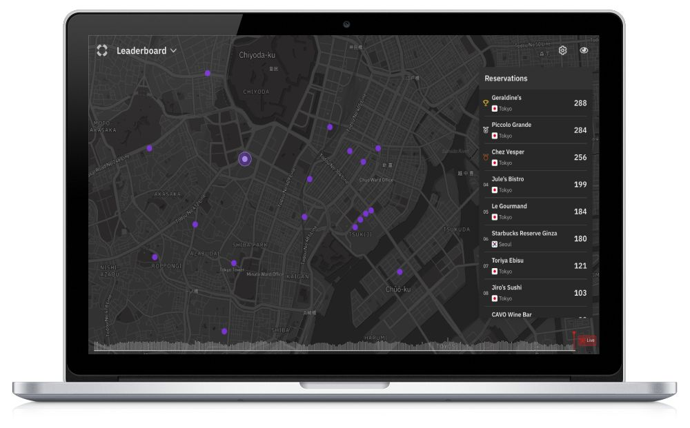

TableMap is the winning project in TableCheck's first hackathon. The team consisted of two front-end engineers (including myself), one back-end engineer and one designer. We worked for two days on it.

The aim of the project was to display real-time restaurant reservations around the world using [TableCheck's platform](tablecheck.com/en/join). To achieve this, we used several techonologies, including [MapBox](https://www.mapbox.com/), [TableKit](/tablekit) and python.

The UI supports both, light and dark mode. It also displays a leaderboard with the restaurants in the area with most live reservations.