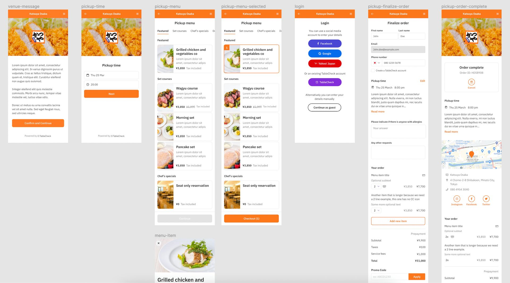

<a class="btn" href="https://booking-demo.tablecheck.com/en/gallery" target="_blank">Demo App</a>

TableCheck's booking form is incredibly comprehensive. The amount of settings that merchants can configure is mind-blowing. For most restaurants, especially in western cultures, there's no need to request a lot of details from diners. In fact, everyone would agree that it'd be counterproductive to do so. But in Japan, <a href="https://www.japan.travel/en/au/experience/culture/omotenashi/">omotenashi</a> is very important, hence most restauraters would like to go the extra mille to make sure their guests' expectations are met. Unfortunatelly, this involves requesting a lot of details during the booking process. Althought this is something that TableCheck eventually wants to fix by providing user traffic data to merchants and let them know how a long booking journey impacts their booking conversion rate.

At the same time, the old booking form was previously built on Ruby a long time ago. The platform was getting old and required an upgrade to React, so merchants could embed it on their websites and apply their branding to provide a great UX and DX (Dining Experience).

Given these requirements, my team and I were tasked to come up with a new design, prototype and eventually an MVP. The process took longer than everyone expected (mostly due to design changes along the way), but we eventually released the MVP and some clients started using it in production.

My involvement in the project changed at different phases, mostly because I had to attend other projects. But overall, I can say that I contributed significantly, especially in the prototyping, UI/UX coding and project managament areas.

Going forward, the team wants to continue implementing new payment gateways, keep polishing the UI/UX and start getting data of how users interact with the booking form to understand which parts need further improvements.

